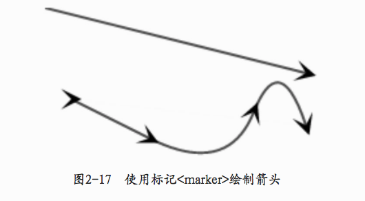

矩形:rect

```html
<html>
<body>
<svg height="100%" width="100%">
    <rect x="20" y="20" width="200" height="100"
          style=" fill:steelblue; stroke:blue; stroke-width:4; opacity:0.5" />
    <rect x="250" y="20" rx="20" ry="30" width="200" height="100"
          style=" fill:yellow; stroke:black; stroke-width:4; opacity:0.5" />
</svg>
</body>
</html>
<!-- 
x：矩形左上角的x坐标。
y：矩形左上角的y坐标。
width：矩形的宽度。
height：矩形的高度。
rx：对于圆角矩形，指定椭圆在x方向的半径。
ry：对于圆角矩形，指定椭圆在y方向的半径。
-->
```


# 圆、椭圆:circle,ellipse

```html
<html>
<body>
<svg height="100%" width="100%">
    <circle cx="160" cy="280" r="80"
             style=" fill:yellow; stroke:black; stroke-width:4" />
    <ellipse cx="420" cy="280" rx="110" ry="80"
             style=" fill:#33FF33; stroke:blue; stroke-width:4" />
</svg>
</body>
</html>
<!-- 
cx：圆心的x坐标。
cy：圆心的y坐标。
r：圆的半径。

cx：圆心的x坐标。
cy：圆心的y坐标。
rx：椭圆的水平半径”
ry：椭圆的垂直半径。
-->

```


# 线段:line

```html
<html>
<body>
<svg height="100%" width="100%">
    <line x1="20" y1="20" x2="300" y2="100"
      style=" stroke:black; stroke-width:4" />
</svg>
</body>
</html>
<!-- 
x1：起点的x坐标。
y1：起点的y坐标。
x2：终点的x坐标。
y2：终点的y坐标。
-->
```

# 多边形和折线:polygon,polyline

```html
<html>
<body>
<svg height="100%" width="100%">
    <polygon points="100,20 20,90 60,160 140,160 180,90"
              style=" fill:LawnGreen; stroke:black; stroke-width:3 "/>

    <polyline points="100,20 20,90 60,160 140,160 180,90"
              style=" fill:white; stroke:black; stroke-width:3 "
              transform="translate(200,0)"/>
</svg>
</body>
</html>
<!-- 
points:坐标点组
-->
```


# 路径:path

```html
<html>
<body>
<svg height="100%" width="100%">
    <path d="M30,100 L270,300
             M30,100 H270
             M30,100 V300"
          style="stroke:black; stroke-width:3 "/>
</svg>
</body>
</html>
<!-- 
移动类
	 	M=moveto：将画笔移动到指定坐标。
直线类
    L=lineto：画直线到指定坐标。
    H=horizontal lineto：画水平直线到指定坐标。
    V=vertical lineto：画垂直直线到指定坐标。
-->
```


```html
<html>
<body>
<svg height="100%" width="100%">
    <path d="M30,100 C100,20 190,20 270,100
             S400,180 450,100"
           style="fill:white; stroke:black; stroke-width:3 "/>

  	<!-- 绘制二次贝塞尔曲线 -->
    <path d="M30,100 Q190,20 270,100
             T450,100"
           style="fill:white; stroke:black; stroke-width:3 "/>
</svg>
</body>
</html>
<!-- 
曲线类
    C=curveto：画三次贝塞尔曲线经两个指定控制点到达终点坐标。
    S=shorthand/smooth curveto：与前一条三次贝塞尔曲线相连，第一个控制点为前一条曲线第二个控制点的对称点，只需输入第二个控制点和终点，即可绘制一个三次贝塞尔曲线。
    Q=quadratic Bézier curveto：画二次贝塞尔曲线经一个指定控制点到达终点坐标。
    T=Shorthand/smooth quadratic Bézier curveto：与前一条二次贝塞尔曲线相连，控制点为前一条二次贝塞尔曲线控制点的对称点，只需输入终点，即可绘制一个二次贝塞尔曲线。
-->
```


```html
<html>
<body>
<svg height="100%" width="100%">
  	<!-- a用了小写英文字母，表示相对坐标 -->
    <path d="M100,200 a200,150 0 1,0 150,-150 Z"
           fill="yellow" stroke="blue" stroke-width="4" />
</svg>
</body>
</html>

<!-- 
rx：椭圆x方向的半轴大小。
ry：椭圆y方向的半轴大小。
x-axis-rotation：椭圆的x轴与水平轴顺时针方向的夹角。
large-arc-flag：有两个值（1：大角度弧线、0：小“角度弧线）。
sweep-flag：有两个值（1：顺时针至终点、0：逆时针至终点）。
x：终点x坐标。
y：终点y坐标。

弧线类
		A=elliptical arc：画椭圆曲线到指定坐标。
闭合类
		Z=closepath：绘制一条直线连接终点和起点，用来封闭图形。
-->
```


# 文字:text

```html
<html>
<body>
<svg height="100%" width="100%">
    <text x="200" y="150" dx="-5" dy="5" rotate="180" textLength="90" >
        I love D3
    </text>
</svg>
</body>
</html>
<!--
x：文字位置的x坐标。
y：文字位置的y坐标。
dx：相对于当前位置在x方向上平移的距离（值为正则往右，负则往左）。
dy：相对于当前位置在y方向上平移的距离（值为正则往下，负则往上）。
rotate：旋转角度（顺时针为正，逆时针为负）,旋转的是每个字符。
textLength：文字的显示长度（不足则拉长，足则压缩）。

如果要对文字中某一部分文字单独定义样式，可使用<tspan>标签 。
-->
```


# 样式

```html
<!-- 
SVG支持使用CSS选择器给元素定义样式。 
.linestyle{
   stroke: red;
   stroke-width: 2;
}


fill：填充色，改变文字<text>的颜色也用这个。
stroke：轮廓线的颜色。
stroke-width：轮廓线的宽度。
stroke-linecap：线头端点的样式，圆角、直角等。
stroke-dasharray：虚线的样式。
opacity：透明度，0.0为完全透明，1.0为完全不透明。
font-family：字体。
font-size：字体大小。
font-weight：字体粗细，有normal、bold、bolder、lighter可选。
font-style：字体的样式，斜体等。
text-decoration：上画线、下画线等。
-->
```


# 标记:marker

标记（marker）是SVG中一个重要的概念，能贴附于<path>、<line>、<polyline>、<polygon>元素上。最典型的应用就是给线段添加箭头。标记<marker>写在<defs></defs>中，defs用于定义可重复利用的图形元素。

```html
<html>
<body>
<svg height="100%" width="100%">
    <defs>
        <marker id="arrow"
                markerUnits="strokeWidth"
                markerWidth="12"
                markerHeight="12"
                viewBox="0 0 12 12"
                refX="6"
                refY="6"
                orient="auto">
         		<path d="M2,2 L10,6 L2,10 L6,6 L2,2" style="fill: #000000;" />
        </marker>
    </defs>

    <line x1="0" y1="0" x2="200" y2="50"
          stroke="red" stroke-width="2"
          marker-end="url(#arrow)"/>
    <path d="M20,70 T80,100 T160,80 T200,90"
          fill="white" stroke="red" stroke-width="2"
          marker-start="url(#arrow)"
          marker-mid="url(#arrow)"
          marker-end="url(#arrow)"/>
</svg>
</body>
</html>

<!-- 
viewBox：坐标系的区域。
refX, refY：在viewBox内的基准点，绘制时此点在直线端点上。
markerUnits：标记大小的基准，有两个值，即strokeWidth（线的宽度）和userSpaceOnUse （线前端的大小）。
markerWidth, markerHeight：标识的大小。
orient：绘制方向，可设定为auto（自动确认方向）和角度值。
id：标识的id号。

marker-start：路径起点处。
marker-mid：路径中间端点处。
marker-end：路径终点处。
-->
```




# 滤镜

```html
<!DOCTYPE html>
<html lang="en">
<head>
    <meta charset="UTF-8">
    <title>Title</title>
</head>
<body>
    <svg width="100%" height="100%">
        <defs>
            <filter id="GaussianBlur"> 
                <!-- stdDeviation是高斯模糊唯一的参数，数值越大，模糊程度越高 -->
                <feGaussianBlur in="SourceGraphic" stdDeviation="2"/>
            </filter>
        </defs>
        <rect x="100" y="100" width="150" height="100" fill="blue"/>
        <rect x="300" y="100" width="150" height="100" fill="blue" filter="url(#GaussianBlur)"/>
    </svg>
</body>
</html>
<!-- 
feMorphology
feGaussianBlur 高斯模糊的滤镜
feFlood

feDistantLight
fePointLight
feSpotLight
-->
```


```html
<!DOCTYPE html>
<html lang="en">
<head>
    <meta charset="UTF-8">
    <title>Title</title>
</head>
<body>
    <svg width="100%" height="100%">
        <defs>
            <linearGradient id="myGradient" x1="0%" y1="0%" x2="100%" y2="0%">
                <stop offset="0%" stop-color="#F00" />
                <stop offset="100%" stop-color="#0FF" />
            </linearGradient>
        </defs>
        <rect fill="url(#myGradient)" x="10" y="10" width="300" height="100"/>
    </svg>
</body>
</html>
<!--
线性渐变<linearGradient>和放射性渐变<radialGradient>

x1、y1、x2、y2定义渐变的方向. 
offset定义渐变开始的位置，stop-color定义此位置的颜色.
-->
```


# D3

## 圆形

```html
<!DOCTYPE html>
<html lang="en">
<head>
    <meta charset="UTF-8">
    <title>Title</title>
</head>
<body>

<script src="../d3.v3.min.js"></script>
<script>
    var width = 400;                          //SVG绘制区域的宽度
    var height = 400;                         //SVG绘制区域的高度
    var svg = d3.select("body")               //选择<body>
        .append("svg")             //在<body>中添加<svg>
        .attr("width", width)      //设定<svg>的宽度属性
        .attr("height", height);   //设定<svg>的高度属性

    svg.append("circle")    //在<svg>中添加<circle>标签
        .attr("cx","150px") //设置属性cx的值为50px
        .attr("cy","150px") //设置属性cy的值为50px
        .attr("r", "50px") 	//设置属性r的值为50px
        .attr("fill","red");//设置属性fill的值为red

</script>
</body>
</html>
```


## 选择集

D3中，选择元素的函数有两个：select和selectAll。

- select：返回匹配选择器的第一个元素。

- selectAll：返回匹配选择器的所有元素

```html
<!DOCTYPE html>
<html lang="en">
<head>
    <meta charset="UTF-8">
    <title>Title</title>
</head>
<body>
    <script src="../d3.v3.min.js"></script>
    <script>
        d3.select("body");         //选择body元素
        d3.select("#important");   //选择id为important的元素
        d3.select(".content");     //选择类为content的第一个元素

        d3.selectAll("p");         //选择所有的p元素
        d3.selectAll(".content");  //选择类为content的所有元素
        d3.selectAll("ul li");     //选择ul中所有的li元素

        var important = document.getElementById("important");
        d3.select(important); //除了CSS选择器，还可以是已经被DOM API选择的元素

        d3.select("body").selectAll("p");//选择body中所有的p元素
    </script>
    
    <p> Paragraph 1 </p>
    <p> Paragraph 2 </p>
    <p> Paragraph 3 </p>
    <script>
       var paragraphs = d3.selectAll("p");
       console.log( paragraphs.empty() );  //false
       console.log( paragraphs.node() );   //<p> Paragraph 1 </p>
       console.log( paragraphs.size() );   //3
    </script>
</body>
</html>
<!-- 
selection.empty() 如果选择集为空，则返回true；如果不为空，返回false。
selection.node() 返回第一个非空元素，如果选择集为空，返回null。
selection.size() 返回选择集中的元素个数。
-->
```

## 设定和获取属性

**selection.attr(name[, value])** 

```html
<script>
      d3.select("p").attr("id","para");
</script>

<!-- 
selection.attr(name[, value]) 
设置或获取选择集的属性，name是属性名称，value是属性值。
如果省略value，则返回当前的属性值；如果不省略，则将属性name的值设置为value。
-->
```

**selection.classed(name[, value])**

```html
<script>
      d3.select("p")
        .classed("red",true)         //开启red类
        .classed("bigsize",false);   //不开启bigsize类
</script>

<!-- 
selection.classed(name[, value])
设定或获取选择集的CSS类，name是类名，value是一个布尔值。布尔值表示该类是否开启。
-->
```

**selection.style(name[, value[, priority]])**

```html
<script>
      d3.select("p")
        .style("color","red")
        .style("font-size","30px");
</script>

<!-- 
selection.style(name[, value[, priority]])
设定或获取选择集的样式，name是样式名，value是样式值
-->
```

**selection.property(name[, value])**

```html
<script>
      d3.select("#fname").property("value");
      d3.select("#fname").property("value","LiSi");
</script>

<!-- 
selection.property(name[, value])
设定或获取选择集的属性，name是属性名，value是属性值。如果省略value，则返回属性名。
有部分属性，不能用attr()设定和获取，最典型的是文本输入框的value属性，此属性值不会在标签中显示。
-->
```

**selection.text([value])**

```html
<script>
      d3.select("p").text()
</script>

<script>
      d3.select("p").html()
</script>
<!-- 
selection.text([value])
设定或获取选择集的文本内容，如果省略value，则返回当前的文本内容。

selection.html([value])
设定或获取选择集的内部HTML内容，相当于DOM的innerHTML，包括元素内部的标签
-->
```

## 添加、插入和删除

selection.**append**(name) 在选择集的末尾添加一个元素，name为元素名称。

selection.**insert**(name[, before]) 在选择集中的指定元素之前插入一个元素，name是被插入的元素名称，before是CSS选择器名称。

selection.**remove**() 删除选择集中的元素。

```html
<!DOCTYPE html>
<html lang="en">
<head>
    <meta charset="UTF-8">
    <title>Title</title>
</head>
<body>
<script src="../d3.v3.min.js"></script>
<!-- body中的三个段落元素 -->
<p>Car</p>
<p id="plane">Plane</p>
<p>Ship</p>

<script>

    //选择body元素
    var body = d3.select("body");

    //在body中所有元素的末尾处添加一个p元素，内容为Train
    body.append("p").text("Train");

    //在body中id为plane的元素前添加一个p元素，内容为Bike
    body.insert("p", "#plane").text("Bike");

    //选择id为plane的元素
    var plane = d3.select("#plane");
    //删除id为plane的元素
    plane.remove();

</script>
</body>
</html>
```


## 数据绑定

数据绑定，就是使被选择元素里“含有”数据

 selection.**datum**([value]) 选择集中的每一个元素都绑定相同的数据value。

```html
<!DOCTYPE html>
<html lang="en">
<head>
    <meta charset="UTF-8">
    <title>Title</title>
</head>
<body>
<script src="../d3.v3.min.js"></script>
<!-- 三个段落元素 -->
<p>Fire</p>
<p>Water</p>
<p>Wind</p>

<script>
    //选择body中所有的p元素，选择集结果赋值给变量p
    var p = d3.select("body").selectAll("p");

    //绑定数值7到选择集上
    p.datum(7);

    //在控制台输出选择集
    console.log(p);
</script>
</body>
</html>
<!-- 
对于选择集中的每一个元素，都为其增加一个__data__属性，属性值为datum(value)的参数value。
此处的value并非一定要是number（数值）型，也可以是string（字符串）、boolean（布尔型）和object（对象），
无论是什么类型，其工作过程都是给__data__赋值。

在被绑定数据的选择集中添加元素后，新元素会继承该数据。
-->
```


selection.**data**([values[, key]]) 选择集中的每一个元素分别绑定数组values的每一项。key是一个键函数，用于指定绑定数组时的对应规则。当数组长度大于元素数量时，为多余数据预留元素位置，以便将来插入新元素；当数组长度小于元素数量时，能获取多余元素的位置，以便将来删除。

```html
<!DOCTYPE html>
<html lang="en">
<head>
    <meta charset="UTF-8">
    <title>Title</title>
</head>
<body>
<script src="../d3.v3.min.js"></script>
<!-- 三个段落元素 -->
<p>Fire</p>
<p>Water</p>
<p>Wind</p>

<script>
    //定义数组
    var dataset = [3, 6, 9];
    //选择body中的p元素
    var p = d3.select("body").selectAll("p");
    //绑定数据到选择集
    var update = p.data(dataset);
    //输出绑定的结果
    console.log(update);
</script>
</body>
</html>
```


update：数组长度 = 元素数量。如果数组长度等于元素数量，则绑定数据的元素“即将被更新（update）”。

enter：数组长度 > 元素数量。如果数组长度大于元素数量，则部分还不存在的元素“即将进入可视化（enter）”。

exit：数组长度 < 元素数量。如果数组长度小于元素数量，则多余的元素“即将退出可视化（exit）”。

```html
<!DOCTYPE html>
<html lang="en">
<head>
    <meta charset="UTF-8">
    <title>Title</title>
</head>
<body>
<script src="../d3.v3.min.js"></script>
<!-- 三个段落元素 -->
<p>Fire</p>
<p>Water</p>
<p>Wind</p>

<script>
    var dataset = [3, 6, 9, 12, 15];
    var p = d3.select("body").selectAll("p");
    var update = p.data(dataset);
    console.log(update);
    console.log(update.enter());
    console.log(update.exit());
</script>
</body>
</html>
```


## enter()

```html
<!DOCTYPE html>
<html lang="en">
<head>
    <meta charset="UTF-8">
    <title>Title</title>
</head>
<body>
<script src="../d3.v3.min.js"></script>
<!-- body中的三个段落元素 -->
<p></p>
<script>
    var dataset = [3, 6, 9];
    var p = d3.select("body").selectAll("p");

    //绑定数据后，分别获取update和enter部分
    var update = p.data(dataset);
    var enter = update.enter();

    //update部分的处理方法是直接修改内容
    update.text( function(d){ return d; } );

    //enter部分的处理方法是添加元素后再修改内容
    enter.append("p").text(function(d){ return d; });
</script>
</body>
</html>
```

body中的p元素只有一个，但是数据有三个，因此enter部分有多余的两个数据。对多余数据的处理方法就是添加元素（append），使其与多余数据对应。处理之后，body里有三个p元素，内容分别为：

```html
<p>3</p>
<p>6</p>
<p>9</p>
```

通常，从服务器读取数据后，网页中是没有与之对应的元素的。因此，有一个很常见的用法：选择一个空集，然后使用enter().append()的形式来添加足够数量的元素。

```js
var dataset = [10,20,30,40,50];
var body = d3.select("body");
body.selectAll("p") //选择body中的所有p，但由于没有p，因此选择了一个空集
   .data(dataset)    //绑定dataset数组
   .enter()          //返回enter部分
   .append("p")      //添加p元素
   .text(function(d){ return d; });
```

```html
<body>
   <p>10</p>
   <p>20</p>
   <p>30</p>
   <p>40</p>
   <p>50</p>
</body>
```


## exit()

```js
var dataset = [10, 20, 30];
var p = d3.select("body").selectAll("p");
//绑定数据之后，分别获取update部分和exit部分
var update = p.data(dataset);
var exit = update.exit();
//update部分的处理方法是修改内容
update.text( function(d){ return d; } );
//exit部分的处理方法是删除
exit.remove();
```

```js
// 模板
var dataset = [10, 20, 30];
var p = d3.select("body").selectAll("p");

//绑定数据后，分别返回update、enter、exit部分
var update = p.data(dataset);
var enter = update.enter();
var exit = update.exit();

//1.update部分的处理方法
update.text( function(d){ return d; } );

//2.enter部分的处理方法
enter.append("p")
   .text( function(d){ return d; } );

//3.exit部分的处理方法
exit.remove();
```

## 过滤器

这个函数的返回结果为绑定数据的数值大于20的所有元素。

```js
selection.filter(function(d,i){
   if( d > 20 )
       return true;
   else
       return false;
}); 
```

sort排序

```js
selection.sort(function(a,b){
   return b-a;
});
```

each 遍历

```js
var persons = [{ id: 1001 , name:"ZhangSan" },
                    { id: 1002 , name:"LiSi" }];

var p = d3.select("body").selectAll("p");

p.data(persons)
   .each(function(d,i){
       d.age = 20;
   })
   .text( function(d,i){
       return d.id + " " + d.name + " " + d.age;
   });
```

## call()

call()允许将选择集自身作为参数，传递给某一函数。

```js
d3.selectAll("div").call(myfun);

// 等同将选择集作为参数传递给myfun函数使用
function myfun(selection) {
   //在这里进行相关操作
   selection.attr("name", "value");
}
myfun(d3.selectAll("div"));
```


## 数组处理

sort排序

**d3.ascending**(a,b) 递增函数。如果a小于b，返回–1；如果a大于b，返回1；如果a等于b，返回0

**d3.descending**(a,b) 递减函数。如果a大于b，返回–1；如果a小于b，返回1；如果a等于b，返回0

```js
var numbers = [54,23,77,11,34];
numbers.sort(d3.ascending);
console.log(numbers);   //[11, 23, 34, 54, 77]

var numbers = [54,23,77,11,34];
numbers.sort(d3.descending);
console.log(numbers);   //[77, 54, 34, 23, 11]
```

 **d3.min(array[, accessor])** 返回数组最小值。

**d3.max(array[, accessor])** 返回数组最大值。

**d3.extend(array[, accessor])** 返回数组最小值和最大值。

```js
//数组定义
var numbers = [30,20,10,50,40];

//求最小值和最大值
var min = d3.min(numbers);
var max = d3.max(numbers);
var extent = d3.extent(numbers);

//输出结果
console.log(min);    //10
console.log(max);    //50
console.log(extent); //[10, 50]

//使用accessor，在求值前先处理数据
var minAcc = d3.min(numbers, function(d){ return d*3; });
var maxAcc = d3.max(numbers, function(d){ return d - 5; });
var extentAcc = d3.extent(numbers, function(d){ return d%7; });

//输出结果
console.log(minAcc);    //30
console.log(maxAcc);    //45
console.log(extentAcc); //[1, 6]
```

d3.sum(array[, accessor]) 返回数组的总和，如果数组为空，则返回0。

**d3.mean**(array[, accessor]) 返回数组的平均值，如果数组为空，则返回undefined。

```js
//数组定义
var numbers = [69,11,undefined,53,27,82,65,34,NaN];

//求总和、平均值
var sum = d3.sum(numbers,function(d){ return d/3; });
var mean = d3.mean(numbers);

//输出结果
console.log(sum);   //113.66666666666667
console.log(mean);  //48.714285714285715
```

**d3.median**(array[, accessor]) 求数组的中间值，如果数组为空，则返回undefined。会忽略掉undefined和NaN

**d3.quantile**(numbers, p) 求取p分位点的值，p的范围为[0,1]。数组需先递增排序。

```js
var numbers1 = [3,1,7,undefined,9,NaN];
d3.median(numbers1);   //返回5
var numbers2 = [3,1,7,undefined,9,10,NaN];
d3.median(numbers2);   //返回7

var numbers = [3,1,10];
numbers.sort(d3.ascending);
d3.quantile(numbers,0);     //返回1
d3.quantile(numbers,0.25);  //返回2
d3.quantile(numbers,0.5);   //返回3
d3.quantile(numbers,0.75);  //返回6.5
d3.quantile(numbers,0.9);   //返回8.599999999999998
d3.quantile(numbers,1.0);   //返回10
```

**d3.variance**(array[, accessor]) 求方差。

**d3.deviation**(array[, accessor]) 求标准差。

```js
var numbers1 = [1,9,7,9,5,8,9,10];
d3.mean(numbers1);       //返回平均值：7.25
d3.variance(numbers1);   //返回方差：约等于8.79
d3.deviation(numbers1);  //返回标准差：约等于2.96

var numbers2 = [7,8,6,7,7,8,8,7];
d3.mean(numbers2);       //返回平均值：7.25
d3.variance(numbers2);   //返回方差：约等于0.50
d3.deviation(numbers2);  //返回标准差：约等于0.71
```

**d3.bisectLeft**() 获取某数组项左边的位置。

**d3.bisect**() 获取某数组项右边的位置。

**d3.bisectRight**() 和bisect()一样。

bisectLeft()、bisect()、bisectRight()可配合splice()使用

```js
var countries = ["China","America","Japan","France"];

//在数组索引为1的位置处，删除0个项后，插入字符串Germany
countries.splice(1,0,"Germany");

//输出 ["China", "Germany", "America", "Japan", "France"]
console.log(countries);

//在数组索引为3的位置处，删除一个项后，插入两个字符串Britain和Russia
countries.splice(3,1,"Britain","Russia");

//输出["China", "Germany", "America", "Britain", "Russia", "France"]
console.log(countries);
```

```js
var numbers = [10,13,16,19,22,25];

//iLeft的值为2
var iLeft = d3.bisectLeft(numbers.sort(d3.ascending),16);

//在iLeft位置处，删除0个项后，插入77
numbers.splice(iLeft,0,77);

//输出[10, 13, 77, 16, 19, 22, 25]
console.log(numbers);

var numbers = [10,13,16,19,22,25];

//18在数组中不存在，返回介于16和19之间的位置，返回值为3
var iLeft = d3.bisectLeft(numbers.sort(d3.ascending),18);
numbers.splice(iLeft,0,77);

//输出[10, 13, 16, 77, 19, 22, 25]
console.log(numbers);
```

d3.shuffle(array[, lo[, hi]])：随机排列数组。

```js
var numbers = [10,13,16,19,22,25];
d3.shuffle(numbers);

//结果随机，本次试验为[16, 25, 13, 10, 22, 19]
console.log(numbers);
```

 d3.merge(arrays)：合并两个数组。

```js
// returns [1, 2, 3]
d3.merge([ [1], [2, 3] ]);
```

d3.pairs(array)：返回邻接的数组对,使用pairs()后，原数组是不变的。

```js
var colors = ["red","blue","green"];

//colors不变，结果保存在pairs中
var pairs = d3.pairs(colors);

//结果为[ ["red","blue"] , ["blue","green"] ]
console.log(pairs);
```

 d3.range([start, ]stop[, step])：返回等差数列。[start, start + step, start + 2 * step, ...]

```js
//start为0，stop为10，step为1
var a = d3.range(10);

//输出[0, 1, 2, 3, 4, 5, 6, 7, 8, 9]
console.log(a);

//start为2，stop为10，step为1
var b = d3.range(2,10);

//输出[2, 3, 4, 5, 6, 7, 8, 9]
console.log(b);
第4章　选择集与数据
本章内容包括：

如何选择元素
选择集的状态和属性
数据绑定
选择集的处理
操作数组
柱形图
选择集和数据，是D3最重要的基础。选择集是被选择的元素集合，例如所有的<p>；数据是可视化的来源，D3允许将数据和选择集绑定在一起，以凭借数据操作选择集。

第1节，讲述如何选择元素。

第2节，介绍如何查看选择集的状态，以及设定和获取选择集的属性。

第3节，讨论对应一个选择集，如何添加、插入和删除元素。

第4节，学习如何将数据绑定到选择集上，极为重要。

第5节，讨论当数据与选择集绑定在一起后，该如何处理。

第6节，介绍数组的处理方法，可视化数据主要是由数组构成的。

第7节，制作一个简单的柱形图，以复习本章的知识。

4.1　选择元素
D3中，选择元素的函数有两个：select和selectAll。两种方式都很常用，它们的区别如下。

• select：返回匹配选择器的第一个元素。

• selectAll：返回匹配选择器的所有元素。

选择器是select和selectAll的参数，指定应当选择文档中的哪些元素。此处的选择器，指的是CSS选择器，第2.2.2节讲述了选择器的相关内容。知道了选择器的表示方式，即可用如下代码来选择所需元素。

d3.select("body");         //选择body元素
d3.select("#important");   //选择id为important的元素
d3.select(".content");     //选择类为content的第一个元素
要注意，符合选择器的可能有多个元素，但select只选择第一个。如果要选择符合选择器的所有元素，使用selectAll，代码如下。

d3.selectAll("p");         //选择所有的p元素
d3.selectAll(".content");  //选择类为content的所有元素
d3.selectAll("ul li");     //选择ul中所有的li元素
关于select和selectAll的参数，除了CSS选择器，还可以是已经被DOM API选择的元素，代码如下。

var important = document.getElementById("important");
d3.select(important);
上面的代码中，变量important保存的是被getElementById选择的元素，将important作为参数select的参数即可。但是，此方法有一个问题：如果选择的是多个元素，将其作为select的参数，不能达到选择其中第一个元素的效果。这种情况下，应将其作为selectAll的参数。请看下面的示例。

//使用DOM选择类为content的元素集
var content = document.getElementsByClassName("content");

//如果使用select，达不到选择第一个元素的效果
//d3.select(content);

//这种使用方法是正确的
d3.selectAll(content);
基本上，使用getElementById选择的元素要用select，使用getElementsByClassName选择的元素要使用selectAll。但是，尽量直接使用CSS选择器作为参数，简单易懂。

如果要对选择集中的元素再进行一番选择，例如选择body中所有的p元素，除了使用CSS的派生选择器作为参数之外，还可采用如下手法。

d3.select("body").selectAll("p");
熟悉jQuery的朋友一定对此用法很有好感，D3也支持这种连续调用函数的方法，称为“连缀语法”。

4.2　选择集
d3.select和d3.selectAll返回的对象称为选择集（selection），添加、删除、设定网页中的元素，都得使用选择集。

4.2.1　查看状态
查看选择集的状态，有三个函数可供使用。

• selection.empty()

如果选择集为空，则返回true；如果不为空，返回false。

• selection.node()

返回第一个非空元素，如果选择集为空，返回null。

• selection.size()

返回选择集中的元素个数。

以上三个函数，都是对选择集说的，请看如下代码。

<p> Paragraph 1 </p>
<p> Paragraph 2 </p>
<p> Paragraph 3 </p>
<script>
   var paragraphs = d3.selectAll("p");
   console.log( paragraphs.empty() );  //false
   console.log( paragraphs.node() );   //<p> Paragraph 1 </p>
   console.log( paragraphs.size() );   //3
</script>
d3.selectAll选择了文档中所有的p元素，返回一个选择集，保存到变量paragraphs。其后，分别调用 empty()、node()和 size()，返回结果输出到控制台。输出结果是三行文字，分别为：“false”、“<p> Paragraph 1 </p>”和“3”。

4.2.2　设定和获取属性
假设HTML文档中有一个段落元素<p>，如下：

<p> This is a paragraph </p>
如果要给此元素设置一个id，可直接写在HTML元素上，代码如下：

<p id="para"> This is a paragraph </p>
换成用D3来修改元素p的属性，只需：

d3.select("p").attr("id","para");
包括上面的attr()，设定或获取选择集属性的函数共有六个，以下分别介绍。

• selection.attr(name[, value])

设置或获取选择集的属性，name是属性名称，value是属性值。如果省略value，则返回当前的属性值；如果不省略，则将属性name的值设置为value。

应用此函数后，添加的属性在元素标签中以name="value"的形式出现。即便是不存在的属性，也可以添加，只是没有任何效果。第3.4节，给svg添加circle元素后，也使用了此函数：

svg.append("circle")     //在<svg>中添加<circle>标签
   .attr("cx","50px")    //设置属性cx的值为50px
   .attr("cy","50px")    //设置属性cy的值为50px
   .attr("r", "50px")    //设置属性r的值为50px
   .attr("fill","red");  //设置属性fill的值为red
其结果是，circle元素添加了如下属性：

<circle cx="50px" cy="50px" r="50px" fill="blue"></circle>
如果要获取选择集某属性的值，则省略第二个参数value即可：

var cx = d3.select("circle").attr("cx");
console.log(cx);   //50px
• selection.classed(name[, value])

设定或获取选择集的CSS类，name是类名，value是一个布尔值。布尔值表示该类是否开启。

selection.attr()是可以设置类的，但在设置多个类时不方便，例如：

d3.select("p")
   .attr("class","red bigsize"); //类名间用空格隔开
给选择集设置了red和bigsize两个类。但是，如果需要根据判断条件来开启和关闭，attr()就办不到了，而classed的第二个参数正是一个判断条件：

d3.select("p")
   .classed("red",true)         //开启red类
   .classed("bigsize",false);   //不开启bigsize类
当布尔值为true时，开启对应的类，元素标签添加class="classname"。当布尔值为false时，标签中不会添加任何属性。另外，classed还有以下形式：

.classed({ "red": true , "bigsize":true });  //写在一个对象里
.classed("red bigsize",true);                //用空格分开写在一起
如果省略第二个参数value，则返回一个布尔值，表示类是否开启：

//输出true或false
console.log( d3.select("p").classed("bigsize") );
• selection.style(name[, value[, priority]])

设定或获取选择集的样式，name是样式名，value是样式值：

d3.select("p")
   .style("color","red")
   .style("font-size","30px");
则元素标签将添加如下属性：

<p style="color: red; font-size: 30px;"></p>
与classed一样，可以用对象的形式，将几个样式写在一起：

.style({"color":"red" , "font-size":"30px"});
如果只保留第一个参数，则返回该样式的值。

• selection.property(name[, value])

设定或获取选择集的属性，name是属性名，value是属性值。如果省略value，则返回属性名。

有部分属性，不能用attr()设定和获取，最典型的是文本输入框的value属性，此属性值不会在标签中显示。例如，有文本框元素：

<input id="fname" type="text" name="fullname"/>
在文本框中输入文本，例如字符串ZhangSan。但是，标签中并不会添加value="ZhangSan"，因此，不能使用attr()来获取属性值，而要用property()：

d3.select("#fname").property("value");
返回结果是字符串ZhangSan。使用第二个参数，即可给文本框赋值：

d3.select("#fname").property("value","LiSi");
此外，还有复选框等，都需要用property()来获取属性。总之，凡是不能用attr()来处理的属性，都可考虑用property()。

• selection.text([value])

设定或获取选择集的文本内容，如果省略value，则返回当前的文本内容。文本内容相当于DOM的innerText，不包括元素内部的标签：

//HTML中的元素，标签里包含着标签
<p> This <span>is</span> a paragraph </p>

//选择p后，调用text()函数，将返回值在控制台中输出
console.log( d3.select("p").text() );
输出结果为This is a paragraph，不包含其中的span标签。

• selection.html([value])

设定或获取选择集的内部HTML内容，相当于DOM的innerHTML，包括元素内部的标签：

<p> This <span>is</span> a paragraph </p>
console.log( d3.select("p").html() );
输出结果为This<span>is</span>a paragraph，包含其中的span标签。

4.3　添加、插入和删除
对于选择集，可以添加、插入和删除元素，相关函数的介绍如下。

• selection.append(name)

在选择集的末尾添加一个元素，name为元素名称。

• selection.insert(name[, before])

在选择集中的指定元素之前插入一个元素，name是被插入的元素名称，before是CSS选择器名称。

• selection.remove()

删除选择集中的元素。

下面的代码，包含了以上三个函数的用法：

<body>
   <!-- body中的三个段落元素 -->
   <p>Car</p>
   <p id="plane">Plane</p>
   <p>Ship</p>

   //JavaScript代码块
   <script>

       //选择body元素
       var body = d3.select("body");

       //在body中所有元素的末尾处添加一个p元素，内容为Train
       body.append("p").text("Train");

       //在body中id为plane的元素前添加一个p元素，内容为Bike
       body.insert("p","#plane").text("Bike");

       //选择id为plane的元素
       var plane = d3.select("#plane");
       //删除id为plane的元素
       plane.remove();

   </script>
</body>
这段代码的结果是在网页上显示四个段落，文字和排列次序分别为：Car、Bike、Ship、Train。添加删除元素的过程如图4-1所示。

079-1
图4-1　添加删除元素的过程

首先，使用append()给body的末尾添加了一个p元素，内容为Train，这时页面中有四个段落元素，按次序排列分别为：Car、Plane、Ship、Train。

然后，调用insert()在Plane前插入了一个p元素，内容为Bike，这时页面中有五个段落元素，按次序排列分别为：Car、Bike、Plane、Ship、Train。

最后，调用remove()将Plane删除，故最终结果为：Car、Bike、Ship、Train。

上面代码中，insert()的第二个参数是#plane，这是CSS选择器，任何符合选择器语法的字符串都可作为第二个参数的值。

4.4　数据绑定
将数据绑定到DOM上，是D3最大的特色。d3.select和d3.selectAll返回元素的选择集，选择集上是没有数据的。数据绑定，就是使被选择元素里“含有”数据。相关函数有两个。

• selection.datum([value])

选择集中的每一个元素都绑定相同的数据value。

• selection.data([values[, key]])

选择集中的每一个元素分别绑定数组values的每一项。key是一个键函数，用于指定绑定数组时的对应规则。

上面的概念可能难以理解，不要着急，接下来会详细剖析datum()和data()，来看看数据绑定是如何工作的，两个函数有什么不同之处。不理解原理，直接使用或许也不错，但遇到意料之外的结果时，往往不知道如何调试。因此，大致知道其工作过程是必要的，而且本节内容对于想要学好D3太重要了，笔者建议一定要细心阅读。

4.4.1　datum()的工作过程
datum()绑定数据的方法很简单，可能使用得比较少，某些时候还是能派上大用场的。并且，它能帮助理解D3是如何绑定数据到选择集上的。请先看下面的代码。

<body>
   <!-- 三个段落元素 -->
   <p>Fire</p>
   <p>Water</p>
   <p>Wind</p>

   <script>
       //选择body中所有的p元素，选择集结果赋值给变量p
       var p = d3.select("body").selectAll("p");

       //绑定数值7到选择集上
       p.datum(7);

       //在控制台输出选择集
       console.log(p);
   </script>
</body>
代码中，使用datum()将数值7绑定到了选择集上，然后在控制台输出该选择集。在浏览器的控制台，可以看到如图4-2所示的输出结果。其中包含有三个p元素，正是使用selectAll选择的三个段落，还可看到选择集的大小（length）、父节点（parentNode）等信息。

081-1
图4-2　被输出到控制台的选择集

展开任意一个p元素，其各属性值如图4-3所示。注意画圈的部分，有一个__data__属性，这是被绑定数据之后才会出现的，其数值7正是刚才绑定的数据。展开其他的p元素，会发现每一个元素中都多出了一个__data__，并且数值都是7。

081-2
图4-3　绑定到元素上的数据

那么datum()的工作过程就再明白不过了，即对于选择集中的每一个元素，都为其增加一个__data__属性，属性值为datum(value)的参数value。此处的value并非一定要是number（数值）型，也可以是string（字符串）、boolean（布尔型）和object（对象），无论是什么类型，其工作过程都是给__data__赋值。如果使用undefined和null作为参数，则将不会创建__data__属性。下面来看看datum()的源代码：

d3_selectionPrototype.datum = function(value) {
   return arguments.length
       ? this.property("__data__", value)
       : this.property("__data__");
};
由以上源代码可知，datum()是用第4.2.2节中提到的property()函数实现的：如果有参数value，则调用property给当前对象添加一个__data__属性；否则返回__data__属性值。下面来试验一下没有参数的情形。

var p = d3.select("body").selectAll("p");
p.datum(7);
console.log( p.datum() );   //在控制台输出被绑定的数据
这段代码将在控制台输出数字7，正是被绑定的数据。现在有一个问题，数据被绑定在选择集上后，该如何使用呢，或者说D3希望我们如何使用呢？举一个例子，用被绑定的字符串，替换掉段落原来的字符串。

<body>
   <p>Fire</p>
   <p>Water</p>
   <p>Wind</p>
   <script>
        var p = d3.select("body").selectAll("p");
        p.datum("Thunder")    //绑定字符串Thunder到选择集上
         .text(function(d,i){ //替换内容
               return d + " " + i;
        });
   </script>
</body>
datum()绑定了一个字符串Thunder到选择集上，然后调用text()替换字符串。text()可设定选择集的文本内容。在这里，text()的参数是一个无名函数function(d,i)，这两个参数分别代数据（datum）和索引（index）。其实，无名函数两个参数的名称不一定要用d和i，但意义是不变的。按照惯例，建议写成d和i。

最后，无名函数返回了由d和i结合而成的字符串，中间加一空格。结果如图4-4所示，网页中的三个段落元素p的字符串分别被替换成：Thunder 0、Thunder 1、Thunder 2。

082-1
图4-4　使用被绑定的数据

由结果也可得知，无名函数的两个参数d和i，d是被绑定的字符串，i是索引号。索引号是从0开始的。D3中，使用被绑定的数据大多数用上述形式：定义一个无名函数function(d,i)，在函数体中使用d和i。

D3还有一个特性，能使被绑定的数据传递给子元素。对前一段代码稍做修改：

p.datum("Thunder")
   .append("span") //在每一个被选择元素后添加元素span
   .text(function(d,i){
       return " " + d;
   });
结果如图4-5所示，各段落元素的末尾被添加了span元素，内容为Thunder。

082-2
图4-5　在各段落元素中添加span子元素

下面使用console.log在控制台输出选择集p，如图4-6所示。可以看到，子元素span里也含有属性__data__，属性值仍然是字符串Thunder。据此可得出一个结论：

在被绑定数据的选择集中添加元素后，新元素会继承该数据。

083-1
图4-6　将被绑定的数据传递给子元素

这一点后续章节中会很常用。

4.4.2　data()的工作过程
data()能将数组各项分别绑定到选择集的各元素上，并且能指定绑定的规则。当数组长度与元素数量不一致时，data()也能够处理。当数组长度大于元素数量时，为多余数据预留元素位置，以便将来插入新元素；当数组长度小于元素数量时，能获取多余元素的位置，以便将来删除。下面剖析data()是如何绑定数据的，与datum()有什么不同。

假设body中有三个段落元素p，代码如下：

<body>
   <p>Lion</p>
   <p>Tiger</p>
   <p>Leopard</p>
</body>
现要将一个数组的各项分别绑定到各元素上。假设，数组为[3,6,9]，令第一个p元素绑定3，第二个绑定6，第三个绑定9，这种情况就需要使用data()。如果是datum()，则会将数组本身绑定到各元素上，即第一个p元素绑定[3,6,9]，第二个绑定[3,6,9]，第三个也是绑定[3,6,9]，data()和datum()的区别如图4-7所示。

083-2
图4-7　data()和datum()的区别

使用data()绑定数据的代码如下：

//定义数组
var dataset = [3, 6, 9];
//选择body中的p元素
var p = d3.select("body").selectAll("p");
//绑定数据到选择集
var update = p.data(dataset);
//输出绑定的结果
console.log(update);
这段代码中，将数组绑定到选择集并输出结果。如图4-8所示，数组的三项分别被绑定到了各元素上，与图4-7的预测一致。

084-1
图4-8　使用data()将数组分别绑定到各元素

上例中，数组长度与元素数量正好相等。两者也有不相等的情况，如果数组长度为5，而元素数量为3，则多出两个数据没有绑定元素。如果数组长度为1，元素数量为3，则会有两个元素没有绑定数据。在D3中，根据数组长度和元素数量的关系，分别把各种情况归纳如下。

• update：数组长度 = 元素数量。

• enter：数组长度 > 元素数量。

• exit：数组长度 < 元素数量。

这三个单词的含义可能很难理解，update的原意为“更新”，enter的原意为“进入”，exit的原意为“退出”，直译的结果很难表现所需的意思。一般来说，在读入数据进行可视化的过程中，被读入的数据都要绑定到选择集的元素上，没有绑定数据的元素是没有用的。因此，这三个单词可以理解为：

• 如果数组长度大于元素数量，则部分还不存在的元素“即将进入可视化（enter）”。

• 如果数组长度小于元素数量，则多余的元素“即将退出可视化（exit）”。

• 如果数组长度等于元素数量，则绑定数据的元素“即将被更新（update）”。

还是很难理解吗？没关系，请看图4-9，其中左图表示数组长度为5、元素数量为3的情况，那么有两个数组项没有与之相连的元素，这一部分被称为enter；其中右图表示数组长度为1、元素数量为3的情况，那么有两个元素没有数组项与之相连，这一部分称为exit。数组项和元素相连的部分被称为update。

085-1
图4-9　当数组长度大于元素数量时，update和enter所代表的范围（左）；当数组长度小于元素数量时， update和exit所代表的范围（右）

data()返回一个对象，对象里包含update部分，还有两个方法：一个是enter()，返回enter部分；一个是exit()，返回exit部分。请看如下代码：

var dataset = [3, 6, 9, 12, 15];
var p = d3.select("body").selectAll("p");
var update = p.data(dataset);
console.log(update);
console.log(update.enter());
console.log(update.exit());
上面的代码中，数组长度为5，元素数量为3，多出两个数组项。其输出结果如图4-10和图4-11所示。

085-2
图4-10　console.log(update)的输出结果

086-1
图4-11　console.log(update.enter())和console.log(update.exit())的输出结果

图4-10中，可以看到被绑定数据的三个p元素。还有enter()和exit()两个函数，用于返回本次绑定的enter和exit部分。

由图4-11可以看到，enter部分中，D3已经为多余的数组项12和15预留了位置，以备将来添加元素。enter部分中，还有一个变量update，指向update部分。本次绑定中，没有多余的元素，所以exit部分没有内容。如果将数组换成：

var dataset = [3];
则exit部分的输出结果如图4-12所示，多出两个p元素。

086-2
图4-12　数组长度小于元素数量时的exit部分

update、enter、exit是非常重要的概念，可能一时难以理解，在后续章节中还会大量出现。

4.4.3　绑定的顺序
默认情况下，data()是按索引号顺序绑定的：第0个元素绑定数组第0项，第1个元素绑定数组第1项，依此类推。也可以不按此顺序进行，这就要用到data()的第二个参数。此参数是一个函数，称为键函数（key function）。

要注意，只有在选择集原来已经绑定有数据的情况下，使用键函数才有效果。请看以下示例。

<body>
   <!-- 三个空的p元素 -->
   <p></p>
   <p></p>
   <p></p>
   <script>
   //数据
   var persons = [ { id: 3 , name:"张三" },
                   { id: 6 , name:"李四" },
                   { id: 9 , name:"王五" }];

   //选择body中的所有p元素
   var p = d3.select("body").selectAll("p");

   //绑定数据，并修改p元素的内容
   p.data(persons)
       .text(function(d){
           return d.id + " : " + d.name;
       });
   </script>
</body>
这段代码对p元素的内容进行了修改，修改之后的p元素为：

<p>3 : 张三</p>
<p>6 : 李四</p>
<p>9 : 王五</p>
下面将persons里的数据更新，再绑定一次数据。本次绑定添加键函数：

//更新persons里的数据
persons = [   { id: 6 , name:"张三" },
              { id: 9 , name:"李四" },
              { id: 3 , name:"王五" }];

//根据键函数的规则绑定数据，并修改内容
p.data(persons, function(d){ return d.id; })
       .text(function(d){
           return d.id + " : " + d.name;
       });
键函数里只有一个语句return d.id，表示使用数组项的id作为键。使用本次绑定的数据修改p元素的内容后，结果如下：

<p>3 : 王五</p>
<p>6 : 张三</p>
<p>9 : 李四</p>
可以看到，结果并没有按照新persons数组的次序（6：张三、9：李四、3：王五）排列。绑定过程如图4-13所示，绑定的顺序不按照索引号绑定，而是使键值依次对应。

088-1
图4-13　根据键函数绑定数据

4.5　选择集的处理
上一节讲述了绑定数据的原理。当数组长度与元素数量不一致时，有enter部分和exit部分，前者表示存在多余的数据，后者表示存在多余的元素。本节将介绍如何处理这些多余的东西，然后讲解一个处理模板，此模板包含处理enter、exit、update部分的内容。

4.5.1　enter的处理方法
如果没有足够的元素，那么处理方法就是添加元素。请看下面的代码：

<body>
   <p></p>
   <script>
   var dataset = [3, 6, 9];
   var p = d3.select("body").selectAll("p");

   //绑定数据后，分别获取update和enter部分
   var update = p.data(dataset);
   var enter = update.enter();

   //update部分的处理方法是直接修改内容
   update.text( function(d){ return d; } );

   //enter部分的处理方法是添加元素后再修改内容
   enter.append("p")
         .text(function(d){ return d; });
   </script>
</body>
本例中，body中的p元素只有一个，但是数据有三个，因此enter部分有多余的两个数据。对多余数据的处理方法就是添加元素（append），使其与多余数据对应。处理之后，body里有三个p元素，内容分别为：

<p>3</p>
<p>6</p>
<p>9</p>
通常，从服务器读取数据后，网页中是没有与之对应的元素的。因此，有一个很常见的用法：选择一个空集，然后使用enter().append()的形式来添加足够数量的元素。例如，假设body里没有p元素，请看如下代码。

var dataset = [10,20,30,40,50];
var body = d3.select("body");
body.selectAll("p") //选择body中的所有p，但由于没有p，因此选择了一个空集
   .data(dataset)    //绑定dataset数组
   .enter()          //返回enter部分
   .append("p")      //添加p元素
   .text(function(d){ return d; });
上述代码中，selectAll选择了一个空集，然后绑定数据。由于选择集为空，因此data()返回的update部分为空。然后，调用enter()返回enter部分，enter部分包含有多余的五个数据。接下来，向enter部分添加元素（append），使得每一个数据都有元素p与之对应。最后，更改p元素的内容。最终，网页中元素结构为：

<body>
   <p>10</p>
   <p>20</p>
   <p>30</p>
   <p>40</p>
   <p>50</p>
</body>
4.5.2　exit的处理方法
如果存在多余的元素，没有数据与之对应，那么就需要删除元素。使用remove()即可删除元素。请看下面的示例，假设body中原有5个p元素。

var dataset = [10, 20, 30];
var p = d3.select("body").selectAll("p");
//绑定数据之后，分别获取update部分和exit部分
var update = p.data(dataset);
var exit = update.exit();
//update部分的处理方法是修改内容
update.text( function(d){ return d; } );
//exit部分的处理方法是删除
exit.remove();
这段代码中，对于exit部分的处理方法是删除。删除之后，网页中将不会有多余的p元素，剩下来的每一个p元素都有数据与之对应。

4.5.3　处理模板
经过第4.5.1和4.5.2节的学习，知道了如何处理多余的数据和元素。但是，有时候不知道是数据多，还是元素多。其实，不必在意数组长度和元素数量。大多数情况下，update部分都是“更新元素属性”，enter部分都是“添加元素并赋予初始属性”，exit部分都是“删除元素”。因此，无论数据和元素如何，其处理方法都是类似的。因此，可归纳成一个处理模板，用户不必理会数组长度和元素数量之间的关系。模板的代码如下。

var dataset = [10, 20, 30];
var p = d3.select("body").selectAll("p");

//绑定数据后，分别返回update、enter、exit部分
var update = p.data(dataset);
var enter = update.enter();
var exit = update.exit();

//1.update部分的处理方法
update.text( function(d){ return d; } );

//2.enter部分的处理方法
enter.append("p")
   .text( function(d){ return d; } );

//3.exit部分的处理方法
exit.remove();
如此，则不需要考虑网页中p元素是多余还是不足。无论是何种情况，最终的结果必定是一个p元素对应数组中的一个项，没有多余的。对于上面的模式，笔者称其为模板，在数据需经常更新时很常用。

4.5.4　过滤器
有时需要根据被绑定数据对某选择集的元素进行过滤，如只对id大于100的职员进行奖励，只选拔身高超过170cm的学生等。类似这样的问题，需根据条件获取选择集的一部分子集，该方法称为过滤器。代码如下所示。

selection.filter(function(d,i){
   if( d > 20 )
       return true;
   else
       return false;
}); 
当所绑定的数据的数值大于20时，返回true；否则返回false。即只有数值大于20的元素才能够存在，其他的被过滤掉。这个函数的返回结果为绑定数据的数值大于20的所有元素。

4.5.5　选择集的顺序
sort()可以根据被绑定数据重新排列选择集中的元素。sort()的参数是一个无名函数，该函数也称作比较器。比较器的规则与JavaScript的Array.sort()一样。先看下面的比较函数。

function(a,b){
   if( a < b )
       return -1;
   else if( a > b )
       return 1;
   else
       return 0;
}
此比较函数有两个参数，当a应该位于b之前时，则返回一个负数；当a应该位于b之后时，则返回一个正数；如果a与b相等，则返回0。

根据以上规则，可以对选择集重新排序，例如：

selection.sort(function(a,b){
   return b-a;
});
如此可使选择集递减排序。如果不指定比较函数，则默认为d3.ascending，这是D3提供的一个递增函数。

4.5.6　each()的应用
each()允许对选择集的各元素分别处理。请看如下代码：

var persons = [{ id: 1001 , name:"ZhangSan" },
                    { id: 1002 , name:"LiSi" }];

var p = d3.select("body").selectAll("p");

p.data(persons)
   .each(function(d,i){
       d.age = 20;
   })
   .text( function(d,i){
       return d.id + " " + d.name + " " + d.age;
   });
这段代码中，被绑定的数据里是没有age属性的。通过each()函数为每一项添加了age属性后，在最后的text()中使用了此新属性。

4.5.7　call()的应用
call()允许将选择集自身作为参数，传递给某一函数。如：

d3.selectAll("div").call(myfun);
这段代码将选择集作为参数传递给myfun函数使用。等同于以下代码：

function myfun(selection) {
   //在这里进行相关操作
   selection.attr("name", "value");
}
myfun(d3.selectAll("div"));
后续章节中，将会出现拖曳、缩放元素等操作，那时会常用到call()，这里先有一个印象即可，后文中出现时还会详细介绍其用法。

4.6　数组的处理
数组是一种常用的数据结构，通常是由相同数据类型的项组成集合，拥有数组名，可以凭借数组名和下标来访问数组项。虽然JavaScript允许一个数组中存在不同的数据类型，但实际很少这样使用。需要被可视化的数据常以数组的形式存在，虽然JavaScript中提供了不少操作数组的方法，但JavaScript不是为了数据可视化而存在的。因此，D3根据数据可视化的需求封装了不少数组处理函数。

4.6.1　排序
第4.5.5节中提到，对选择集使用sort()时，如果不指定比较函数，默认是d3.ascending。D3提供了递增和递减两个比较函数。比较函数的规则是：有函数function(a,b)，

如果要使a位于b之前，则返回值小于0；

如果要使a位于b之后，则返回值大于0；

如果a与b相等，则返回值为0。

• d3.ascending(a,b)

递增函数。如果a小于b，返回–1；如果a大于b，返回1；如果a等于b，返回0。请看下面的例子：

var numbers = [54,23,77,11,34];
numbers.sort(d3.ascending);
console.log(numbers);   //[11, 23, 34, 54, 77]
要注意，上面的sort()是JavaScript的数组对象（Array）的方法，而不是D3的selection.sort()。输出结果是经过递增排序后的数组。

• d3.descending(a,b)

递减函数。如果a大于b，返回–1；如果a小于b，返回1；如果a等于b，返回0。再看一个类似的例子：

var numbers = [54,23,77,11,34];
numbers.sort(d3.descending);
console.log(numbers);   //[77, 54, 34, 23, 11]
输出结果是经过递减排序后的数组。

4.6.2　求值
求取数组的最大值、最小值、中间值、平均值等，是十分常用的操作。D3中，这一类函数形如：

d3.function( array [, accessor ] );
第一个参数array是数组，第二个参数accessor是可选参数。accessor是一个函数，指定之后，数组各项首先会调用accessor，然后再使用原函数function进行处理。

• d3.min(array[, accessor])

返回数组最小值。

• d3.max(array[, accessor])

返回数组最大值。

• d3.extend(array[, accessor])

返回数组最小值和最大值。

以上三个函数的参数有两个：必选参数array和可选参数accessor。其中，array中的undefined会自动被忽略。请看下面的例子：

//数组定义
var numbers = [30,20,10,50,40];

//求最小值和最大值
var min = d3.min(numbers);
var max = d3.max(numbers);
var extent = d3.extent(numbers);

//输出结果
console.log(min);    //10
console.log(max);    //50
console.log(extent); //[10, 50]

//使用accessor，在求值前先处理数据
var minAcc = d3.min(numbers, function(d){ return d*3; });
var maxAcc = d3.max(numbers, function(d){ return d - 5; });
var extentAcc = d3.extent(numbers, function(d){ return d%7; });

//输出结果
console.log(minAcc);    //30
console.log(maxAcc);    //45
console.log(extentAcc); //[1, 6]
这段代码中，先是在不指定accessor的情况下，调用了最大值和最小值的三个函数，并输出计算结果。然后，在指定accessor的情况下，再次调用了三个函数。以d3.min为例来讲解accessor的用法，函数如下：

function(d){
   return d*3;
}
对于以上函数，numbers数组中的每一项都会先调用此函数，即：每一项都乘以3。调用之后数组变为[90, 60, 30, 150, 120]，然后再求此数组的最小值，结果为30。d3.max()中的accessor是将每一项减5，减去之后数组变为[25, 15, 5, 45, 35]，因此最大值为45。

d3.extent()相当于分别调用d3.min()和d3.max()，返回值是一个数组，第一项是最小值，第二项是最大值。

• d3.sum(array[, accessor])

返回数组的总和，如果数组为空，则返回0。

• d3.mean(array[, accessor])

返回数组的平均值，如果数组为空，则返回undefined。

以上两个函数的参数同样是：必选参数array和可选参数accessor。array中无效的值undefined或NaN会被忽略。请看下面的例子：

//数组定义
var numbers = [69,11,undefined,53,27,82,65,34,NaN];

//求总和、平均值
var sum = d3.sum(numbers,function(d){ return d/3; });
var mean = d3.mean(numbers);

//输出结果
console.log(sum);   //113.66666666666667
console.log(mean);  //48.714285714285715
这段代码的数组中，有两项的值为undefined和NaN，但是对于函数的使用是不受影响的。这里有一个问题：求平均值的时候，平均值等于数组各项的总和除以数组长度，但是由于有undefined和NaN等值的存在，数组长度会大于实际需要的长度，那么d3.mean()会怎么处理呢？其实，d3.mean()并非等同于：

d3.sum(array)/array.length;
而是使用去除掉无效数值之后的有效长度。

• d3.median(array[, accessor])

求数组的中间值，如果数组为空，则返回undefined。

• d3.quantile(numbers, p)

求取p分位点的值，p的范围为[0,1]。数组需先递增排序。

d3.median()的参数为：数组array和可选参数accessor。与d3.sum()和d3.mean()一样，会忽略掉undefined和NaN。如果数组的有效长度为奇数，则中间值为数组经过递增排序之后位于正中间的值；如果有效长度为偶数，则中间值为经过递增排序后位于正中间的两个数的平均值。

d3.median()其实是使用d3.quantile()实现的。d3.quantile()接受两个参数：第一个是经过递增排序后的数组；第二个是分位点，范围是[0,1]。请先看看d3.quantile()是如何使用的：

var numbers = [3,1,10];
numbers.sort(d3.ascending);
d3.quantile(numbers,0);     //返回1
d3.quantile(numbers,0.25);  //返回2
d3.quantile(numbers,0.5);   //返回3
d3.quantile(numbers,0.75);  //返回6.5
d3.quantile(numbers,0.9);   //返回8.599999999999998
d3.quantile(numbers,1.0);   //返回10
这段代码的数组，1位于0分位处，3位于0.5分位处，10位于1分位处。d3.median()其实相当于是将数组中的无效值（undefined和NaN）去掉之后，再使用d3.quantile()获取0.5分位处的值，即：

d3.quantile( numbers.sort(d3.ascending), 0.5);
下面来看看使用d3.median()的例子。

var numbers1 = [3,1,7,undefined,9,NaN];
d3.median(numbers1);   //返回5
var numbers2 = [3,1,7,undefined,9,10,NaN];
d3.median(numbers2);   //返回7
这段代码表示数组中无效值被忽略了，只计算有效项的中间值。

• d3.variance(array[, accessor])

求方差。

• d3.deviation(array[, accessor])

求标准差。

方差和标准差用于度量随机变量和均值之间的偏离程度，在概率统计中经常用到。其中标准差是方差的二次方根。这两个值越大，表示此随机变量偏离均值的程度越大。这两个函数的参数为必选参数array和可选参数accessor，并且都会忽略数组array中的undefined和NaN。请看下面的代码。

var numbers1 = [1,9,7,9,5,8,9,10];
d3.mean(numbers1);       //返回平均值：7.25
d3.variance(numbers1);   //返回方差：约等于8.79
d3.deviation(numbers1);  //返回标准差：约等于2.96

var numbers2 = [7,8,6,7,7,8,8,7];
d3.mean(numbers2);       //返回平均值：7.25
d3.variance(numbers2);   //返回方差：约等于0.50
d3.deviation(numbers2);  //返回标准差：约等于0.71
这段代码中，数组numbers1和numbers2的平均值都是7.25，但是前者的方差和标准差分别为8.79和2.96，后者的方差和标准差分别为0.50和0.71，表明数组numbers1中的值偏离平均值7.25的程度较大。

• d3.bisectLeft()

获取某数组项左边的位置。

• d3.bisect()

获取某数组项右边的位置。

• d3.bisectRight()

和bisect()一样。

有时候需要对数组中指定的位置插入项，因此需要获取指定的位置。在JavaScript中，要向某数组插入项，可使用splice()，而bisectLeft()、bisect()、bisectRight()可配合splice()使用。首先来看看splice()是怎样插入数组项的。

var countries = ["China","America","Japan","France"];

//在数组索引为1的位置处，删除0个项后，插入字符串Germany
countries.splice(1,0,"Germany");

//输出 ["China", "Germany", "America", "Japan", "France"]
console.log(countries);

//在数组索引为3的位置处，删除一个项后，插入两个字符串Britain和Russia
countries.splice(3,1,"Britain","Russia");

//输出["China", "Germany", "America", "Britain", "Russia", "France"]
console.log(countries);
splice()可用于删除数组项，也可用于插入数组项。例如，splice(1,3)表示删除从下标1开始的3项；splice(1,0,"Germany")则表示在索引为1的位置处插入字符串Germany（删除0个项）。下面来看看bisectLeft()是怎么使用的：

var numbers = [10,13,16,19,22,25];

//iLeft的值为2
var iLeft = d3.bisectLeft(numbers.sort(d3.ascending),16);

//在iLeft位置处，删除0个项后，插入77
numbers.splice(iLeft,0,77);

//输出[10, 13, 77, 16, 19, 22, 25]
console.log(numbers);
这段代码中，将numbers排序后，再使用bisectLeft()获取了16左边的位置。bisectLeft()所使用的数组必须经过递增排序。第二个参数用于指定某项的位置，如果此项在数组中存在，则返回此位置的左边；如果此项在数组中不存在，则返回第一个大于此项的值的左边。请看下面的例子：

var numbers = [10,13,16,19,22,25];

//18在数组中不存在，返回介于16和19之间的位置，返回值为3
var iLeft = d3.bisectLeft(numbers.sort(d3.ascending),18);
numbers.splice(iLeft,0,77);

//输出[10, 13, 16, 77, 19, 22, 25]
console.log(numbers);
bisect()和bisectRight()是一样的，和bisectLeft()类似，只是获取的是指定项右边的位置。

4.6.3　操作数组
D3提供了将数组洗牌、合并等操作，使用起来是很方便的。

• d3.shuffle(array[, lo[, hi]])：随机排列数组。

“shuffle”有“洗牌”的意思，将数组作为参数使用后，能将数组随机排列。请看下面的例子。

var numbers = [10,13,16,19,22,25];
d3.shuffle(numbers);

//结果随机，本次试验为[16, 25, 13, 10, 22, 19]
console.log(numbers);
数组被重新随机排列了。

• d3.merge(arrays)：合并两个数组。

将两个数组合并时使用：

// returns [1, 2, 3]
d3.merge([ [1], [2, 3] ]);
数组[1]和[2,3]被合并成了一个数组[1,2,3]。

• d3.pairs(array)：返回邻接的数组对。

以第i项和第i–1项为对返回，请看下面的例子：

var colors = ["red","blue","green"];

//colors不变，结果保存在pairs中
var pairs = d3.pairs(colors);

//结果为[ ["red","blue"] , ["blue","green"] ]
console.log(pairs);
使用pairs()后，原数组是不变的。

• d3.range([start, ]stop[, step])：返回等差数列。

参数有三个：start、stop、step。返回的等差数列为：

[start, start + step, start + 2 * step, ...]
如果stop为正，则最后的值小于stop；如果stop为负，则最后的值大于stop。start和step如果省略，则默认值分别为0和1。请看下面的例子。

//start为0，stop为10，step为1
var a = d3.range(10);

//输出[0, 1, 2, 3, 4, 5, 6, 7, 8, 9]
console.log(a);

//start为2，stop为10，step为1
var b = d3.range(2,10);

//输出[2, 3, 4, 5, 6, 7, 8, 9]
console.log(b);

//start为2，stop为10，step为2
var c = d3.range(2,10,2);

//输出[2, 4, 6, 8]
console.log(c);
```

d3.permute(array, indexes)：根据指定的索引号数组返回排列后的数组。

数组索引号是从0开始的，如果有超出范围的索引号，该位置会以undefined代替

```js
var animals = ["cat","dog","bird"];

//根据[2,1,0]将数组animals重新排列，但是原数组animals不变，结果保存在返回值中
var newAnimals = d3.permute(animals,[2,1,0]);

//输出["bird", "dog", "cat"]
console.log(newAnimals);
```

d3.zip(arrays...)：用多个数组来制作数组的数组

```js
var zip = d3.zip( [1000,1001,1002],
                  ["Zhangsan","Lisi","Wangwu"],
                  [true,false,true] );

//输出为[  [1000, "Zhangsan", true] ,[1001, "Lisi", false] ,[1002, "Wangwu", true] ]
console.log(zip);
```

zip()可以被用来求向量的内积

```js
var a = [10,20,5];
var b = [-5,10,3];
var ab = d3.sum( d3.zip(a,b) , function(d){ return d[0]*d[1]; } );
console.log(ab); //165
```

d3.transpose(matrix)：求转置矩阵。

```js
var a = [ [1,2,3] , [4,5,6] ] ;

//转置后，原数组a不变，结果保存在返回值中
var t = d3.transpose(a);

//输出[ [1,4],[2,5],[3,6] ]
console.log(t);
```

## 映射Map

**d3.map**([object][, key])构造映射。第一个参数是源数组，第二个参数用于指定映射的key。

**map.has**(key)如果指定的key存在，则返回true；反之，则返回false。

**map.get**(key)如果指定的key存在，则返回该key的value；否则，返回undefined。

**map.set**(key, value)对指定的key设定value，如果该key已经存在，则新value会覆盖旧value；如果该key不存在，则会添加一个新的value。

**map.remove**(key)如果指定的key存在，则将此key和value删除，并返回true；如果不存在，则返回false。

**map.keys**()以数组形式返回该map所有的key。

**map.values**()以数组形式返回该map所有的value。

**map.entries**()以数组形式返回该map所有的key和value。

**map.forEach**(function)分别对该映射中的每一项调用function函数，function函数传入两个参数：key和value。分别代表每一项的key和value。

**map.empty**()如果该映射为空，返回true；否则，返回false。

**map.size**()返回该映射的大小。

```js
/用于构建映射的数组
var dataset = [ { id: 1000, color:"red" },
                { id: 1001, color:"green" },
                { id: 1002, color:"blue" } ];

//以数组dataset构建映射，并以其中各项的id作为键
var map = d3.map(dataset, function(d){ return d.id; });

map.has(1001);  //返回true
map.has(1003);  //返回false

map.get(1001);  //返回{ id: 1001, color:"green" }
map.get(1003);  //返回undefined

//将1001键的值设置为 { id: 1001, color:"yellow" }
map.set(1001, { id: 1001, color:"yellow" } );

//将1003键的值设置为 { id: 1003, color:"white" }
map.set(1003, { id: 1003, color:"white" } );

map.remove(1001); //删除键为1001的键和值

map.keys();       //返回["1000", "1002", "1003"]
map.values();     //返回所有的值
map.entries();    //返回所有的键和值

//该循环会进行三次，键依次为1000、1002、1003
map.forEach(function(key,value){
   console.log(key);
   console.log(value);
});

map.empty();  //返回false
map.size();   //返回3
```

## 集合Set

**d3.set**([array])使用数组来构建集合，如果数组里有重复的元素，则只添加其中一项。

**set.has**(value)如果集合中有指定元素，则返回true；如果没有，返回false。

**set.add**(value)如果该集合中没有指定元素，则将其添加到集合中，并返回该元素；如果有，则不添加。

**set.remove**(value)如果该集合中有指定元素，则将其删除并返回true；否则，返回false。

**set.values**()以数组形式返回该集合中所有的元素。

**set.forEach**(function)对每一个元素都调用function函数，函数里传入一个参数，即该元素的值。

**set.empty**()如果该集合为空，则返回true；否则，返回false。

**set.size**()返回该集合的大小。

```js
//源数组
var dataset = ["tiger","dragon","snake","horse","sheep"];

//构建一个集合，将其保存在变量set中
var set = d3.set(dataset);

set.has("tiger");    //返回true
set.add("monkey");   /添加monkey，并返回monkey

set.remove("snake"); //删除snake

//返回["tiger","dragon","horse","sheep","monkey"]
   set.values();

//集合中的每一个元素都将调用function函数，该函数的内容为输出各元素
set.forEach(function(value){
   console.log( value );
});
set.empty();  //返回false
set.size();   //返回5
```

## 嵌套Nest


**d3.nest**()该函数没有任何参数，表示接下来将会构建一个新的嵌套结构。其他函数需要跟在此函数之后一起使用。

**nest.key**(function)指定嵌套结构的键。

**nest.entries**(array)指定数组array将被用于构建嵌套结构。

```js
var persons = [
   {id:100, name:"张某某", year:1989, hometown:"北京"},
   {id:101, name:"李某某", year:1987, hometown:"北京"},
   {id:102, name:"王某某", year:1988, hometown:"上海"},
   {id:103, name:"赵某某", year:1987, hometown:"广州"},
    {id:104, name:"孙某某", year:1989, hometown:"上海"}
];

var nest = d3.nest()
               //将year作为第一个键
               .key(function(d) { return d.year; })
               //将hometown作为第二个键
               .key(function(d) { return d.hometown; })
               //指定将应用嵌套结构的数组为persons
               .entries(persons);

console.log(nest);
[{key: 1987, values: [
   {key: "北京", values: [
       {id:101, name:"李某某", year:1987, hometown:"北京"}
   ]},
   {key: "广州", values: [
       {id:103, name:"赵某某", year:1987, hometown:"广州"}
   ]}
]},
{key: 1988, values: [
   {key: "上海", values: [
       {id:102, name:"王某某", year:1988, hometown:"上海"}
   ]}
]},
{key: 1989, values: [
   {key: "北京", values: [
       {id:100, name:"张某某", year:1989, hometown:"北京"}
   ]},
   {key: "上海", values: [
       {id:104, name:"孙某某", year:1989, hometown:"上海"}
   ]}
]}]
```

**nest.sortKeys**(comparator)按照键对嵌套结构进行排序，接在nest.key()后使用。

```js
d3.nest()
   .key(function(d) { return d.year; })
   .sortKeys(d3.descending)   //按照键year进行排序
   .key() //其他键的定义
```

**nest.sortValues**(comparator)按照值对嵌套结构进行排序。

```js
var persons = [
   {sex:"男", age:48 , name:"张某某"},
   {sex:"男", age:42 , name:"李某某"},
   {sex:"男", age:45 , name:"王某某"},
   {sex:"女", age:33 , name:"赵某某"},
   {sex:"女", age:31 , name:"孙某某"}
];
var nest = d3.nest()
               .key(function(d) { return d.sex; })
               .sortValues(function(a,b){
                   return d3.ascending(a.age,b.age);
               })
               .entries(persons);
[{key: "男", values: [
   {sex:"男", age:42 , name:"李某某"},
   {sex:"男", age:45 , name:"王某某"},
   {sex:"男", age:48 , name:"张某某"}
]},
{key: "女", values: [
   {sex:"女", age:31 , name:"孙某某"}
   {sex:"女", age:33 , name:"赵某某"}
]}]
```

**nest.rollup**(function)对每一组叶子节点调用指定的函数function，该函数含有一个参数values，是当前叶子节点的数组。

```js
var nest = d3.nest()
               .key(function(d) { return d.sex; })
               .rollup(function(values){ return values.length; })
               .entries(persons);
[{key: "男", values: 3 },
 {key: "女", values: 2 }]
```

**nest.map**(array[, mapType])以映射的形式输出数组。

```js
var map= d3.nest()
           .key(function(d) { return d.sex; })
           .map(persons,d3.map);
{
   "女":[
       {sex:"女", age:33 , name:"赵某某"},
       {sex:"女", age:31 , name:"孙某某"}
   ] ,
   "男":[
       {sex:"男", age:48 , name:"张某某"},
       {sex:"男", age:42 , name:"李某某"},
       {sex:"男", age:45 , name:"王某某"}
   ]
}
```


each 遍历

```js
var persons = [{ id: 1001 , name:"ZhangSan" },
                    { id: 1002 , name:"LiSi" }];

var p = d3.select("body").selectAll("p");

p.data(persons)
   .each(function(d,i){
       d.age = 20;
   })
   .text( function(d,i){
       return d.id + " " + d.name + " " + d.age;
   });
```

## 柱形图

x和y坐标是矩形的左上角顶点，其坐标是相对于svg绘制区域来说的。svg区域的左上角为坐标原点(0,0)，越往右x值越大，越往下y值越小

```html
<!DOCTYPE html>
<html lang="en">
<head>
    <meta charset="UTF-8">
    <title>Title</title>
</head>
<body>
<script src="../d3.v3.min.js"></script>
<script>
    var width = 400;                          //SVG绘制区域的宽度
    var height = 400;                         //SVG绘制区域的高度
    var svg = d3.select("body")               //选择<body>
        .append("svg")             //在<body>中添加<svg>
        .attr("width", width)      //设定<svg>的宽度属性
        .attr("height", height);   //设定<svg>的高度属性

    var dataset = [50, 43, 120, 87, 99, 167, 142];

    //定义上下左右的边距
    var padding = { top: 20 , right: 20, bottom: 20, left: 20 };

    //矩形所占的宽度（包括空白），单位为像素
    var rectStep = 35;

    //矩形所占的宽度（不包括空白），单位为像素
    var rectWidth = 30;

    let rect = svg.selectAll("rect")
        .data(dataset)  //绑定数据
        .enter()        //获取enter部分
        .append("rect") //添加rect元素，使其与绑定数组的长度一致
        .attr("fill","steelblue")  //设置颜色为steelblue
        // d: 50, 43, 120, 87, 99, 167, 142
        // i: 0, 1, 2, 3, 4, 5, 6
        // x: 20, 55, 90, 125, 160, 195, 230
        // y: 330, 337, 260, 293, 281, 213, 238
        .attr("x", function(d,i){  //设置矩形的x坐标
            return padding.left + i * rectStep;
        })
        .attr("y", function(d){  //设置矩形的y坐标
            return height- padding.bottom - d;
        })
        .attr("width",rectWidth)       //设置矩形的宽度
        .attr("height",function(d){ //设置矩形的高度
            return d;
        });

</script>
</body>
</html>
```


```html
<!DOCTYPE html>
<html lang="en">
<head>
    <meta charset="UTF-8">
    <title>Title</title>
</head>
<body>
<script src="../d3.v3.min.js"></script>
<script>
    var width = 400;                          //SVG绘制区域的宽度
    var height = 400;                         //SVG绘制区域的高度
    var svg = d3.select("body")               //选择<body>
        .append("svg")             //在<body>中添加<svg>
        .attr("width", width)      //设定<svg>的宽度属性
        .attr("height", height);   //设定<svg>的高度属性

    var dataset = [50, 43, 120, 87, 99, 167, 142];

    //定义上下左右的边距
    var padding = { top: 20 , right: 20, bottom: 20, left: 20 };

    //矩形所占的宽度（包括空白），单位为像素
    var rectStep = 35;

    //矩形所占的宽度（不包括空白），单位为像素
    var rectWidth = 30;

    // 添加矩形
    let rect = svg.selectAll("rect")
        .data(dataset)  //绑定数据
        .enter()        //获取enter部分
        .append("rect") //添加rect元素，使其与绑定数组的长度一致
        .attr("fill","steelblue")  //设置颜色为steelblue
        // d: 50, 43, 120, 87, 99, 167, 142
        // i: 0, 1, 2, 3, 4, 5, 6
        // x: 20, 55, 90, 125, 160, 195, 230
        // y: 330, 337, 260, 293, 281, 213, 238
        .attr("x", function(d,i){  //设置矩形的x坐标
            return padding.left + i * rectStep;
        })
        .attr("y", function(d){  //设置矩形的y坐标
            return height- padding.bottom - d;
        })
        .attr("width",rectWidth)       //设置矩形的宽度
        .attr("height",function(d){ //设置矩形的高度
            return d;
        });

    // 添加文字
    var text = svg.selectAll("text")
        .data(dataset)   //绑定数据
        .enter()         //获取enter部分
        .append("text")  //添加text元素，使其与绑定数组的长度一致
        .attr("fill","white")
        .attr("font-size","14px")
        .attr("text-anchor","middle") // 文字显示位置
        .attr("x", function(d,i){
            return padding.left + i * rectStep;
        })
        .attr("y", function(d){
            return height- padding.bottom - d;
        })
        .attr("dx",rectWidth/2)
        .attr("dy","1em")
        .text(function(d){
            return d;
        });
</script>
</body>
</html>
<!-- 
text-anchor有三个值：start、middle、end，分别对应三种情况
1.文字的第一个字符位于起始位置的右方。
2.文字的中心位于起始位置上。
3.文字的最后一个字符靠近起始位置。
-->
```


**更新数据**

分别获取矩形和文字的update、enter、exit三个部分，然后再分别处理

```html
<!DOCTYPE html>
<html lang="en">
<head>
    <meta charset="UTF-8">
    <title>Title</title>
</head>
<body>
<button type="button" onclick="mysort()">排序</button>
<button type="button" onclick="myadd()">增加数据</button>
<script src="../d3.v3.min.js"></script>
<script>
    var width = 400;                          //SVG绘制区域的宽度
    var height = 400;                         //SVG绘制区域的高度
    var svg = d3.select("body")               //选择<body>
        .append("svg")             //在<body>中添加<svg>
        .attr("width", width)      //设定<svg>的宽度属性
        .attr("height", height);   //设定<svg>的高度属性

    var dataset = [50, 43, 120, 87, 99, 167, 142];

    //定义上下左右的边距
    var padding = { top: 20 , right: 20, bottom: 20, left: 20 };

    //矩形所占的宽度（包括空白），单位为像素
    var rectStep = 35;

    //矩形所占的宽度（不包括空白），单位为像素
    var rectWidth = 30;

    // 添加矩形
    let rect = svg.selectAll("rect")
        .data(dataset)  //绑定数据
        .enter()        //获取enter部分
        .append("rect") //添加rect元素，使其与绑定数组的长度一致
        .attr("fill","steelblue")  //设置颜色为steelblue
        // d: 50, 43, 120, 87, 99, 167, 142
        // i: 0, 1, 2, 3, 4, 5, 6
        // x: 20, 55, 90, 125, 160, 195, 230
        // y: 330, 337, 260, 293, 281, 213, 238
        .attr("x", function(d,i){  //设置矩形的x坐标
            return padding.left + i * rectStep;
        })
        .attr("y", function(d){  //设置矩形的y坐标
            return height- padding.bottom - d;
        })
        .attr("width",rectWidth)       //设置矩形的宽度
        .attr("height",function(d){ //设置矩形的高度
            return d;
        });

    // 添加文字
    var text = svg.selectAll("text")
        .data(dataset)   //绑定数据
        .enter()         //获取enter部分
        .append("text")  //添加text元素，使其与绑定数组的长度一致
        .attr("fill","white")
        .attr("font-size","14px")
        .attr("text-anchor","middle")
        .attr("x", function(d,i){
            return padding.left + i * rectStep;
        })
        .attr("y", function(d){
            return height- padding.bottom - d;
        })
        .attr("dx",rectWidth/2)
        .attr("dy","1em")
        .text(function(d){
            return d;
        });

    function draw(){
        //获取矩形的update部分
        var updateRect = svg.selectAll("rect")
            .data(dataset);

        //获取矩形的enter部分
        var enterRect = updateRect.enter();

        //获取矩形的exit部分
        var exitRect = updateRect.exit();

        //1. 矩形的update部分的处理方法
        updateRect.attr("fill","steelblue")     //设置颜色为steelblu
            .attr("x", function(d,i){        //设置矩形的x坐标
                return padding.left + i * rectStep;
            })
            .attr("y", function(d){          //设置矩形的y坐标
                return height- padding.bottom - d;
            })
            .attr("width",rectWidth)         //设置矩形的宽度
            .attr("height",function(d){      //设置矩形的高度
                return d;
            });
        //2. 矩形的enter部分的处理方法
        enterRect.append("rect")
            .attr("fill","steelblue")        //设置颜色为steelblu
            .attr("x", function(d,i){        //设置矩形的x坐标
                return padding.left + i * rectStep;
            })
            .attr("y", function(d){  //设置矩形的y坐标
                return height- padding.bottom - d;
            })
            .attr("width",rectWidth)         //设置矩形的宽度
            .attr("height",function(d){ //设置矩形的高度
                return d;
            });
        //3. 矩形的exit部分的处理方法
        exitRect.remove();

        //获取文字的update部分
        var updateText = svg.selectAll("text")
            .data(dataset);

        //获取文字的enter部分
        var enterText = updateText.enter();

        //获取文字的exit部分
        var exitText = updateText.exit();

        //1. 文字的update部分的处理方法
        updateText.attr("fill","white")
            .attr("font-size","14px")
            .attr("text-anchor","middle")
            .attr("x", function(d,i){
                return padding.left + i * rectStep;
            })
            .attr("y", function(d){
                return height- padding.bottom - d;
            })
            .attr("dx",rectWidth/2)
            .attr("dy","1em")
            .text(function(d){
                return d;
            });
        //2. 文字的enter部分的处理方法
        enterText.append("text")  //添加text元素，使其与绑定数组的长度一致
            .attr("fill","white")
            .attr("font-size","14px")
            .attr("text-anchor","middle")
            .attr("x", function(d,i){
                return padding.left + i * rectStep;
            })
            .attr("y", function(d){
                return height- padding.bottom - d;
            })
            .attr("dx",rectWidth/2)
            .attr("dy","1em")
            .text(function(d){
                return d;
            });
        //3. 文字的exit部分的处理方法
        exitText.remove();
    }

    function mysort(){
        dataset.sort(d3.ascending); //排序
        draw();
    }

    function myadd(){
        dataset.push( Math.floor(Math.random() * 100) );  //添加一个项
        draw();
    }
</script>
</body>
</html>
```

## 比例尺

比例尺能将“一个区间”的数据对应到“另一个区间”，每个比例尺都需要指定一个domain（定义域）和range（值域）。

- 将[0, 1]对应到[0,300]。当输入0.5时，输出150。
- 将[0, 1, 2]对应到["red","green","blue"]。当输入2时，输出blue。

### 定量比例尺

**线性比例尺**

线性比例尺（Linear Scale）是常用比例尺，与线性函数类似，计算线性的对应关系。

d3.scale.**linear**()创建一个线性比例尺。

**linear**(x)输入一个在定义域内的值x，返回值域内对应的值。

```js
var linear = d3.scale.linear()
           .domain([0,20])        //设置定义域为[0,20]
           .range([0,100]);       //设置值域为[0,100]

console.log( linear(10) );        //输出50
console.log( linear(30) );        //输出150
console.log( linear.invert(80) ); //输出16
```

linear.**invert**(y)输入一个在值域内的值，返回定义域内对应的值。

linear.**domain**([numbers])设定或获取定义域。

linear.**range**([values])设定或获取值域。

linear.**rangeRound**([values])代替range()使用的话，比例尺的输出值会进行四舍五入的运算，结果为整数。

```js
linear.rangeRound([0,100]);
console.log( linear(13.33) ); //输出67
```

linear.**clamp**([boolean])默认被设置为false，当该比例尺接收一个超出定义域范围内的值时，依然能够按照同样的计算方法计算得到一个值，这个值可能是超出值域范围的。如果设置为true，则任何超出值域范围的值，都会被收缩到值域范围内。

```js
// 不希望其超出范围，可使用clamp(),将clamp()设置为true后，超出值域的值会取值域的上下限作为输出。
linear.clamp(true);
console.log( linear(30) ); //输出100
```

linear.**nice**([count])将定义域的范围扩展成比较理想的形式。例如，定义域为[0.500000543, 0.899995435234]，则使用nice()之后，其定义域变为[0.5, 0.9]。对于[0.500000543, 69.99997766]这样的定义域，则自动将其变为[0, 70]。

```js
linear.domain([0.12300000,0.4888888888]).nice();
console.log( linear.domain() );   //输出[0.1, 0.5]

linear.domain([33.611111,45.97745]).nice();
console.log( linear.domain() );   //输出[33, 46]
```

inear.**ticks**([count])设定或获取定义域内具有代表性的值的数目。count默认为10，如果定义域为[0,70]，则该函数返回[0, 10, 20, 30, 40, 50, 60, 70]。如果count设置为3，则返回[0, 20, 40, 60]。**该方法主要用于选取坐标轴刻度。**

linear.**tickFormat**(count,[format])用于设置定义域内具有代表性的值的表示形式，如显示到小数点后两位，使用百分比的形式显示，主要用于坐标轴上。

```js
var linear = d3.scale.linear()
           .domain([-20,20])
           .range([0,100]);

var ticks = linear.ticks(5);
console.log(ticks);    //输出[-20, -10, 0, 10, 20]

var tickFormat = linear.tickFormat(5,"+");

for(var i=0;i<ticks.length;i++){

   //ticks数组中的每一个值，都使用一次tickFormat()函数
   ticks[i] = tickFormat(ticks[i]);
}
console.log(ticks);    //输出["-20", "-10", "+0", "+10", "+20"]
```

比例尺的domain()和range()最少放入两个数，可以超过两个数，但两者的数量必须相等。这表示有两个线性函数，当输入的值为30时，属于domain的20～40范围，那么输出为100～150范围。这里的30对应的值为125，所以result的值为125。

```js
var scale = d3.scale.linear();
scale.domain([0, 20, 40])
     .range([0, 100, 150]);
var result = scale(30);   //返回值为125
```

**指数和对数比例尺**

exponent()，用于指定指数；对数比例尺多一个base()，用于指定底数。

```js
//设置指数比例尺的指数为3
var pow = d3.scale.pow().exponent(3);
console.log( pow(2) ); //输出8
console.log( pow(3) ); //输出27

//设置指数比例尺的指数为0.5，即平方根
pow.exponent(0.5);
console.log( pow(2) ); //输出1.414
console.log( pow(3) ); //输出1.732
```

这段代码输出11.25，指数为3，输入为1.5。可是1.5的3次方为3.375，这是怎么计算的呢？其实，指数比例尺内部调用了线性比例尺，而且把这个线性比例尺定义域的边界变为了其指定次方。在这段代码中，实际上相当于定义了一个线性比例尺，定义域为[0, 27]，值域为[0, 90]。当计算1.5的3次方得到结果3.375之后，再对这个结果应用线性比例尺，最终得到11.25

```js
var pow = d3.scale.pow()
           .exponent(3)
           .domain([0,3])
           .range([0,90]);

console.log( pow(1.5) );     //输出11.25
```

**量子和分位比例尺**

量子比例尺（Quantize Scale）的定义域是连续的，值域是离散的，根据输入值的不同，结果是其对应的离散值。

- 定义域：[0,10]

- 值域：["red","green","blue","yellow","black"]

使用量子比例尺后，定义域将被分隔成5段，每一段对应值域的一个值。[0,2)对应red，[2,4)对应green，依此类推

```js
var quantize = d3.scale.quantize()
               .domain([0,10])
               .range(["red","green","blue","yellow","black"]);

console.log( quantize(1) );        //red
console.log( quantize(3) );        //green
console.log( quantize(5.9999) );   //blue
console.log( quantize(6) );        //yellow
```

```html
<!DOCTYPE html>
<html lang="en">
<head>
    <meta charset="UTF-8">
    <title>Title</title>
</head>
<body>
<script src="../d3.v3.min.js"></script>
<script>
    var width = 400;                          //SVG绘制区域的宽度
    var height = 400;                         //SVG绘制区域的高度
    var svg = d3.select("body")               //选择<body>
        .append("svg")             //在<body>中添加<svg>
        .attr("width", width)      //设定<svg>的宽度属性
        .attr("height", height);   //设定<svg>的高度属性

    //定义量子化比例尺
    var quantize = d3.scale.quantize()
        .domain([50,0])
        .range(["#888","#666","#444","#222","#000"]);

    //定义圆的半径
    var r = [45,35,25,15,5];

    //给body中添加一个svg元素
    var svg = d3.select("body").append("svg")
        .attr("width",400)
        .attr("height",400);

    //给svg里添加圆
    svg.selectAll("circle")
        .data(r)
        .enter()
        .append("circle")
        .attr("cx",function(d,i){ return 50 + i * 30; })
        .attr("cy",50)
        .attr("r",function(d){ return d; })
        .attr("fill",function(d){ return quantize(d); });

</script>
</body>
</html>
```


分位比例尺（Quantile Scale），也是用于将连续的定义域区域分成段，每一段对应到一个离散的值上

```js
//量子比例尺
var quantize = d3.scale.quantize()
                    .domain([0,2,4,10])
                    .range([1,100]);

//分位比例尺
var quantile = d3.scale.quantile()
                    .domain([0,2,4,10])
                    .range([1,100]);

console.log( quantize(3) );   //输出1
console.log( quantile(3) );   //输出100
```

阈值（Threshold）又叫临界值，是指一个效应能够产生的最低值或最高值。

```js
var threshold = d3.scale.threshold()
           .domain([10,20,30])
           .range(["red","green","blue","black"]);

console.log( threshold(5) );   //输出red
console.log( threshold(15) );  //输出green
console.log( threshold(25) );  //输出blue
console.log( threshold(35) );  //输出black

//输出[undefined, 10]
console.log( threshold.invertExtent("red") );

//输出[10, 20]
console.log( threshold.invertExtent("green") );

//输出[20, 30]
console.log( threshold.invertExtent("blue") );

//输出[30, undefined]
console.log( threshold.invertExtent("black") );
```

### 序数比例尺

通过输入一些离散的值（如名称、序号、ID号等），要得到另一些离散的值（如颜色、头衔等），这种时候就要考虑序数比例尺

d3.scale.**ordinal**()构建一个序数比例尺。

```js
var ordinal = d3.scale.ordinal()
           .domain([1,2,3,4,5])
           .range([10,20,30,40,50]);

console.log( ordinal(1) ); //输出10
console.log( ordinal(3) ); //输出30
console.log( ordinal(5) ); //输出50
console.log( ordinal(8) ); //输入值不在定义域中，输出10
```

**ordinal**(x)输入定义域内一个离散值，返回值域内一个离散值。

ordinal.**domain**([values])设定或获取定义域。

ordinal.**range**([values])设定或获取值域。

ordinal.**rangePoints**(interval[, padding])代替range()设定值域。接收一个连续的区间，然后根据定义域中离散值的数量将其分段，分段值即作为值域的离散值。

ordinal.**rangeRoundPoints**(interval[, padding])和rangePoints()一样，但是会将结果取整。

```js
var ordinal = d3.scale.ordinal()
           .domain([1,2,3,4,5])
           .rangePoints([0,100]);

console.log( ordinal.range() );//输出值域[0, 25, 50, 75, 100]
console.log( ordinal(1) );    //输出0
console.log( ordinal(3) );    //输出50
console.log( ordinal(5) );    //输出100

ordinal.rangePoints([0,100],5);
//输出[27.77777, 38.88888, 50, 61.11111, 72.22222]
console.log( ordinal.range() );

ordinal.rangeRoundPoints([0,100],5);
//输出[28, 39, 50, 61, 72] ，结果被四舍五入取整了
console.log( ordinal.range() );
```

ordinal.**rangeBands**(interval[, padding[, outerPadding]])代替range()设定值域。与rangePoints()一样，也是接收一个连续的区间，然后根据定义域中离散值的数量将其分段，但是其分段方法是不同的。

ordinal.**rangeRoundBands**(interval[, padding[, outerPadding]])和rangeBands()一样，但是会将结果取整。

ordinal.**rangeBand**()返回使用rangeBands()设定后每一段的宽度。

ordinal.**rangeExtend**()返回一个数组，数组里存有值域的最大值和最小值。

**颜色比例尺**

d3.scale.**category10**()：10种颜色。

d3.scale.**category20**()：20种颜色。

d3.scale.**category20b**()：20种颜色。

d3.scale.**category20c**()：20种颜色。

```js
var color = d3.scale.category10();

//输出#1f77b4
console.log( color(1) );

//输出#ff7f0e
console.log( color("zhangsan") );
```

```html
<!DOCTYPE html>
<html lang="en">
<head>
    <meta charset="UTF-8">
    <title>Title</title>
</head>
<body>
<script src="../d3.v3.min.js"></script>
<script>
    var width = 600;
    var height = 600;
    var dataset = d3.range(5); //返回[0,1,2,3,4,5]

    //定义表示颜色的序数比例尺
    var color = d3.scale.category10();

    var svg = d3.select("body").append("svg")
        .attr("width",width)
        .attr("height",height);

    //绘制圆
    var circle = svg.selectAll("circle")
        .data(dataset)
        .enter()
        .append("circle")
        .attr("cx",function(d,i){
            return 30 + i * 80;
        })
        .attr("cy",100)
        .attr("r",30)
        .attr("fill",function(d,i){
            return color(i); // 颜色比例尺
        });
</script>
</body>
</html>
```


### 坐标轴

坐标轴必须要设置一个比例尺，根据比例尺的不同可以得到不同的坐标轴。

SVG中有<path>、<line>、<text>元素，D3所绘制的坐标轴就是由这三种元素组成的。其中，坐标轴的主直线是由<path>绘制的，刻度是由<line>绘制的，刻度文字是由<text>所绘制的。

d3.svg.**axis**()创建一个默认的新坐标轴。

**axis**(selection)将此坐标轴应用到指定的选择集上，该选择集需要包含有<svg>或<g>元素。

axis.**scale**([scale])设定或获取坐标轴的比例尺。

axis.**orient**([orientation])设定或获取坐标轴的方向，有四个值：top、bottom、left、right。top表示水平坐标轴的刻度在直线下方，bottom表示水平坐标轴的刻度在直线上方，left表示垂直坐标轴的刻度在直线右方，right表示垂直坐标轴的刻度在直线左方。

```html
<!DOCTYPE html>
<html lang="en">
<head>
    <meta charset="UTF-8">
    <title>Title</title>
    <style>
        .axis path,
        .axis line{
            fill: none;
            stroke: black;
            shape-rendering: crispEdges;
        }

        .axis text {
            font-family: sans-serif;
            font-size: 11px;
        }
    </style>
</head>
<body>
<script src="../d3.v3.min.js"></script>
<script>
    var width = 600;
    var height = 600;

    var svg = d3.select("body").append("svg")
        .attr("width",width)
        .attr("height",height);

    //用于坐标轴的线性比例尺
    var xScale = d3.scale.linear()
        .domain([0,10])
        .range([0,300]);

    //定义坐标轴
    var axis = d3.svg.axis()
        .scale(xScale)         //使用上面定义的比例尺
        .orient("bottom"); //刻度方向向下

    //在svg中添加一个包含坐标轴各元素的g元素
    var gAxis = svg.append("g")
        .attr("transform","translate(80,80)")
        .attr("class","axis"); //平移到(80,80)

    //在gAxis中绘制坐标轴
    axis(gAxis);
    //gAxis.call(axis)
</script>
</body>
</html>
```


说到坐标轴的属性，基本上是在说刻度，例如刻度的方向、间隔、长度、文字格式等。

axis.**ticks**([argument...])设定或获取坐标轴的分隔数，默认为10。例如，设定为5，则坐标轴上的刻度数量为6，分段数为5。这个函数会调用比例尺的ticks()。

axis.**tickValues**([values])设定或获取坐标轴的指定刻度。例如，参数为[1,2,3,6,7,8]，则在这几个值上会有刻度。

```html
<!DOCTYPE html>
<html lang="en">
<head>
    <meta charset="UTF-8">
    <title>Title</title>
    <style>
        .axis path,
        .axis line{
            fill: none;
            stroke: black;
            shape-rendering: crispEdges;
        }

        .axis text {
            font-family: sans-serif;
            font-size: 11px;
        }
    </style>
</head>
<body>
<script src="../d3.v3.min.js"></script>
<script>
    var width = 600;
    var height = 600;

    var svg = d3.select("body").append("svg")
        .attr("width",width)
        .attr("height",height);

    //用于坐标轴的线性比例尺
    var xScale = d3.scale.linear()
        .domain([0,10])
        .range([0,300]);

    var axisLeft = d3.svg.axis()
        .scale(xScale)
        .orient("left")
        .ticks(5);
    var gAxis = svg.append("g")
        .attr("transform","translate(80,80)")
        .attr("class","axis")
        .call(axisLeft); //平移到(80,80)

    // axisRight，gAxis2 顺序不能反
    var axisRight = d3.svg.axis()
        .scale(xScale)
        .orient("right")
        .tickValues([3,4,5,6,7]);
    var gAxis2 = svg.append("g")
        .attr("transform","translate(120,80)")
        .attr("class","axis") //平移到(80,80)
        .call(axisRight);

</script>
</body>
</html>
```


axis.**tickSize**([inner, outer])设定或获取坐标轴的内外刻度的长度。默认都为6。

axis.**innerTickSize**([size])设定或获取坐标轴的内刻度的长度。内刻度指不是两端的刻度。

axis.**outerTickSize**([size])设定或获取坐标轴的外刻度的长度。外刻度指两端的刻度。

axis.**tickFormat**([format])设定或获取刻度的格式。

```html
<!DOCTYPE html>
<html lang="en">
<head>
    <meta charset="UTF-8">
    <title>Title</title>
    <style>
        .axis path,
        .axis line{
            fill: none;
            stroke: black;
            shape-rendering: crispEdges;
        }

        .axis text {
            font-family: sans-serif;
            font-size: 11px;
        }
    </style>
</head>
<body>
<script src="../d3.v3.min.js"></script>
<script>
    var width = 600;
    var height = 600;

    var svg = d3.select("body").append("svg")
        .attr("width",width)
        .attr("height",height);

    //用于坐标轴的线性比例尺
    var xScale = d3.scale.linear()
        .domain([0,10])
        .range([0,300]);

    //定义坐标轴
    var axis = d3.svg.axis()
        .scale(xScale)         //使用上面定义的比例尺
        .orient("bottom") //刻度方向向下
        .tickFormat(d3.format("$0.1f")); //指定刻度文字的格式

    //在svg中添加一个包含坐标轴各元素的g元素
    var gAxis = svg.append("g")
        .attr("transform","translate(80,80)")
        .attr("class","axis") //平移到(80,80)
        .call(axis);
</script>
</body>
</html>
```


### 优化柱形图

```html
<!DOCTYPE html>
<html lang="en">
<head>
    <meta charset="UTF-8">
    <title>Title</title>
    <style>
        .axis path,
        .axis line{
            fill: none;
            stroke: black;
            shape-rendering: crispEdges;
        }

        .axis text {
            font-family: sans-serif;
            font-size: 11px;
        }
    </style>
</head>
<body>
<script src="../d3.v3.min.js"></script>
<script>
    var width = 400;                          //SVG绘制区域的宽度
    var height = 400;                         //SVG绘制区域的高度
    var svg = d3.select("body")               //选择<body>
        .append("svg")             //在<body>中添加<svg>
        .attr("width", width)      //设定<svg>的宽度属性
        .attr("height", height);   //设定<svg>的高度属性

    var dataset = [50, 43, 120, 87, 99, 167, 142];

    //x轴宽度
    var xAxisWidth = 300;

    //y轴宽度
    var yAxisWidth = 300;

    //x轴比例尺（序数比例尺）
    var xScale = d3.scale.ordinal()
        .domain(d3.range(dataset.length))
        .rangeRoundBands([0,xAxisWidth],0.2);

    //y轴比例尺（线性比例尺）
    var yScale = d3.scale.linear()
        .domain([0,d3.max(dataset)])
        .range([0,yAxisWidth]);

    //定义上下左右的边距
    var padding = { top: 20 , right: 20, bottom: 20, left: 20 };

    // 添加矩形
    let rect = svg.selectAll("rect")
        .data(dataset)  //绑定数据
        .enter()        //获取enter部分
        .append("rect") //添加rect元素，使其与绑定数组的长度一致
        .attr("fill","steelblue")  //设置颜色为steelblue
        // 设置坐标和宽高，全从比例尺取
        .attr("x", function(d,i){  //设置矩形的x坐标
            return padding.left + xScale(i);
        })
        .attr("y", function(d){  //设置矩形的y坐标
            return height- padding.bottom - yScale(d);
        })
        .attr("width",xScale.rangeBand())       //设置矩形的宽度
        .attr("height",function(d){ //设置矩形的高度
            return yScale(d);
        });

    // 添加文字
    var text = svg.selectAll("text")
        .data(dataset)   //绑定数据
        .enter()         //获取enter部分
        .append("text")  //添加text元素，使其与绑定数组的长度一致
        .attr("fill","white")
        .attr("font-size","14px")
        .attr("text-anchor","middle")
        .attr("x", function(d,i){
            return padding.left + xScale(i);
        })
        .attr("y", function(d){
            return height- padding.bottom - yScale(d);
        })
        .attr("dx",xScale.rangeBand()/2)
        .attr("dy","1em")
        .text(function(d){
            return d;
        });

    //x轴
    var xAxis = d3.svg.axis()
        .scale(xScale)
        .orient("bottom");

    //重新设置y轴比例尺的值域，与原来的相反
    yScale.range([yAxisWidth,0]);

    //y轴
    var yAxis = d3.svg.axis()
        .scale(yScale)
        .orient("left");

    svg.append("g")
        .attr("class","axis")
        .attr("transform","translate(" + padding.left + "," + (height - padding.bottom) +  ")")
        .call(xAxis);
    svg.append("g")
        .attr("class","axis")
        .attr("transform","translate(" + padding.left + "," + (height - yAxisWidth- padding.bottom) +  ")")
        .call(yAxis);
</script>
</body>
</html>
```


### 散点图

散点图（Scatter Chart），通常是一横一竖两个坐标轴，数据是一组二维坐标，分别对应两个坐标轴，与坐标轴对应的地方打上点（圆）。

```html
<!DOCTYPE html>
<html lang="en">
<head>
    <meta charset="UTF-8">
    <title>Title</title>
    <style>
        .axis path,
        .axis line{
            fill: none;
            stroke: black;
            shape-rendering: crispEdges;
        }

        .axis text {
            font-family: sans-serif;
            font-size: 11px;
        }
    </style>
</head>
<body>
<script src="../d3.v3.min.js"></script>
<script>
    var width = 400;                          //SVG绘制区域的宽度
    var height = 400;                         //SVG绘制区域的高度
    var svg = d3.select("body")               //选择<body>
        .append("svg")             //在<body>中添加<svg>
        .attr("width", width)      //设定<svg>的宽度属性
        .attr("height", height);   //设定<svg>的高度属性

    //圆心数据
    var center = [[0.5,0.5],[0.7,0.8],[0.4,0.9],
                    [0.11,0.32],[0.88,0.25],[0.75,0.12],
                    [0.5,0.1],[0.2,0.3],[0.4,0.1],[0.6,0.7]];

    //x轴宽度
    var xAxisWidth = 300;

    //y轴宽度
    var yAxisWidth = 300;

    //外边框
    var padding = { top: 30 , right: 30, bottom: 30, left: 30 };

    //x轴比例尺
    var xScale = d3.scale.linear()
        .domain([0, 1.2 * d3.max(center,function(d){
            return d[0];
        })])
        .range([0,xAxisWidth]);

    //y轴比例尺
    var yScale = d3.scale.linear()
        .domain([0, 1.2 * d3.max(center,function(d){
            return d[1];
        })])
        .range([0,yAxisWidth]);

    //绘制圆
    var cirlce = svg.selectAll("circle")
        .data(center)      //绑定数据
        .enter()           //获取enter部分
        .append("circle")  //添加circle元素，使其与绑定数组的长度一致
        .attr("fill","black")          //设置颜色为black
        .attr("cx", function(d){       //设置圆心的x坐标
            return padding.left + xScale(d[0]);
        })
        .attr("cy", function(d){      //设置圆心的y坐标
            return height- padding.bottom - yScale(d[1]);
        })
        .attr("r", 5 );

    //x轴
    var xAxis = d3.svg.axis()
        .scale(xScale)
        .orient("bottom");

    //y轴
    var yAxis = d3.svg.axis()
        .scale(yScale)
        .orient("left");

    //重新设置y轴比例尺的值域，与原来的相反
    yScale.range([yAxisWidth,0]); // 注意一定要重绘，并且必须要在绘制了图形后最后绘制坐标轴

    svg.append("g")
        .attr("class","axis")
        .attr("transform","translate(" + padding.left + "," + (height - padding.bottom) +  ")")
        .call(xAxis);
    svg.append("g")
        .attr("class","axis")
        .attr("transform","translate(" + padding.left + "," + (height - yAxisWidth- padding.bottom) +  ")")
        .call(yAxis);
</script>
</body>
</html>
```


## 插值

如果要计算介于两个颜色之间的颜色，需要用到插值（Interpolation）。D3提供了d3.inter-polateRgb()来处理RGB颜色之间的插值运算，d3.interpolateHsl()来处理HSL颜色之间的插值运算。更方便的是用d3.interpolate()，它会自动判断颜色的类型。d3.interpolate()也可以处理数值、字符串等之间的插值。

```js
var a = d3.rgb(255,0,0);  //红色
var b = d3.rgb(0,255,0);  //绿色

var compute = d3.interpolate(a,b);

console.log( compute(0) );    //输出#ff0000
console.log( compute(0.2) );  //输出#cc3300
console.log( compute(0.5) );  //输出#808000
console.log( compute(1) );    //输出#00ff00
第6章　绘制
本章内容包括：

颜色
各种路径生成器
制作折线图
D3本身没有作图的功能，它只能为我们计算出作图所需的数据。因此，实际作图是需要指定一个画板的，这个画板就是SVG（可缩放的矢量图形），在前几章已经使用过了。虽然D3不是必须在SVG上作图，但SVG一定是最适合D3的。

SVG的图形元素包括矩形<rect>、圆形<circle>、线段<line>、路径<path>等，其中路径是最强大的，可以表示其他所有图形。但是，路径元素<path>的路径值比较复杂，如果手动计算必定要花很大工夫。为此，D3提供了数量众多的路径生成器，以完成这一复杂工作。

第1节，讲述RGB和HSL颜色，以及颜色插值函数。

第2节至第7节，分别介绍线段生成器、区域生成器、弧生成器、符号生成器、弦生成器、对角线生成器，共六个生成器的用法。

第8节，制作折线图，用于复习本章的知识。

6.1　颜色
计算机中的颜色，常用的标准有RGB和HSL。

RGB色彩模式是通过对红（Red）、绿（Green）、蓝（Blue）三个颜色通道相互叠加来得到各式各样的颜色。三个通道的值的范围都为0～255，因此总共能表示16777216（256×256×256）种，即一千六百多万种颜色。几乎包括了人类所能识别的所有颜色，是应用最广泛的色彩模式。

HSL色彩模式是通过对色相（Hue）、饱和度（Saturation）、明度（Lightness）三个通道的相互叠加来得到各种颜色的。其中，色相的范围为0°～360°，饱和度的范围为0～1，明度的范围为0～1。色相的取值是一个角度，每个角度可以代表之中的一种颜色，需要记住的是0°或360°代表红色，120°代表绿色，240°代表蓝色。饱和度的数值越大，颜色越鲜艳，灰色越少。明度值用于控制色彩的明暗变化，值越大，越明亮，越接近于白色；值越小，越暗，越接近黑色。

RGB颜色和HSL颜色可以相互转换。

6.1.1　RGB
D3中提供了RGB颜色的创建、调整明暗、转换为HSL模式的方法，介绍如下。

• d3.rgb(r, g, b)

分别输出r、g、b值来创建颜色，范围都为[0, 255]。

• d3.rgb(color)

输入相应的字符串来创建颜色，例如：

RGB的十进制值："rgb(255, 255, 255)"。
HSL的十进制值："hsl(120, 0.5, 0.5)"。
RGB的十六进制值："#ffeeaa"。
RGB的十六进制值的缩写形式："#fea"。
颜色名称："red"、"white"。
• rgb.brighter([k])

颜色变得更明亮。RGB各通道的值乘以0.7^-k。如果k省略，k的值为1。只有当某通道的值的范围在30～255之间时，才会进行相应的计算。

• rgb.darker([k])

颜色变得更暗。RGB各通道的值乘以0.7^k。

• rgb.hsl()

返回该颜色对应的HSL值。

• rgb.toString()

以字符串形式返回该颜色值，如"#ffeeaa"。

brighter()和darker()返回一个新的颜色对象，不会改变当前颜色对象。hsl()返回当前颜色对应的HSL值，也是一个新的对象。请看以下示例：

var color1 = d3.rgb(40,80,0);
var color2 = d3.rgb("red");
var color3 = d3.rgb("rgb(0,255,255)");

//将color1的颜色变亮，返回值的颜色为 r: 81, g: 163, b:0
console.log( color1.brighter(2) );
//原颜色值不变，依然是 r: 40, g: 80, b:0
console.log( color1 );

//将color2的颜色变亮，返回值的颜色为 r: 124, g: 0, b:0
console.log( color2.darker(2) );
//原颜色值不变，依然是 r: 255, g: 0, b:0
console.log( color2 );

//输出color3颜色的HSL值，h: 180, s: 1, l: 0.5
console.log( color3.hsl() );

//输出#00ffff
console.log( color3.toString() );
要注意，brighter()、darker()、hsl()返回的都是对象，不是字符串。

6.1.2　HSL
HSL颜色的创建和使用与d3.rgb几乎一样，只是各颜色通道的意义不同。

• d3.hsl(h, s, l)

根据h、s、l的值来创建HSL颜色。

• d3.hsl(color)

根据字符串来创建HSL颜色。

• hsl.brighter([k])。

变得更亮。

• hsl.darker([k])

变得更暗。

• hsl.rgb()

返回对应的RGB颜色。

• hsl.toString()

以RGB字符串形式输出该颜色。

对HSL颜色来说，brighter()和darker()更好理解，因为HSL的“L”就是明亮度。也就是说，应用brighter()或darker()后，只有h、s、l中的第三个颜色通道“l”发生变化。请看以下代码：

var hsl = d3.hsl(120,1.0,0.5);

//返回的对象中，h:120, s:1.0, l:0.714
console.log( hsl.brighter() );

//返回的对象中，h:120, s:1.0, l:0.35
console.log( hsl.darker() );

//返回的对象中，r:0, g:255, b:0
console.log( hsl.rgb() );

//输出#00ff00
console.log( hsl.toString() );
一般来说，编程人员喜欢使用RGB颜色，比较好理解。美术人员更喜欢使用HSL颜色，方便调整饱和度和亮度。

6.1.3　插值
如果要计算介于两个颜色之间的颜色，需要用到插值（Interpolation）。D3提供了d3.inter-polateRgb()来处理RGB颜色之间的插值运算，d3.interpolateHsl()来处理HSL颜色之间的插值运算。更方便的是用d3.interpolate()，它会自动判断颜色的类型。d3.interpolate()也可以处理数值、字符串等之间的插值。请看下面的例子：

var a = d3.rgb(255,0,0);  //红色
var b = d3.rgb(0,255,0);  //绿色

var compute = d3.interpolate(a,b);

console.log( compute(0) );    //输出#ff0000
console.log( compute(0.2) );  //输出#cc3300
console.log( compute(0.5) );  //输出#808000
console.log( compute(1) );    //输出#00ff00

console.log( compute(2) );    //输出#00ff00
console.log( compute(-1) );   //输出#ff0000
```

## 线段生成器

原始方式：

```html
<line x1="20" y1="20" x2="300" y2="100" />
<!-- 
svg.append("line")
   .attr("x1",20)
   .attr("y1",20)
   .attr("x2",300)
   .attr("y2",100);
-->
```

```html
<path d="M20,20L300,100" />
<!-- 
svg.append("path")
   .attr("d","M20,20L300,100");
-->
```

D3中引入了路径生成器（Path Generator）的概念，能够自动根据数据生成路径。

• d3.svg.**line**()创建一个线段生成器。

• **line**(data)使用线段生成器绘制data数据。

```html
<!DOCTYPE html>
<html lang="en">
<head>
    <meta charset="UTF-8">
    <title>Title</title>
</head>
<body>
<script src="../d3.v3.min.js"></script>
<script>
    var width = 400;                          //SVG绘制区域的宽度
    var height = 400;                         //SVG绘制区域的高度
    var svg = d3.select("body")               //选择<body>
        .append("svg")             //在<body>中添加<svg>
        .attr("width", width)      //设定<svg>的宽度属性
        .attr("height", height);   //设定<svg>的高度属性

    //线段的点数据，每一项是一个点的x和y坐标
    var lines = [[80,80],[200,100],[200,200],[100,200]];

    //创建一个线段生成器
    var linePath = d3.svg.line();

    //添加路径
    svg.append("path")
        .attr("d",linePath(lines)) //使用了线段生成器
        .attr("stroke","black")
        .attr("stroke-width","3px")
        .attr("fill","none");
</script>
</body>
</html>
```


• line.**x**([x])设置或获取线段x坐标的访问器，即使用什么数据作为线段的x坐标。

• line.**y**([y])同上，设置或获取y坐标的访问器。

```html
<!DOCTYPE html>
<html lang="en">
<head>
    <meta charset="UTF-8">
    <title>Title</title>
</head>
<body>
<script src="../d3.v3.min.js"></script>
<script>
    var width = 400;                          //SVG绘制区域的宽度
    var height = 400;                         //SVG绘制区域的高度
    var svg = d3.select("body")               //选择<body>
        .append("svg")             //在<body>中添加<svg>
        .attr("width", width)      //设定<svg>的宽度属性
        .attr("height", height);   //设定<svg>的高度属性

    var lines = [80,120,160,200,240,280];

    var linePath = d3.svg.line()
        .x(function(d){ return d; }) // 对x坐标处理
        .y(function(d,i){ return i%2==0 ? 40 : 120; });// 对y坐标处理

    //添加路径
    svg.append("path")
        .attr("d",linePath(lines)) //使用了线段生成器
        .attr("stroke","black")
        .attr("stroke-width","3px")
        .attr("fill","none");
</script>
</body>
</html>
```


• line.**interpolate**([interpolate])设置或获取线段的插值模式，共有13种。根据模式的不同，线段的形式（路径）会发生很大的变化。如linear、linear-closed、step、basis、bundle、cardinal、monotone。使用的时候可自行查询API手册。

```html
<!DOCTYPE html>
<html lang="en">
<head>
    <meta charset="UTF-8">
    <title>Title</title>
</head>
<body>
<script src="../d3.v3.min.js"></script>
<script>
    var width = 400;                          //SVG绘制区域的宽度
    var height = 400;                         //SVG绘制区域的高度
    var svg = d3.select("body")               //选择<body>
        .append("svg")             //在<body>中添加<svg>
        .attr("width", width)      //设定<svg>的宽度属性
        .attr("height", height);   //设定<svg>的高度属性

    var lines = [80,120,160,200,240,280];

    var linePath = d3.svg.line()
        // .interpolate("linear") // 插值模式
        // .interpolate("linear-closed")
        // .interpolate("step")
        // .interpolate("basis")
        // .interpolate("bundle")
        // .interpolate("cardinal")
        // .interpolate("monotone")
        .x(function(d){ return d; }) // 对x坐标处理
        .y(function(d,i){ return i%2==0 ? 40 : 120; });// 对y坐标处理

    //添加路径
    svg.append("path")
        .attr("d",linePath(lines)) //使用了线段生成器
        .attr("stroke","black")
        .attr("stroke-width","3px")
        .attr("fill","none");
</script>
</body>
</html>
```


• line.**tension**([tension])设置或获取张力系数，当插值模式为cardinal、cardinal-open、cardinal-closed的时候有效。

• line.**defined**([defined])设置或获取一个访问器，用于确认线段是否存在，只有判定为存在的数据才被绘制。

```js
var lines = [80,120,160,200,240,280];

var linePath = d3.svg.line()
                 .x(function(d){ return d; })
                 .y(function(d,i){ return i%2==0 ? 40 : 120; })
                 .defined(function(d){ return d<200; });
// 如果其值小于200，则将其添加进路径，否则不添加。只有80、120、160三个数据被绘制了    
```

## 区域生成器

区域生成器（Area Generator）用于生成一块区域，使用方法与线段生成器类似。数据访问器有x()、x0()、x1()、y()、y0()、y1()六个

```html
<!DOCTYPE html>
<html lang="en">
<head>
    <meta charset="UTF-8">
    <title>Title</title>
</head>
<body>
<script src="../d3.v3.min.js"></script>
<script>
    var width = 400;                          //SVG绘制区域的宽度
    var height = 400;                         //SVG绘制区域的高度
    var svg = d3.select("body")               //选择<body>
        .append("svg")             //在<body>中添加<svg>
        .attr("width", width)      //设定<svg>的宽度属性
        .attr("height", height);   //设定<svg>的高度属性

    var dataset = [80,120,130,70,60,90];

    //创建一个区域生成器
    var areaPath = d3.svg.area()
        .x(function(d,i){ return 50 + i * 80; })
        .y0(function(d,i){ return height/2; })
        .y1(function(d,i){ return height/2 - d; });

    //添加路径
    svg.append("path")
        .attr("d",areaPath(dataset))
        .attr("stroke","black")
        .attr("stroke-width","3px")
        .attr("fill","yellow");
</script>
</body>
</html>
<!-- 
当d=80，i=0时，x等于50，y0等于250，y1等于170。
当d=120，i=1时，x等于50+1*80，y0等于250，y1等于130。
-->
```

x是各段的x坐标，y0是区域的下限坐标，y1是区域的上限坐标。如果不定制访问器，默认是：x为d[0]，y0为0，y1为d[1]。


区域生成器也有interpolate()、tension()、defined()这些方法，意义相同。通过设定interpolate，两点之间的插值会发生相应变化，规则与线段生成器一样。

```html
<!DOCTYPE html>
<html lang="en">
<head>
    <meta charset="UTF-8">
    <title>Title</title>
</head>
<body>
<script src="../d3.v3.min.js"></script>
<script>
    var width = 400;                          //SVG绘制区域的宽度
    var height = 400;                         //SVG绘制区域的高度
    var svg = d3.select("body")               //选择<body>
        .append("svg")             //在<body>中添加<svg>
        .attr("width", width)      //设定<svg>的宽度属性
        .attr("height", height);   //设定<svg>的高度属性

    var dataset = [80,120,130,70,60,90];

    //创建一个区域生成器
    var areaPath = d3.svg.area()
        // .interpolate("linear")
        // .interpolate("step")
        // .interpolate("basis")
        // .interpolate("bundle")
        // .interpolate("cardinal")
        // .interpolate("monotone")
        .x(function(d,i){ return 50 + i * 80; })
        .y0(function(d,i){ return height/2; })
        .y1(function(d,i){ return height/2 - d; });

    //添加路径
    svg.append("path")
        .attr("d",areaPath(dataset))
        .attr("stroke","black")
        .attr("stroke-width","3px")
        .attr("fill","yellow");
</script>
</body>
</html>
```


## 弧生成器

弧生成器（Arc Generator）可凭借起始角度、终止角度、内半径、外半径等，生成弧线的路径，因此在制作饼状图、弦图等图表时很常用。

有四个访问器需要谨记：内半径访问器innerRadius()、外半径访问器outerRadius()、起始角度访问器startAngle()、终止角度访问器endAngle()。


```html
<!DOCTYPE html>
<html lang="en">
<head>
    <meta charset="UTF-8">
    <title>Title</title>
</head>
<body>
<script src="../d3.v3.min.js"></script>
<script>
    var width = 400;                          //SVG绘制区域的宽度
    var height = 400;                         //SVG绘制区域的高度
    var svg = d3.select("body")               //选择<body>
        .append("svg")             //在<body>中添加<svg>
        .attr("width", width)      //设定<svg>的宽度属性
        .attr("height", height);   //设定<svg>的高度属性

    var dataset = { startAngle: 0 , endAngle: Math.PI * 0.75 };

    //创建一个弧生成器
    var arcPath = d3.svg.arc()
        .innerRadius(50)
        .outerRadius(100);

    //添加路径
    svg.append("path")
        .attr("d",arcPath(dataset))
        .attr("transform","translate(250,250)")
        .attr("stroke","black")
        .attr("stroke-width","3px")
        .attr("fill","yellow");
</script>
</body>
</html>
```


```html
<!DOCTYPE html>
<html lang="en">
<head>
    <meta charset="UTF-8">
    <title>Title</title>
</head>
<body>
<script src="../d3.v3.min.js"></script>
<script>
    var width = 400;                          //SVG绘制区域的宽度
    var height = 400;                         //SVG绘制区域的高度
    var svg = d3.select("body")               //选择<body>
        .append("svg")             //在<body>中添加<svg>
        .attr("width", width)      //设定<svg>的宽度属性
        .attr("height", height);   //设定<svg>的高度属性

    var dataset = [{ startAngle: 0 , endAngle: Math.PI * 0.6 },
        { startAngle: Math.PI * 0.6 , endAngle: Math.PI },
        { startAngle: Math.PI  , endAngle: Math.PI * 1.7 },
        { startAngle: Math.PI * 1.7 , endAngle: Math.PI * 2 }];

    //创建一个弧生成器
    var arcPath = d3.svg.arc()
        .innerRadius(0)
        .outerRadius(100);

    var color = d3.scale.category10();

    //添加路径
    svg.selectAll("path")
        .data(dataset)
        .enter()
        .append("path")
        .attr("d",function(d){ return arcPath(d); })
        .attr("transform","translate(250,250)")
        .attr("stroke","black")
        .attr("stroke-width","2px")
        .attr("fill",function(d,i){ return color(i); });
    
    // 给弧添加文字
    svg.selectAll("text")
        .data(dataset)
        .enter()
        .append("text")
        .attr("transform",function(d){
            return "translate(250,250)" +
                "translate(" + arcPath.centroid(d) + ")";  //弧的中心位置
        })
        .attr("text-anchor","middle")
        .attr("fill","white")
        .attr("font-size","18px")
        .text(function(d){
            return Math.floor((d.endAngle - d.startAngle)*180/Math.PI)
                + "°";
        });
</script>
</body>
</html>
```


## 符号生成器

符号生成器（Symbol Generator）能够生成三角形、十字架、菱形、圆形等符号.

• d3.svg.**symbol**()创建一个符号生成器。

• **symbol**(datum[, index])返回指定数据datum的路径字符串。

• symbol.**type**([type])设定或获取符号的类型。

• symbol.**size**([size])设定或获取符号的大小，单位是像素的平方。例如设定为100，则是一个宽度为10，高度也为10的符号。默认是64。

• d3.svg.**symbolTypes**支持的符号类型。

符号生成器的类型共有六种：圆形（circle）、十字架（cross）、菱形（diamond）、正方形（square）、下三角形（triangle-down）、上三角形（triangle-up）。

```html
<!DOCTYPE html>
<html lang="en">
<head>
    <meta charset="UTF-8">
    <title>Title</title>
</head>
<body>
<script src="../d3.v3.min.js"></script>
<script>
    var width = 400;                          //SVG绘制区域的宽度
    var height = 400;                         //SVG绘制区域的高度
    var svg = d3.select("body")               //选择<body>
        .append("svg")             //在<body>中添加<svg>
        .attr("width", width)      //设定<svg>的宽度属性
        .attr("height", height);   //设定<svg>的高度属性

    //数组长度
    var n = 30;

    //数组
    var dataset = [];

    //给数组添加元素
    for(var i=0;i<n;i++){
        dataset.push( {
            //符号的大小
            size: Math.random() * 30 + 200,
            //符号的类型
            type: d3.svg.symbolTypes[ Math.floor(
                Math.random() * d3.svg.symbolTypes.length )]
        });
    }

    //创建一个符号生成器
    var symbol = d3.svg.symbol()
        .size(function(d){ return d.size; })
        .type(function(d){ return d.type; });
    var color = d3.scale.category20b();

    //添加路径
    svg.selectAll()
        .data(dataset)
        .enter()
        .append("path")
        .attr("d",function(d){ return symbol(d); })
        .attr("transform",function(d,i){
            var x = 100 + i%5 * 30;
            var y = 100 + Math.floor(i/5) * 30;
            return "translate(" + x + "," + y + ")";
        })
        .attr("fill",function(d,i){ return color(i); });

</script>
</body>
</html>
```


## 弦生成器

弦生成器（Chord Generator）根据两段弧来绘制弦，共有五个访问器，分别为source()、target()、radius()、startAngle()、endAngle()，默认都返回与函数名称相同的变量。

其中，source为起始弧，target为终止弧，而startAngle、endAngle、radius则分别是弧的起始角度、终止角度和半径；

```js
{
   source:{
      startAngle: 0.2 ,
      endAngle: Math.PI * 0.3 ,
      radius: 100
   },
   target:{
      startAngle: Math.PI * 1.0 ,
      endAngle: Math.PI * 1.6 ,
      radius:100
   }
}
```


```html
<!DOCTYPE html>
<html lang="en">
<head>
    <meta charset="UTF-8">
    <title>Title</title>
</head>
<body>
<script src="../d3.v3.min.js"></script>
<script>
    var width = 400;                          //SVG绘制区域的宽度
    var height = 400;                         //SVG绘制区域的高度
    var svg = d3.select("body")               //选择<body>
        .append("svg")             //在<body>中添加<svg>
        .attr("width", width)      //设定<svg>的宽度属性
        .attr("height", height);   //设定<svg>的高度属性

    var dataset = {
        startArc:{
            start: 0.2 ,
            end: Math.PI * 0.3 ,
            radius: 100
        },
        endArc:{
            start: Math.PI * 1.0 ,
            end: Math.PI * 1.6 ,
            radius:100
        }
    }

    //创建一个弦生成器
    var chord = d3.svg.chord()
        .source(function(d){ return d.startArc; })
        .target(function(d){ return d.endArc; })
        .radius(200)
        .startAngle(function(d){ return d.start; })
        .endAngle(function(d){ return d.end; });

    //添加路径
    svg.append("path")
        .attr("d",chord(dataset)  )
        .attr("transform","translate(200,200)")
        .attr("fill","yellow")
        .attr("stroke","black")
        .attr("stroke-width",3);
</script>
</body>
</html>
```


## 对角线生成器

弦生成器用于将两段弧连接起来，对角线生成器（Diagonal Generator）用于将两个点连接起来，连接线是三次贝赛尔曲线。

```html
<!DOCTYPE html>
<html lang="en">
<head>
    <meta charset="UTF-8">
    <title>Title</title>
</head>
<body>
<script src="../d3.v3.min.js"></script>
<script>
    var width = 400;                          //SVG绘制区域的宽度
    var height = 400;                         //SVG绘制区域的高度
    var svg = d3.select("body")               //选择<body>
        .append("svg")             //在<body>中添加<svg>
        .attr("width", width)      //设定<svg>的宽度属性
        .attr("height", height);   //设定<svg>的高度属性

    var dataset = { source:{ x: 100 , y: 100 },
        target:{ x: 300 , y: 200 }};

    //创建一个弦生成器
    var chord = d3.svg.chord()
        .source(function(d){ return d.startArc; })
        .target(function(d){ return d.endArc; })
        .radius(200)
        .startAngle(function(d){ return d.start; })
        .endAngle(function(d){ return d.end; });

    //创建一个对角线生成器
    var diagonal = d3.svg.diagonal();

    //添加路径
    svg.append("path")
        .attr("d",diagonal(dataset)  )
        .attr("fill","none")
        .attr("stroke","black")
        .attr("stroke-width",3);

</script>
</body>
</html>
```


使用projection()可以定制具有投影的生成器。这样，对于每个起点和终点坐标，x坐标和y坐标都会放大1.5倍，但是，原数据并不会更改，只是在绘制的时候使用投影后的坐标。

```js
var diagonal = d3.svg.diagonal()
                   .projection(function(d){
                       var x = d.x * 1.5;
                       var y = d.y * 1.5;
                       return [x,y];
              });
```

## 折线图

```html
<!DOCTYPE html>
<html lang="en">
<head>
    <meta charset="UTF-8">
    <title>Title</title>
    <style>
        .axis path,
        .axis line {
            fill: none;
            stroke: black;
            shape-rendering: crispEdges;
        }

        .axis text {
            font-family: sans-serif;
            font-size: 11px;
        }
    </style>
</head>
<body>
<script src="../d3.v3.min.js"></script>
<script>
    var width = 400;                          //SVG绘制区域的宽度
    var height = 400;                         //SVG绘制区域的高度
    var svg = d3.select("body")               //选择<body>
        .append("svg")             //在<body>中添加<svg>
        .attr("width", width)      //设定<svg>的宽度属性
        .attr("height", height);   //设定<svg>的高度属性

    var dataset = [
        {
            country: "china",
            gdp: [[2000, 11920], [2001, 13170], [2002, 14550],
                [2003, 16500], [2004, 19440], [2005, 22870],
                [2006, 27930], [2007, 35040], [2008, 45470],
                [2009, 51050], [2010, 59490], [2011, 73140],
                [2012, 83860], [2013, 103550]]
        },
        {
            country: "japan",
            gdp: [[2000, 47310], [2001, 41590], [2002, 39800],
                [2003, 43020], [2004, 46550], [2005, 45710],
                [2006, 43560], [2007, 43560], [2008, 48490],
                [2009, 50350], [2010, 54950], [2011, 59050],
                [2012, 59370], [2013, 48980]]
        }
    ];

    //外边框
    var padding = {top: 50, right: 50, bottom: 50, left: 50};

    //计算GDP的最大值
    var gdpmax = 0;
    for (var i = 0; i < dataset.length; i++) {
        var currGdp = d3.max(dataset[i].gdp, function (d) {
            return d[1];
        });
        if (currGdp > gdpmax)
            gdpmax = currGdp;
    }

    // 定义比例尺的定义域和值域
    var xScale = d3.scale.linear()
        .domain([2000, 2013])
        .range([0, width - padding.left - padding.right]);

    var yScale = d3.scale.linear()
        .domain([0, gdpmax * 1.1])
        .range([height - padding.top - padding.bottom, 0]);


    //创建一个直线生成器
    var linePath = d3.svg.line()
        .x(function (d) {
            return xScale(d[0]);
        })
        .y(function (d) {
            return yScale(d[1]);
        });

    //定义两个颜色
    var colors = [d3.rgb(0, 0, 255), d3.rgb(0, 255, 0)];

    //添加路径
    svg.selectAll("path") //选择<svg>中所有的<path>
        .data(dataset)     //绑定数据
        .enter()           //选择enter部分
        .append("path")    //添加足够数量的<path>元素
        .attr("transform", "translate(" + padding.left + "," + padding.top + ")")
        .attr("d", function (d) {
            return linePath(d.gdp);    //返回线段生成器得到的路径
        })
        .attr("fill", "none")
        .attr("stroke-width", 3)
        .attr("stroke", function (d, i) {
            return colors[i];
        });

    //x轴
    var xAxis = d3.svg.axis()
        .scale(xScale)
        .ticks(5)
        .tickFormat(d3.format("d"))
        .orient("bottom");

    //y轴
    var yAxis = d3.svg.axis()
        .scale(yScale)
        .orient("left");

    //添加一个<g>元素用于放x轴
    svg.append("g")
        .attr("class", "axis")
        .attr("transform", "translate(" + padding.left + "," + (height - padding.bottom) + ")")
        .call(xAxis);

    //添加一个<g>元素用于放y轴
    svg.append("g")
        .attr("class", "axis")
        .attr("transform", "translate(" + padding.left + "," + padding.top + ")")
        .call(yAxis);

</script>
</body>
</html>
```


## 过渡和动画

过渡效果的起始状态和目标状态都很明确，指定之后元素会从起始状态缓缓变为目标状态，时间是确定的；动画的起始状态和目标状态不明确，通常不用指定，并且时间通常是不确定的。

### 过渡

过渡是使元素缓缓地发生变化，因此在以下三种场合可能会用到过渡。

• 元素刚开始出现的时候。

• 元素被更新的时候（用户进行了交互操作）。

• 元素被删除的时候。

元素刚开始出现时，为了告知用户图形绘制的顺序或侧重点，可能用到；元素被更新时，为了让用户能更清楚地看到哪些数据发生了变化，可能会用到；元素被删除的时候，将元素缓缓淡出，能使用户感到友好。

• d3.**transition**([selection],[name])创建一个过渡对象，参数是选择集。但是，由于每个选择集中都有transition()方法，可用d3.select("rect").transition()的方式来创建过渡，因此一般不直接用d3.transition()。

```html
<!DOCTYPE html>
<html lang="en">
<head>
    <meta charset="UTF-8">
    <title>Title</title>
</head>
<body>
<script src="../d3.v3.min.js"></script>
<script>
    var width = 400;                          //SVG绘制区域的宽度
    var height = 400;                         //SVG绘制区域的高度
    var svg = d3.select("body")               //选择<body>
        .append("svg")             //在<body>中添加<svg>
        .attr("width", width)      //设定<svg>的宽度属性
        .attr("height", height);   //设定<svg>的高度属性

    svg.append("rect")
        .attr("fill","steelblue")
        .attr("x",10)
        .attr("y",10)
        .attr("width",100)
        .attr("height",30)
        .transition()
        .attr("width",300);
</script>
</body>
</html>
<!-- 
上述代码只使用了transition()。默认情况下，延迟（delay）为0ms，持续时长（duration）为250ms。
-->
```

**如果没有调用transition()，append()返回该元素的选择集对象。如果调用了transition()，返回的就不是选择集对象，而是一个过渡对象。选择集对象和过渡对象是完全不同的概念，其成员变量和方法有所不同。**

过渡对象是不能绑定数据的,调用transition()，得到过渡对象。之后，一般会跟着delay()、duration()、ease()，用于设置延迟、过渡时间、过渡样式。

• transition.**delay**([delay])设定延迟的时间。过渡会经过一定时间后才开始发生，单位是毫秒。

• transition.**duration**([duration])设定过渡的持续时间（不包括延迟的时间），单位为毫秒。如.duration(2000)，是持续2000ms，即2s。

• transition.**ease**(value[, arguments])设定过渡样式，例如线性过渡、在目标处弹跳几次等方式。

```html
<!DOCTYPE html>
<html lang="en">
<head>
    <meta charset="UTF-8">
    <title>Title</title>
</head>
<body>
<script src="../d3.v3.min.js"></script>
<script>
    var width = 400;                          //SVG绘制区域的宽度
    var height = 400;                         //SVG绘制区域的高度
    var svg = d3.select("body")               //选择<body>
        .append("svg")             //在<body>中添加<svg>
        .attr("width", width)      //设定<svg>的宽度属性
        .attr("height", height);   //设定<svg>的高度属性

    var rect = svg.append("rect")
        .attr("fill","steelblue")
        .attr("x",10)
        .attr("y",10)
        .attr("width",100)
        .attr("height",30);

    var rectTran = rect.transition()
        .delay(500)     //延迟500ms再开始
        .duration(1000) //过渡时长为1000ms
        .ease("bounce") //过渡样式
        .attr("width",300); //目标属性
</script>
</body>
</html>
```

过渡的属性，是指元素的状态。由于过渡的前后状态不同，因此需要指定过渡前后元素的不同属性。

• transition.**attr**(name, value)将属性name过渡到目标值value。value可以是一个函数。

• transition.**attrTween**(name, tween)将属性name使用插值函数tween()进行过渡。

```html
<!DOCTYPE html>
<html lang="en">
<head>
    <meta charset="UTF-8">
    <title>Title</title>
</head>
<body>
<script src="../d3.v3.min.js"></script>
<script>
    var width = 400;                          //SVG绘制区域的宽度
    var height = 400;                         //SVG绘制区域的高度
    var svg = d3.select("body")               //选择<body>
        .append("svg")             //在<body>中添加<svg>
        .attr("width", width)      //设定<svg>的宽度属性
        .attr("height", height);   //设定<svg>的高度属性

    var rect = svg.append("rect")
        .attr("fill","steelblue")
        .attr("x",10)
        .attr("y",10)
        .attr("width",100)
        .attr("height",30);

    var rectTran = rect.transition()
        .duration(2000)
        .attrTween("width",function(d, i, a) {
                return function(t){
                    return Number(a) + t * 300;
                }
            }
        ) ;
</script>
</body>
</html>
<!-- 
attrTween()的第一个参数是属性名，第二个参数是一个无名函数function(d, i, a)，d是被绑定数据，i是索引号，a是属性width的初始值。该函数返回的function(t)，就是插值函数。其参数t的范围是[0, 1]，0表示变化的起始，1表示变化的结束。此处，初始值a等于100，当t等于0时，function(t)返回100；当t等于1时，function(t)返回400。因此，该过渡将width属性从100过渡到400，所用时间为2000ms（2s）
-->
```

• transition.**style**(name, value[, priority])将CSS样式的name属性过渡到目标值value。priority是可选参数，表示CSS样式的优先级，只有null和important两个值。

• transition.**styleTween**(name, tween[, priority])将CSS样式的属性name使用函数tween进行过渡。与attrTween()类似。

```html
<!DOCTYPE html>
<html lang="en">
<head>
    <meta charset="UTF-8">
    <title>Title</title>
</head>
<body>
<script src="../d3.v3.min.js"></script>
<script>
    var width = 400;                          //SVG绘制区域的宽度
    var height = 400;                         //SVG绘制区域的高度
    var svg = d3.select("body")               //选择<body>
        .append("svg")             //在<body>中添加<svg>
        .attr("width", width)      //设定<svg>的宽度属性
        .attr("height", height);   //设定<svg>的高度属性

    var rect = svg.append("rect")
        .attr("fill","steelblue")
        .attr("x",10)
        .attr("y",10)
        .attr("width",100)
        .attr("height",30);

    var rectTran = rect.transition()
        .style("fill","steelblue") // 起始样式
        .duration(2000)
        .attrTween("width",function(d, i, a) {
                return function(t){
                    return Number(a) + t * 300;
                }
            }
        ).style("fill","red") ; // 结束样式
</script>
</body>
</html>
```

• transition.**text**(value)过渡开始时，将文本设置为value值。

• transition.**tween**(name, factory)将属性name按照函数factory进行过渡。attrTween()和styleTween()都是用此函数实现的。

```html
<!DOCTYPE html>
<html lang="en">
<head>
    <meta charset="UTF-8">
    <title>Title</title>
</head>
<body>
<script src="../d3.v3.min.js"></script>
<script>
    var width = 400;                          //SVG绘制区域的宽度
    var height = 400;                         //SVG绘制区域的高度
    var svg = d3.select("body")               //选择<body>
        .append("svg")             //在<body>中添加<svg>
        .attr("width", width)      //设定<svg>的宽度属性
        .attr("height", height);   //设定<svg>的高度属性

    var rect = svg.append("rect")
        .attr("fill","steelblue")
        .attr("x",10)
        .attr("y",10)
        .attr("width",100)
        .attr("height",30);

    var rectTran = rect.transition()
        .style("fill","steelblue")
        .duration(2000)
        .attrTween("width",function(d, i, a) {
                return function(t){
                    return Number(a) + t * 300;
                }
            }
        ).style("fill","red") ;

    var text = svg.append("text")
        .attr("fill","white")
        .attr("x",100)
        .attr("y",10)
        .attr("dy","1.2em")
        .attr("text-anchor","end")
        .text(100);

    var initx = text.attr("x");
    var initText = text.text();

    var textTran = text.transition()
        .duration(2000)
        .tween("text",function(){
            return function(t){
                d3.select(this)
                    .attr("x",Number(initx) + t * 300)
                    .text(Math.floor(Number(initText) + t * 300));
            }
        });
</script>
</body>
</html>
```


transition.**remove**() 过渡结束后，删除被选择元素。当元素淡出的时候需要用到。

```html
<!DOCTYPE html>
<html lang="en">
<head>
    <meta charset="UTF-8">
    <title>Title</title>
</head>
<body>
<script src="../d3.v3.min.js"></script>
<script>
    var width = 400;                          //SVG绘制区域的宽度
    var height = 400;                         //SVG绘制区域的高度
    var svg = d3.select("body")               //选择<body>
        .append("svg")             //在<body>中添加<svg>
        .attr("width", width)      //设定<svg>的宽度属性
        .attr("height", height);   //设定<svg>的高度属性

    var rect = svg.append("rect")
        .attr("fill","steelblue")
        .attr("x",10)
        .attr("y",10)
        .attr("width",100)
        .attr("height",30);

    var rectTran = rect.transition()
        .style("fill","steelblue")
        .duration(2000)
        .attrTween("width",function(d, i, a) { // 过渡控制
                return function(t){
                    return Number(a) + t * 300;
                }
            }
        ).style("fill","red")
        .transition()
        .attr("width",0)
        .remove();

    var text = svg.append("text")
        .attr("fill","white")
        .attr("x",100)
        .attr("y",10)
        .attr("dy","1.2em")
        .attr("text-anchor","end")
        .text(100);

    var initx = text.attr("x");
    var initText = text.text();

    var textTran = text.transition()
        .duration(2000)
        .tween("text",function(){
            return function(t){
                d3.select(this)
                    .attr("x",Number(initx) + t * 300)
                    .text(Math.floor(Number(initText) + t * 300));
            }
        })
        .transition()
        .attr("width",0)
        .remove();
</script>
</body>
</html>
```

在使用selection.transition()的时候，该过渡是对于选择集自身的元素来说的，选择集里的子元素不受影响。如果需要选择子元素，参见如下方法。

• transition.**select**(selector)选择符合选择器的第一个子元素进行过渡。

• transition.**selectAll**(selector)选择符合选择器的所有元素进行过渡。

• transition.**filter(**selector)过滤器，与selection.filter()类似。

```html
<!DOCTYPE html>
<html lang="en">
<head>
    <meta charset="UTF-8">
    <title>Title</title>
</head>
<body>
<script src="../d3.v3.min.js"></script>
<script>
    var width = 400;                          //SVG绘制区域的宽度
    var height = 400;                         //SVG绘制区域的高度
    var svg = d3.select("body")               //选择<body>
        .append("svg")             //在<body>中添加<svg>
        .attr("width", width)      //设定<svg>的宽度属性
        .attr("height", height);   //设定<svg>的高度属性

    var dataset = [100, 100, 100];

    var g = svg.append("g");

    var rect = g.selectAll("rect")
        .data(dataset)
        .enter()
        .append("rect")
        .attr("fill","steelblue")
        .attr("id",function(d,i){ return "rect" + i; })
        .attr("x",10)
        .attr("y",function(d,i){ return 10 + i * 35; })
        .attr("width",function(d,i){ return d; })
        .attr("height",30);


    // g.select("#rect1")
    //     .transition()
    //     .attr("width",300);
    //
    // g.transition()
    //     .selectAll("rect")
    //     .attr("width",300);

    g.transition()
        .selectAll("rect")
        .filter(function(d,i){ return i >= 1; })
        .attr("width",300);

</script>
</body>
</html>
```


选择集里有each()，过渡里也有each()，但稍有不同，过渡对象里的each()支持对事件的响应。

• transition.**each**([type, ]listener) type表示事件的类型，有start（开始）、end（结束）、interrupt（打断）三个值。当对应的事件发生时，调用监听器listener，监听器是一个函数。type也可以省略，如果省略了，那么和选择集的each()几乎一样。

```js
g.transition()
   .duration(2000)
   .selectAll("rect")
   .each("start",function(d,i){
       console.log("start");
   })
   .each("end",function(d,i){
       console.log("end");
   })
   .attr("width",300);
```

• transition.call(function[, arguments...]) 如果坐标轴的定义域或值域需要发生变化，就可以采用过渡方法。以上代码中，坐标轴的定义域由[0, 10]变成[0, 50]。要更新坐标轴，再调用一次call()即可，call()前面要加上transition()。

```html
<!DOCTYPE html>
<html lang="en">
<head>
    <meta charset="UTF-8">
    <title>Title</title>
</head>
<body>
<script src="../d3.v3.min.js"></script>
<script>
    var width = 400;                          //SVG绘制区域的宽度
    var height = 400;                         //SVG绘制区域的高度
    var svg = d3.select("body")               //选择<body>
        .append("svg")             //在<body>中添加<svg>
        .attr("width", width)      //设定<svg>的宽度属性
        .attr("height", height);   //设定<svg>的高度属性

    var xScale = d3.scale.linear()
        .domain([0,10])
        .range([0,300]);

    var xAxis = d3.svg.axis()
        .scale(xScale)
        .orient("bottom");

    var g = svg.append("g")
        .attr("class","axis")
        .attr("transform","translate(50,200)")
        .call(xAxis);

    //坐标轴的定义域发生了变化
    xScale.domain([0,50]);

    //定义一个过渡，事件为2000ms，令坐标轴的变化缓缓发生
    g.transition()
        .duration(2000)
        .call(xAxis);

</script>
</body>
</html>
```

### 过渡样式

过渡效果的原理是：给定一个插值函数function(t)，t的范围为[0, 1]；在一段时间内，不断地取[0, 1]内的值，来调用function(t)，因此得到了某属性变化过程中的值。根据如何取t在[0, 1]内的值，可以有不同的过渡样式。

• linear 线性地变化，随时间的增长以稳定速度增加。

• cubic 默认的方式，逐渐加快速度。

• elastic 像弹簧似地接近终点。

• back 先往回缩一点，再冲到终点。

• bounce 在终点处弹跳几次，笔者最爱的方式。

上述方式可以加上一个减号（-）与in、out联合使用，有四种方式。

• in 按正方向运动。

• out 按相反方向运动。

• in-out 前半段按in方式运动，后半段按out方式运动。

• out-in 前半段按out方式运动，后半段按in方式运动。

```html
<!DOCTYPE html>
<html lang="en">
<head>
    <meta charset="UTF-8">
    <title>Title</title>
</head>
<body>
<script src="../d3.v3.min.js"></script>
<script>
    var width = 400;                          //SVG绘制区域的宽度
    var height = 400;                         //SVG绘制区域的高度
    var svg = d3.select("body")               //选择<body>
        .append("svg")             //在<body>中添加<svg>
        .attr("width", width)      //设定<svg>的宽度属性
        .attr("height", height);   //设定<svg>的高度属性

    var rect = svg.append("rect")
        .attr("fill","steelblue")
        .attr("x",10)
        .attr("y",10)
        .attr("width",100)
        .attr("height",30);

    var rectTran = rect.transition()
        .delay(500)     //延迟500ms再开始
        .duration(1000) //过渡时长为1000ms
        .ease("bounce") //过渡样式
        // .ease("cubic")
        // .ease("elastic")
        // .ease("back")
        // .ease("bounce-out")
        // .ease("bounce-in")
        .attr("width",300); //目标属性

</script>
</body>
</html>
```

### 定时器

动画是由一张张连续的图片组成的，每张图片称为一帧。如果1s之内播放了60帧，那么此动画的帧率为60 FPS，FPS意为每秒显示的帧数（Frames Per Second）

• setInterval(code, millisec) 以指定的周期来执行代码，直到clearInterval()被调用或窗口被关闭。

• setTimeout(code, millisec) 经过指定的时间后执行代码。

• d3.timer(function[, delay[, time]]) 相对指定的绝对时间time延迟delay时长后，调用function()，内部实现时使用的是requestAnimationFrame。

```js
//每隔10ms调用一次draw
setInterval(draw, 10);

function draw(){
   //重绘
   ...
}

   
function draw(){
   //重绘
   ...
   //经过指定的延迟时间10ms再调用draw
   setTimeout(draw,10);
}   
    
    
var id = setInterval(draw, 10);
clearInterval(id); // 调用clearInterval后，动画暂停。
```

d3.timer是使用requestAnimationFrame实现的。requestAnimationFrame的用法与setTimeout类似，只是不用指定延迟的时间而已

```js
d3.timer(draw);
function draw(){
   //重绘
   ...
}
```

d3.timer的后两个参数可用于指定延迟一段时间后再执行。其中，第二个参数delay是相对于绝对时间的延迟时间；第三个参数是绝对时间，默认值为Date.now()，即当前时间。

```js
d3.timer(draw, 1000);

d3.timer(draw, 500, +new Date(2015,1,1,15,21,30));
```

散点图过渡案例

```html
<!DOCTYPE html>
<html lang="en">
<head>
    <meta charset="UTF-8">
    <title>Title</title>
    <style>
        .axis path,
        .axis line{
            fill: none;
            stroke: black;
            shape-rendering: crispEdges;
        }

        .axis text {
            font-family: sans-serif;
            font-size: 11px;
        }
    </style>
</head>
<body>
<button type="button" onclick="update()"> 更新</button>
<button type="button" onclick="add()"> 增加</button>
<button type="button" onclick="sub()"> 减少</button>
<script src="../d3.v3.min.js"></script>
<script>
    var width = 500;  //SVG绘制区域的宽度
    var height = 500;  //SVG绘制区域的高度

    var svg = d3.select("body")           //选择<body>
        .append("svg")         //在<body>中添加<svg>
        .attr("width", width)  //设定<svg>的宽度属性
        .attr("height", height);//设定<svg>的高度属性

    //外边框
    var padding = {top: 30, right: 30, bottom: 30, left: 30};

    var center = [[0.5, 0.5], [0.7, 0.8], [0.4, 0.9], [0.11, 0.32],
        [0.88, 0.25], [0.75, 0.12], [0.5, 0.1], [0.2, 0.3],
        [0.4, 0.1], [0.6, 0.7]];

    //x轴宽度
    var xAxisWidth = 300;

    //y轴宽度
    var yAxisWidth = 300;

    //x轴比例尺
    var xScale = d3.scale.linear()
        .domain([0, 1])
        .range([0, xAxisWidth]);

    //y轴比例尺
    var yScale = d3.scale.linear()
        .domain([0, 1])
        .range([0, yAxisWidth]);

    function drawCircle() {

        //绑定数据，获取update部分
        var circleUpdate = svg.selectAll("circle")
            .data(center);     //绑定数据

        //获取enter部分
        var circleEnter = circleUpdate.enter();

        //获取exit部分
        var circleExit = circleUpdate.exit();

        //1. update部分的处理办法
        //使用过渡的方式，缓缓移动到新坐标位置
        circleUpdate.transition()            //更新数据时启动过渡
            .duration(500)
            .attr("cx", function (d) {   //新的x坐标
                return padding.left + xScale(d[0]);
            })
            .attr("cy", function (d) {   //新的y坐标
                return height - padding.bottom - yScale(d[1]);
            });

        //2. enter部分的处理办法
        //插入圆到坐标原点，然后再过渡到目标点
        circleEnter.append("circle")           //添加元素
            .attr("fill", "black")
            .attr("cx", padding.left)           //过渡前的x坐标
            .attr("cy", height - padding.bottom) //过渡前的y坐标
            .attr("r", 7)
            .transition()              //启动添加元素时的过渡
            .duration(500)             //设定过渡时间
            .attr("cx", function (d) {   //过渡后的x坐标
                return padding.left + xScale(d[0]);
            })
            .attr("cy", function (d) {   //过渡后的y坐标
                console.log(d[1] + " " + yScale(d[1]));
                return height - padding.bottom - yScale(d[1]);
            });

        //3. exit部分的处理办法
        //慢慢变成白色，最后删除
        circleExit.transition()           //删除数据时启动过渡
            .duration(500)         //时间为500ms
            .attr("fill", "white")  //设定过渡目标
            .remove();
    }

    function drawAxis() {

        //x轴的生成器
        var xAxis = d3.svg.axis()
            .scale(xScale)
            .orient("bottom")
            .ticks(5);

        //重定义y轴比例尺的值域
        yScale.range([yAxisWidth, 0]);

        //y轴的生成器
        var yAxis = d3.svg.axis()
            .scale(yScale)
            .orient("left")
            .ticks(5);

        //绘制x轴
        svg.append("g")
            .attr("class", "axis")
            .attr("transform", "translate(" + padding.left + "," +
                (height - padding.bottom) + ")")
            .call(xAxis);

        //绘制y轴
        svg.append("g")
            .attr("class", "axis")
            .attr("transform", "translate(" + padding.left + "," +
                (height - padding.bottom - yAxisWidth) + ")")
            .call(yAxis);

        //绘制完坐标轴后将值域变回去
        yScale.range([0, yAxisWidth]);

    }

    drawCircle();
    drawAxis();
    //更新
    function update() {
        for (var i = 0; i < center.length; i++) {  //对于每一个点
            center[i][0] = Math.random();  //更新x坐标
            center[i][1] = Math.random();  //更新y坐标
        }
        drawCircle();  //重绘
    }

    //添加
    function add() {
        center.push([Math.random(), Math.random()]);  //添加新点
        drawCircle();
    }

    //删除
    function sub() {
        center.pop();  //删除center数组中的最后一个点
        drawCircle();  //重绘
    }
</script>
</body>
</html>
```


### 动画

```html
<!DOCTYPE html>
<html lang="en">
<head>
    <meta charset="UTF-8">
    <title>Title</title>
    <style>
        .time {
            font-family: Cursive;
            font-size: 40px;
            stroke: black;
            stroke-width: 2;
        }
    </style>
</head>
<body>
<button type="button" onclick="update()"> 更新</button>
<button type="button" onclick="add()"> 增加</button>
<button type="button" onclick="sub()"> 减少</button>
<script src="../d3.v3.min.js"></script>
<script>
    var width = 500;  //SVG绘制区域的宽度
    var height = 500;  //SVG绘制区域的高度

    var svg = d3.select("body")           //选择<body>
        .append("svg")         //在<body>中添加<svg>
        .attr("width", width)  //设定<svg>的宽度属性
        .attr("height", height);//设定<svg>的高度属性

    function getTimeString(){
        var time = new Date(); //获取本地当前时间

        var hours = time.getHours();       //获取小时
        var minutes = time.getMinutes();   //获取分钟
        var seconds = time.getSeconds();   //获取秒数

        //如果时分秒为1、2、3这样的数，则将其变为01、02、03
        hours = hours < 10 ? "0" + hours : hours;
        minutes = minutes < 10 ? "0" + minutes : minutes;
        seconds = seconds < 10 ? "0" + seconds : seconds;

        //返回最终字符串
        return hours + ":" + minutes + ":" + seconds;
    }

    var timeText = svg.append("text")
        .attr("x",100)
        .attr("y",100)
        .attr("class","time")
        .text(getTimeString());

    //每1000ms调用一次updateTime()
    setInterval(updateTime,1000);

    function updateTime(){
        //更新timeText的内容
        timeText.text(getTimeString());
    }
</script>
</body>
</html>
```

小球移动

```html
var t0 = Date.now();  //前一时刻
var t1 = Date.now();  //当前时刻
var dt = t1 - t0;   //时间间隔

//循环调用updateBall
d3.timer(updateBall);

//更新小球的速度和位置，并重绘
function updateBall(){

   //计算当前时刻
   t1 = Date.now();

   //计算当前时刻与前一时刻的间隔（乘以0.001变单位为秒）
   dt = (t1 - t0)*0.001;

   //计算下一时刻小球的坐标
   ...

   //更新图形
   ball.attr("cx",function(d){ return d.x; })
       .attr("cy",function(d){ return d.y; });

   //记录当前时刻到t0，为下一次计算使用
   t0 = t1;
}
```

## 交互

鼠标事件是用于响应鼠标操作的，如单击、双击、移动等，在浏览器上绝大多数交互式操作是使用鼠标的。

• click 鼠标单击某元素时，相当于mousedown和mouseup组合在一起。

• mouseover 光标放在某元素上。

• mouseout 光标从某元素上移出来时。

• mousemove 鼠标被移动的时候。

• mousedown 鼠标按钮被按下。

• mouseup 鼠标按钮被松开。

• dblclick 鼠标双击。

