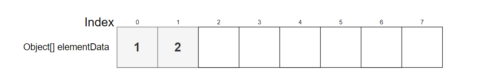
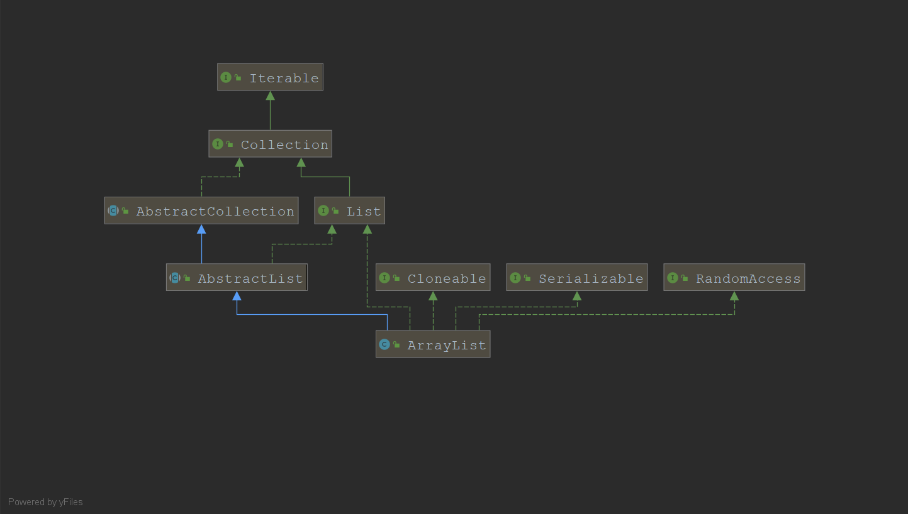
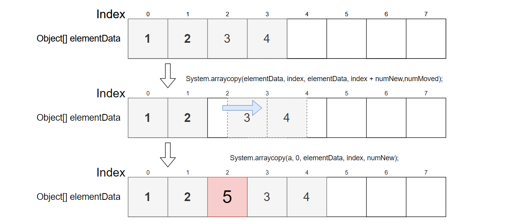
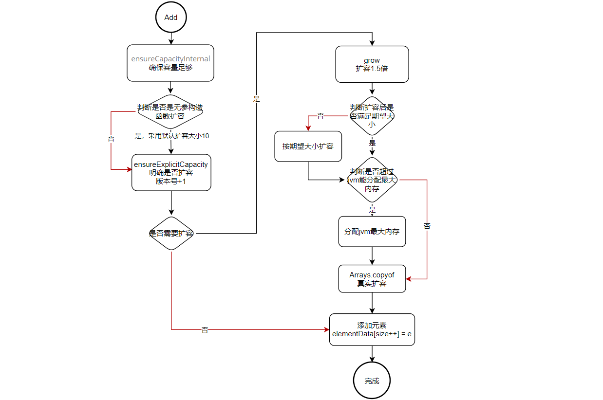

> 微信关注【面试情报局】我们一起干翻面试官。

# 1.前言

今天我们要研究的集合是ArrayList，在我们学习ArrayList之前，我们先看看面试官是如何利用ArrayList的相关知识点来吊打我们得。

>1. ArrayList的底层结构是什么？
>2. ArrayList的初始化容量是多少？
>3. ArrayList的容量会变吗?是怎么变化滴？
>4. ArrayList是线程安全的吗？
>5. ArrayList和LinkedList有什么区别？

看了这些面试题，是不是内心觉得:


言归正传，下面我们就通过ArrayList源码学习来解决解决上述问题。

# 2.概述

ArrayList是基于数组，支持自动扩容的一种数据结构。相比数组来说，因为他支持自动扩容，并且内部实现了很多操作数组的方法，所以成为我们日常开发中最常用的集合类。其内部结构如下：



# 3.类图



- `AbstractList` 抽象类，提供了List接口的相关实现和迭代逻辑的实现，不过对ArrayList意义不大，因为ArrayList大量重写了AbstractList的实现
- `List` 接口，定义了数组的增删改查迭代遍历等相关操作。
- `Cloneable` 接口，支持ArrayList克隆
- `Serializabel` 接口，支持ArrayList序列化与反序列化
- `RandomAccess` 接口，支持ArrayList快速访问

# 4.属性

先让我们看看ArrayList的源码：

```java
public class ArrayList<E> extends AbstractList<E>
        implements List<E>, RandomAccess, Cloneable, java.io.Serializable
{
    // 默认初始容量。
    private static final int DEFAULT_CAPACITY = 10;
    
    // 用于空实例的共享空数组(创建空实例时使用)
    private static final Object[] EMPTY_ELEMENTDATA = {};
    
    // 用于默认大小的空实例的共享空数组实例。
    // 我们将其与EMPTY_ELEMENTDATA区分开来，以便知道添加第一个元素时要膨胀多少。
    private static final Object[] DEFAULTCAPACITY_EMPTY_ELEMENTDATA = {};

    // 存储数组列表元素的数组缓冲区。arrayList的容量就是这个数组缓冲区的长度。
    // 任何空的ArrayList 将被扩展到10当(第一次添加元素时)
    // 注意是通过transient修饰
    transient Object[] elementData; // non-private to simplify nested class access

    // 数组列表的大小(它包含的元素数量)
    private int size;
    
    /* 要分配的数组的最大大小
     * 尝试分配更大的数组可能会导致OutOfMemoryError:请求的数组大小超过VM限制*/
    private static final int MAX_ARRAY_SIZE = Integer.MAX_VALUE - 8;
    
    // 该属性是通过继承 AbstractList 得来,列表修改的次数(版本号)
    protected transient int modCount = 0;
}
```

通过源码我们可以知道到：

- `DEFAULT_CAPACITY` 表示ArrayList的初始容量（采用无参构造时第一次添加元素扩容的容量，后面会介绍），默认是`10`。
- `elementData` 表示ArrayList实际储存数据的数组，是一个`Object[]`。
- `size` 表示该ArrayList的大小(就是`elementData`包含的元素个数)。
- `MAX_ARRAY_SIZE` 表示ArrayList能分配的最大容量 `Integer.MAX_VALUE - 8`
- `modCount` 表示该ArrayList修改的次数，在迭代时可以判断ArrayList是否被修改。

**看到这里，我们就可以很轻松回答上面的1和2两个问题。**

>1. ArrayList的底层结构是什么？
>2. ArrayList的初始化容量是多少？

**ArrayList底层实现就是一个`数组`，其初始容量是`10`。**


# 5.常用方法

## 5-1.构造函数

首先还是让我们看看源码，因为源码最有说服力。

```java
// 使用指定的初始容量构造一个空列表。
public ArrayList(int initialCapacity) {
    if (initialCapacity > 0) {
        this.elementData = new Object[initialCapacity];
    } else if (initialCapacity == 0) {
        this.elementData = EMPTY_ELEMENTDATA; // 如果为0使用默认空数组
    } else {
        throw new IllegalArgumentException("Illegal Capacity: "+initialCapacity);
    }
}

/*Constructs an empty list with an initial capacity of ten.
* 构造一个初始容量为10的空列表。(在第一次扩容时容量才为10，现在还是null)*/
public ArrayList() {
    this.elementData = DEFAULTCAPACITY_EMPTY_ELEMENTDATA;
}

// 构造一个包含指定集合的元素的列表，按照集合的迭代器返回它们的顺序。
public ArrayList(Collection<? extends E> c) {
    elementData = c.toArray(); // 将集合转变为数组
    // 赋值 size 并判非 0
    if ((size = elementData.length) != 0) {
        // c.toArray might (incorrectly) not return Object[] (see 6260652) 这是一个bug在java9已经被解决
        if (elementData.getClass() != Object[].class)
            elementData = Arrays.copyOf(elementData, size, Object[].class);
    } else {
        // replace with empty array.
        this.elementData = EMPTY_ELEMENTDATA;
    }
}
```

通过查看源码我们可以发现：

- ArrayList 有三个构造函数：指定初始化大小构造，无参构造，指定初始化数据构造
- ArrayList的无参构造，其实默认是空数组，我们上面说的初始化容量默认为`10`，是当我们用无参构造函数后，第一次向ArrayList添加元素时扩容的默认大小。

## 5-2.增加

ArrayList添加元素的方法有四个：一个是在末尾添加，一个是指定索引添加，另两个是在末尾添加集合和在指导索引位置添加集合

```java
// 将指定的元素添加到列表的末尾。
public boolean add(E e) {
    // 确保容量足够
    ensureCapacityInternal(size + 1);  // Increments modCount!!
    elementData[size++] = e;
    return true;
}

// 在列表指定的位置插入指定的元素。
// 将当前位于该位置的元素(如果有的话)和随后的元素向右移动(下标加1)。
public void add(int index, E element) {
    // 确保索引合法
    rangeCheckForAdd(index);
    // 确保容量
    ensureCapacityInternal(size + 1);  // Increments modCount!!
    // 移动元素 （原始数组,起始位置，目标数组，起始位置，拷贝大小）
    System.arraycopy(elementData, index, elementData, index + 1, size - index);
    elementData[index] = element;
    size++; // 大小加 1
}

private void ensureCapacityInternal(int minCapacity) {
    // 判断是不是通过无参构造创建的
    if (elementData == DEFAULTCAPACITY_EMPTY_ELEMENTDATA) {
        // 这才是第一次添加元素是默认扩容到10
        minCapacity = Math.max(DEFAULT_CAPACITY, minCapacity);
    }
    ensureExplicitCapacity(minCapacity);
}

// 预扩容
private void ensureExplicitCapacity(int minCapacity) {
    modCount++; // 修改版本号
    // overflow-conscious code 
    if (minCapacity - elementData.length > 0)
        grow(minCapacity);
}

// 增加容量，以确保至少可以保存由最小容量(minCapacity)参数指定的元素数量。
private void grow(int minCapacity) {
    // overflow-conscious code
    int oldCapacity = elementData.length;
    // 1.5倍扩容
    int newCapacity = oldCapacity + (oldCapacity >> 1);
    if (newCapacity - minCapacity < 0) // 扩容后不满足期望大小则以期望大小作为容量
        newCapacity = minCapacity;
    if (newCapacity - MAX_ARRAY_SIZE > 0) // 分配jvm的最大容量，防溢出
        newCapacity = hugeCapacity(minCapacity);
    // minCapacity is usually close to size, so this is a win:
    // 扩容
    elementData = Arrays.copyOf(elementData, newCapacity);
}

// 分配最大容量
private static int hugeCapacity(int minCapacity) {
    if (minCapacity < 0) // overflow 
        throw new OutOfMemoryError();
    return (minCapacity > MAX_ARRAY_SIZE) ? Integer.MAX_VALUE : MAX_ARRAY_SIZE;
}

// 将指定集合中的所有元素追加到此列表的末尾。按照指定集合的迭代器返回它们的顺序。
public boolean addAll(Collection<? extends E> c) {
    Object[] a = c.toArray(); // 集合转数组
    int numNew = a.length;	// 获取要添加的长度
    ensureCapacityInternal(size + numNew);  // Increments modCount
    System.arraycopy(a, 0, elementData, size, numNew); // 通过元素拷贝来追加元素
    size += numNew;
    return numNew != 0;
}

// 将指定集合中的所有元素插入到此列表中，从指定位置开始。
// 新元素将按照指定集合的迭代器返回的顺序出现在列表中。
public boolean addAll(int index, Collection<? extends E> c) {
    rangeCheckForAdd(index); // 检查索引是否合法
    
    Object[] a = c.toArray();
    int numNew = a.length;
    ensureCapacityInternal(size + numNew);  // Increments modCount
    
    int numMoved = size - index;
    if (numMoved > 0) // 腾出空位
        System.arraycopy(elementData, index, elementData, index + numNew,numMoved);
    // 将a拷贝到elementData
    System.arraycopy(a, 0, elementData, index, numNew);
    size += numNew;
    return numNew != 0;
}
```



通过源码我们知道ArrayList添加元素大致流程如下：



通过源码我们需要注意：

- 扩容是原容量+原容量大小一半，也就是说是按照`1.5倍`扩容:`oldCapacity + (oldCapacity >> 1)`,但最后的容量并不一定是按照这个规则计算得到的大小，因为他还有两个`if`判断。
- ArrayList中数组最大只能分配`Integer.MAX_VALUE`,在大就会导致`OutOfMemoryError`。
- ArrayList扩容时有许多溢出判断操作，这非常值得借鉴。
- ArrayList扩容底层调用的是`System.arraycopy(Object src,int srcPos,Object dest, int destPos,int length)`方法,每个参数对应为(原始数组,起始位置，目标数组，起始位置，拷贝大小)

**看到这里我们可以回答第3个问题：**

> ArrayList的容量会变吗?是怎么变化滴？

**数组容量会改变，改变的规则是按照`原数组1.5倍`进行扩容，但最终容量不一定是通过该规则计算得到的值，因为后面有两个`if`判断：1.是否满足期望容量；2.是否超出jvm分配的最大容量**


## 5-3.删除

ArrayList删除元素的方法有四个：删除指定索引位置的元素，删除指定元素，删除指定集合元素和通过过滤器删除

```java
// 删除列表中指定位置的元素。将所有后续元素向左移动(从它们的下标减去1)。
public E remove(int index) {
    // 确保index合法
    rangeCheck(index);

    modCount++;
    E oldValue = elementData(index); // 获取老元素

    int numMoved = size - index - 1;
    // 判断是否需要移动
    if (numMoved > 0)
        System.arraycopy(elementData, index+1, elementData, index,numMoved);
    elementData[--size] = null; // clear to let GC do its work

    return oldValue;
}

// 从列表中删除指定元素的第一个匹配项，如果它存在的话并返回 true。
public boolean remove(Object o) {
    if (o == null) { // 空值单独删除,因为add时也没有对null进行效验
        for (int index = 0; index < size; index++)
            if (elementData[index] == null) {
                fastRemove(index); // 移除元素
                return true;
            }
    } else {
        for (int index = 0; index < size; index++)
            if (o.equals(elementData[index])) { // 通过equals比较，如果是自定义对象元素，一定要重写它
                fastRemove(index);
                return true;
            }
    }
    return false;
}

// 跳过边界检查的移除方法(因为已经被验证边界合法)
private void fastRemove(int index) {
    modCount++;
    int numMoved = size - index - 1;
    if (numMoved > 0) // 通过数组拷贝覆盖来移除元素
        System.arraycopy(elementData, index+1, elementData, index,numMoved);
    elementData[--size] = null; // clear to let GC do its work
}

// 从此列表中删除指定集合中包含的所有元素。
// 如果此列表包含空元素，而指定的集合不允许空元素则会抛出NullPointerException
public boolean removeAll(Collection<?> c) {
    // 判断是否为null
    Objects.requireNonNull(c);
    return batchRemove(c, false);
}

// 通过不同complement来操作列表
private boolean batchRemove(Collection<?> c, boolean complement) {
    final Object[] elementData = this.elementData;
    int r = 0, w = 0;
    boolean modified = false;
    try {
        for (; r < size; r++) // complement决定操作行为
            if (c.contains(elementData[r]) == complement) 
                elementData[w++] = elementData[r];
    } finally {
        // Preserve behavioral compatibility with AbstractCollection,
        // even if c.contains() throws.
        if (r != size) {
            System.arraycopy(elementData, r,elementData, w,size - r);
            w += size - r; 
        }
        if (w != size) { // 将删除的元素赋null
            // clear to let GC do its work
            for (int i = w; i < size; i++)
                elementData[i] = null;
            modCount += size - w;
            size = w;
            modified = true;
        }
    }
    return modified;
}

@Override
public boolean removeIf(Predicate<? super E> filter) {
    Objects.requireNonNull(filter);
    // figure out which elements are to be removed 找出要删除的元素
    // any exception thrown from the filter predicate at this stage
    // will leave the collection unmodified
    int removeCount = 0;
    final BitSet removeSet = new BitSet(size); // 记录要删除元素的集合
    final int expectedModCount = modCount; // 记录版本号
    final int size = this.size;
    for (int i=0; modCount == expectedModCount && i < size; i++) {
        @SuppressWarnings("unchecked")
        final E element = (E) elementData[i];
        if (filter.test(element)) { // 记录要删除的元素index
            removeSet.set(i);
            removeCount++;
        }
    }
    if (modCount != expectedModCount) { // 如果版本号不一致，抛出异常
        throw new ConcurrentModificationException();
    }

    // shift surviving elements left over the spaces left by removed elements
    final boolean anyToRemove = removeCount > 0;
    if (anyToRemove) {
        final int newSize = size - removeCount;
        // 遍历并剔除要删除的元素
        for (int i=0, j=0; (i < size) && (j < newSize); i++, j++) {
            i = removeSet.nextClearBit(i);
            elementData[j] = elementData[i];
        }
        for (int k=newSize; k < size; k++) {
            elementData[k] = null;  // Let gc do its work
        }
        this.size = newSize;
        if (modCount != expectedModCount) {
            throw new ConcurrentModificationException();
        }
        modCount++;
    }
    return anyToRemove;
}
```

通过源码我们可以知道：

- ArrayList删除元素是通过`System.arraycopy`移动数组覆盖元素来实现的
- ArrayList添加元素时没有校验null值，所以删除null值时是特殊处理的
- ArrayList通过对象删除时判断相等是通过`equals`判断，所以我们在储存自定义对象是要注意对`equals`进行重写

**通过源码我们可以看出在使用ArrayList时我们要尽量避免大量的随机删除，因为删除元素会导致元素拷贝（尤其是大元素），这是非常消耗性能的一件事；就算我们通过`removeAll()`来删除也不是特别好，因为它也要通过`c.contains()`去查找元素，不同的集合有不同的实现方式所以查找的性能也不同。**

## 5-4.修改

ArrayList的修改比较简单，是通过指定索引修改

```java
// 将列表中指定位置的元素替换为指定的元素。
public E set(int index, E element) {
    rangeCheck(index);
    E oldValue = elementData(index);
    elementData[index] = element;
    // 返回被替换的元素
    return oldValue;
}
```

现在我们在看看第4问

> ArrayList是线程安全的吗？

通过源码的阅读，我们可以很轻松的回答这个问题。他是不安全的，因为他既没有在属性`elementData`加`validate`，也没有在方法上加`synchronized`。而且在ArrayList的类注释上明确指出他是线程不安全的，要使用线程安全的话可以使用`Collections.synchronizedList`，或者`Vector`。

```java
/* <p><strong>Note that this implementation is not synchronized.</strong>
 * If multiple threads access an <tt>ArrayList</tt> instance concurrently,
 * and at least one of the threads modifies the list structurally, it
 * <i>must</i> be synchronized externally.  (A structural modification is
 * any operation that adds or deletes one or more elements, or explicitly
 * resizes the backing array; merely setting the value of an element is not
 * a structural modification.)  This is typically accomplished by
 * synchronizing on some object that naturally encapsulates the list.
 ***************************************************************************
 * 注意，这个实现是不同步。如果多个线程同时访问ArrayList实例，且至少有一个线程在结构上修改列表，
 * 它必须外部同步。(一个结构修改：添加或删除一个或多个元素的任何操作，或者是明确的改变数组大小，
 * 仅仅设置元素的值不是结构修改) 这通常是通过在自然封装列表的对象上同步来实现的。
 
 * If no such object exists, the list should be "wrapped" using the
 * {@link Collections#synchronizedList Collections.synchronizedList}
 * method.  This is best done at creation time, to prevent accidental
 * unsynchronized access to the list:<pre>
 *   List list = Collections.synchronizedList(new ArrayList(...));</pre>
 ***************************************************************************
 * 如果不存在这样的对象，列表应该使用方法“包装”(Collections.synchronizedList)。
 * 这最好在创建时进行，以防止意外对列表的非同步访问*/
```

至于第5个问题，我们将在学习LinkedList时在来对比讲解。

# 6.总结

> 通过上面的学习，我们已经较为深刻的理解了ArrayList的底层实现，当然如果要非常深刻的理解ArrayList肯定需要自己亲自调试ArrayList的源码；作为面试和平常工作，了解到这里也差不多了。

ArrayList本质就是一个可以自动扩容的数组包装类，他通过无参构造函数初始化并第一次添加元素的扩容大小默认是10，往后每次自动扩容的大小是原数组容量的1.5倍` oldCapacity + (oldCapacity >> 1)`，在使用ArrayList时尽量确定初始化容量的大小，这样可以避免频繁扩容；也要尽量避免随机插入和删除操作，这样会引起元素移动，消耗资源(尤其是对移动大元素来说)。

最后我们在看看ArrayList的一些方法，没有必要全记住因为我也记不住，只要有个大概印象就好了，在我们要用的时候再去查找。

- trimToSize() 调整列表容量为列表的当前大小
- ensureCapacity(int minCapacity) 确保列表容量
- size() 获取列表元素个数
- contains(Object o) 判断是否包含某个对象
- indexOf(Obejct o) 从前往后查找指定对象
- lastIndexOf(Obejct o) 从后往前查找指定对象
- clone() 克隆列表
- toArray() 转换为数组
- toArray(T[] a) 转换为指定类型数组
- get(int index) 获取指定索引元素
- set(int index,E element) 指定索引位置修改
- add(E o) 向列表末尾添加元素
- add(int index,E elemet) 指定位置插入元素
- remove(int index) 移除指定索引 
- remove(Object o) 移除指定元素
- clear() 情况列表
- addAll(Collection<? extends E> c) 在列表末尾添加集合
- addAll(int index,Collection<? extends E> c) 在列表指定索引添加集合
- removeAll(Collection<? > c) 移除包含集合内的所有元素
- retainAll(Collection<? > c) 移除集合内没有的元素
- iterator() 返回一个迭代器
- subList(int fromIndex,int toIndex) 截取子数组
- forEach(Consumer<? super E> action) 增强for循环
- removeIf(Predicate<? super E> filter) 删除元素
- replaceAll(UnayOperator<E> operator) 替换指定元素
- sort(Comparator<? super E>) 排序
- isEmpty() 是否为空

> 微信关注【面试情报局】我们一起干翻面试官。

# 7.附录

```java
package java.util;

import java.util.function.Consumer;
import java.util.function.Predicate;
import java.util.function.UnaryOperator;

/**
 * Resizable-array implementation of the <tt>List</tt> interface.  Implements
 * all optional list operations, and permits all elements, including
 * <tt>null</tt>.  In addition to implementing the <tt>List</tt> interface,
 * this class provides methods to manipulate the size of the array that is
 * used internally to store the list.  (This class is roughly equivalent to
 * <tt>Vector</tt>, except that it is unsynchronized.)
 ***************************************************************************
 * 可变数组实现了List接口。实现了list所有的可选操作，和可选的属性元素包括null。
 * 除了实现List接口外，这个类提供了方法操作数组的大小，使用了内部储存列表。
 * （这个类大致等同于Vector，除了它是不同步的）
 
 * <p>The <tt>size</tt>, <tt>isEmpty</tt>, <tt>get</tt>, <tt>set</tt>,
 * <tt>iterator</tt>, and <tt>listIterator</tt> operations run in constant
 * time.  The <tt>add</tt> operation runs in <i>amortized constant time</i>,
 * that is, adding n elements requires O(n) time.  All of the other operations
 * run in linear time (roughly speaking).  The constant factor is low compared
 * to that for the <tt>LinkedList</tt> implementation.
 ***************************************************************************
 * 方法 size，isempty，get，set，iterator，listIterator 操作是恒定的时间。
 * add操作运行在平摊常数时间，也就是说添加n个元素需要o(n)时间。其他所有操作运行
 * 在线性时间(粗略估计)。这个常数影响和LinkedList实现比是较低的

 * <p>Each <tt>ArrayList</tt> instance has a <i>capacity</i>.  The capacity is
 * the size of the array used to store the elements in the list.  It is always
 * at least as large as the list size.  As elements are added to an ArrayList,
 * its capacity grows automatically.  The details of the growth policy are not
 * specified beyond the fact that adding an element has constant amortized
 * time cost.
 ***************************************************************************
 * 每个ArrayList实例有一个容量。这个容量是用于存储列表中元素的数组的大小。
 * 它总是至少与列表大小相同。当元素被添加到数组列表中，它的容量会自动增长。
 * 增长规则的细节没有指定，在添加一个元素的平摊是常数时间成本
 
 * <p>An application can increase the capacity of an <tt>ArrayList</tt> instance
 * before adding a large number of elements using the <tt>ensureCapacity</tt>
 * operation.  This may reduce the amount of incremental reallocation.
 ***************************************************************************
 * 一个应用程序可以增加ArrayList实例的容量在添加大量的元素使用ensureCapacity操作前。
 * 这可能会减少增量重新分配的数量。
 
 * <p><strong>Note that this implementation is not synchronized.</strong>
 * If multiple threads access an <tt>ArrayList</tt> instance concurrently,
 * and at least one of the threads modifies the list structurally, it
 * <i>must</i> be synchronized externally.  (A structural modification is
 * any operation that adds or deletes one or more elements, or explicitly
 * resizes the backing array; merely setting the value of an element is not
 * a structural modification.)  This is typically accomplished by
 * synchronizing on some object that naturally encapsulates the list.
 ***************************************************************************
 * 注意，这个实现是不同步。如果多个线程同时访问ArrayList实例，且至少有一个线程在结构上修改列表，
 * 它必须外部同步。(一个结构修改：添加或删除一个或多个元素的任何操作，或者是明确的改变数组大小，
 * 仅仅设置元素的值不是结构修改) 这通常是通过在自然封装列表的对象上同步来实现的。
 
 * If no such object exists, the list should be "wrapped" using the
 * {@link Collections#synchronizedList Collections.synchronizedList}
 * method.  This is best done at creation time, to prevent accidental
 * unsynchronized access to the list:<pre>
 *   List list = Collections.synchronizedList(new ArrayList(...));</pre>
 ***************************************************************************
 * 如果不存在这样的对象，列表应该使用方法“包装”(Collections.synchronizedList)。
 * 这最好在创建时进行，以防止意外对列表的非同步访问
 
 * <p><a name="fail-fast">
 * The iterators returned by this class's {@link #iterator() iterator} and
 * {@link #listIterator(int) listIterator} methods are <em>fail-fast</em>:</a>
 * if the list is structurally modified at any time after the iterator is
 * created, in any way except through the iterator's own
 * {@link ListIterator#remove() remove} or
 * {@link ListIterator#add(Object) add} methods, the iterator will throw a
 * {@link ConcurrentModificationException}.  Thus, in the face of
 * concurrent modification, the iterator fails quickly and cleanly, rather
 * than risking arbitrary, non-deterministic behavior at an undetermined
 * time in the future.
 ***************************************************************************
 * 如果列表在迭代器创建之后的任何时间被结构修改,任何方式都可以，除非通过迭代器自己的方式(remove,add)
 * 迭代器将抛出ConcurrentModificationException的异常。因此在面对并发修改时，迭代器快速而干净地失败
 * ，而不是冒着武断的风险，未来不确定时间的不确定行为
 *
 * <p>Note that the fail-fast behavior of an iterator cannot be guaranteed
 * as it is, generally speaking, impossible to make any hard guarantees in the
 * presence of unsynchronized concurrent modification.  Fail-fast iterators
 * throw {@code ConcurrentModificationException} on a best-effort basis.
 * Therefore, it would be wrong to write a program that depended on this
 * exception for its correctness:  <i>the fail-fast behavior of iterators
 * should be used only to detect bugs.</i>
 *
 * 注意，不能保证迭代器快速失败的行为，因为一般来说，在存在非同步并发修改的情况下，不可能做出任何硬保证
 * 安全失败近最大努力抛出异常，迭代器的快速失败行为应该只用于检测bug。
 * <p>This class is a member of the
 * <a href="{@docRoot}/../technotes/guides/collections/index.html">
 * Java Collections Framework</a>.
 *
 * @author  Josh Bloch
 * @author  Neal Gafter
 * @see     Collection
 * @see     List
 * @see     LinkedList
 * @see     Vector
 * @since   1.2
 */

public class ArrayList<E> extends AbstractList<E>
        implements List<E>, RandomAccess, Cloneable, java.io.Serializable
{
    private static final long serialVersionUID = 8683452581122892189L;

    /**
     * Default initial capacity.
     * 默认初始容量。
     */
    private static final int DEFAULT_CAPACITY = 10;

    /**
     * Shared empty array instance used for empty instances.
     * 用于空实例的共享空数组实例。
     */
    private static final Object[] EMPTY_ELEMENTDATA = {};

    /**
     * Shared empty array instance used for default sized empty instances. We
     * distinguish this from EMPTY_ELEMENTDATA to know how much to inflate when
     * first element is added.
     * 用于默认大小的空实例的共享空数组实例。
     * 我们将其与EMPTY_ELEMENTDATA区分开来，以便知道添加第一个元素时要膨胀多少。
     */
    private static final Object[] DEFAULTCAPACITY_EMPTY_ELEMENTDATA = {};

    /**
     * The array buffer into which the elements of the ArrayList are stored.
     * The capacity of the ArrayList is the length of this array buffer. Any
     * empty ArrayList with elementData == DEFAULTCAPACITY_EMPTY_ELEMENTDATA
     * will be expanded to DEFAULT_CAPACITY when the first element is added.
     * 存储数组列表元素的数组缓冲区。arrayList的容量就是这个数组缓冲区的长度。
     * 任何空的ArrayList 将被扩展到10当第一次添加元素时
     */
    transient Object[] elementData; // non-private to simplify nested class access

    /**
     * The size of the ArrayList (the number of elements it contains).
     * 数组列表的大小(它包含的元素数量)
     * @serial
     */
    private int size;

    /**
     * Constructs an empty list with the specified initial capacity.
     * 使用指定的初始容量构造一个空列表。
     * @param  initialCapacity  the initial capacity of the list
     * @throws IllegalArgumentException if the specified initial capacity
     *         is negative
     */
    public ArrayList(int initialCapacity) {
        if (initialCapacity > 0) {
            this.elementData = new Object[initialCapacity];
        } else if (initialCapacity == 0) {
            this.elementData = EMPTY_ELEMENTDATA;
        } else {
            throw new IllegalArgumentException("Illegal Capacity: "+initialCapacity);
        }
    }

    /**
     * Constructs an empty list with an initial capacity of ten.
     * 构造一个初始容量为10的空列表。
     */
    public ArrayList() {
        this.elementData = DEFAULTCAPACITY_EMPTY_ELEMENTDATA;
    }

    /**
     * Constructs a list containing the elements of the specified
     * collection, in the order they are returned by the collection's
     * iterator.
     * 构造一个包含指定集合的元素的列表，按照集合的迭代器返回它们的顺序。
     * @param c the collection whose elements are to be placed into this list
     * @throws NullPointerException if the specified collection is null
     */
    public ArrayList(Collection<? extends E> c) {
        elementData = c.toArray();
        // 赋值 size 并判非 0
        if ((size = elementData.length) != 0) {
            // c.toArray might (incorrectly) not return Object[] (see 6260652)
            if (elementData.getClass() != Object[].class)
                elementData = Arrays.copyOf(elementData, size, Object[].class);
        } else {
            // replace with empty array.
            this.elementData = EMPTY_ELEMENTDATA;
        }
    }

    /**
     * Trims the capacity of this <tt>ArrayList</tt> instance to be the
     * list's current size.  An application can use this operation to minimize
     * the storage of an <tt>ArrayList</tt> instance.
     * 将ArrayList实例的容量调整为列表的当前大小。
     * 应用程序可以使用这个操作来最小化ArrayList实例的存储。
     */
    public void trimToSize() {
        modCount++; // 修改次数
        if (size < elementData.length) {
            elementData = (size == 0) ? EMPTY_ELEMENTDATA : Arrays.copyOf(elementData, size);
        }
    }

    /**
     * Increases the capacity of this <tt>ArrayList</tt> instance, if
     * necessary, to ensure that it can hold at least the number of elements
     * specified by the minimum capacity argument.
     * 增加ArrayList实例的容量，必要时，确保它至少可以容纳由最小容量参数指定的元素数量。
     * @param   minCapacity   the desired minimum capacity 期望的最小容量
     */
    public void ensureCapacity(int minCapacity) {
        int minExpand = (elementData != DEFAULTCAPACITY_EMPTY_ELEMENTDATA)
            // any size if not default element table
            ? 0
            // larger than default for default empty table. It's already
            // supposed to be at default size.
            : DEFAULT_CAPACITY;
		// 期望最小容量大于当前容量，扩容
        if (minCapacity > minExpand) {
            ensureExplicitCapacity(minCapacity);
        }
    }

    private void ensureCapacityInternal(int minCapacity) {
        if (elementData == DEFAULTCAPACITY_EMPTY_ELEMENTDATA) {
            minCapacity = Math.max(DEFAULT_CAPACITY, minCapacity);
        }

        ensureExplicitCapacity(minCapacity);
    }
	
    // 预扩容
    private void ensureExplicitCapacity(int minCapacity) {
        modCount++;

        // overflow-conscious code
        if (minCapacity - elementData.length > 0)
            grow(minCapacity);
    }

    /**
     * The maximum size of array to allocate.
     * Some VMs reserve some header words in an array.
     * Attempts to allocate larger arrays may result in
     * OutOfMemoryError: Requested array size exceeds VM limit
     * 要分配的数组的最大大小。
     * 有些虚拟机在数组中保留一些头词。
     * 尝试分配更大的数组可能会导致OutOfMemoryError:请求的数组大小超过VM限制
     */
    private static final int MAX_ARRAY_SIZE = Integer.MAX_VALUE - 8;

    /**
     * Increases the capacity to ensure that it can hold at least the
     * number of elements specified by the minimum capacity argument.
     * 增加容量，以确保至少可以保存由最小容量参数指定的元素数量。
     * @param minCapacity the desired minimum capacity
     */
    private void grow(int minCapacity) {
        // overflow-conscious code
        int oldCapacity = elementData.length;
        // 1.5倍扩容
        int newCapacity = oldCapacity + (oldCapacity >> 1);
        if (newCapacity - minCapacity < 0) // 扩容后不满足期望大小则以期望大小作为容量
            newCapacity = minCapacity;
        if (newCapacity - MAX_ARRAY_SIZE > 0) // 分配最大容量，防溢出
            newCapacity = hugeCapacity(minCapacity);
        // minCapacity is usually close to size, so this is a win:
        // 扩容
        elementData = Arrays.copyOf(elementData, newCapacity);
    }
    
	// 分配最大容量
    private static int hugeCapacity(int minCapacity) {
        if (minCapacity < 0) // overflow 
            throw new OutOfMemoryError();
        return (minCapacity > MAX_ARRAY_SIZE) ? Integer.MAX_VALUE : MAX_ARRAY_SIZE;
    }

    /**
     * Returns the number of elements in this list.
     * 返回列表中元素的数量。
     * @return the number of elements in this list
     */
    public int size() {
        return size;
    }

    /**
     * Returns <tt>true</tt> if this list contains no elements.
     * 如果列表中没有元素，则返回true。
     * @return <tt>true</tt> if this list contains no elements
     */
    public boolean isEmpty() {
        return size == 0;
    }

    /**
     * Returns <tt>true</tt> if this list contains the specified element.
     * More formally, returns <tt>true</tt> if and only if this list contains
     * at least one element <tt>e</tt> such that
     * <tt>(o==null&nbsp;?&nbsp;e==null&nbsp;:&nbsp;o.equals(e))</tt>.
     * 如果列表中包含指定的元素，则返回true。
     * 更正式地说，返回true当且仅当此列表包含至少一个元素e
     * @param o element whose presence in this list is to be tested
     * @return <tt>true</tt> if this list contains the specified element
     */
    public boolean contains(Object o) {
        return indexOf(o) >= 0;
    }

    /**
     * Returns the index of the first occurrence of the specified element
     * in this list, or -1 if this list does not contain the element.
     * More formally, returns the lowest index <tt>i</tt> such that
     * <tt>(o==null&nbsp;?&nbsp;get(i)==null&nbsp;:&nbsp;o.equals(get(i)))</tt>,
     * or -1 if there is no such index.
     * 返回列表中指定元素的第一个匹配项的索引，如果列表中不包含元素，则为-1。
     * 更正式地说，返回最低的索引i，如果列表中不包含元素，则为-1。
     */
    public int indexOf(Object o) { // 可以查null
        if (o == null) {
            for (int i = 0; i < size; i++)
                if (elementData[i]==null)
                    return i;
        } else {
            for (int i = 0; i < size; i++)
                if (o.equals(elementData[i]))
                    return i;
        }
        return -1;
    }

    /**
     * Returns the index of the last occurrence of the specified element
     * in this list, or -1 if this list does not contain the element.
     * More formally, returns the highest index <tt>i</tt> such that
     * <tt>(o==null&nbsp;?&nbsp;get(i)==null&nbsp;:&nbsp;o.equals(get(i)))</tt>,
     * or -1 if there is no such index.
     * 返回列表中指定元素的最后一次匹配项的索引，如果列表中不包含元素，则为-1。
     * 更正式地说，返回最高的索引i，如果列表中不包含元素，则为-1。
     */
    public int lastIndexOf(Object o) {
        if (o == null) {
            for (int i = size-1; i >= 0; i--)
                if (elementData[i]==null)
                    return i;
        } else {
            for (int i = size-1; i >= 0; i--)
                if (o.equals(elementData[i]))
                    return i;
        }
        return -1;
    }

    /**
     * Returns a shallow copy of this <tt>ArrayList</tt> instance.  (The
     * elements themselves are not copied.)
     * 返回这个ArrayList实例的浅拷贝。元素本身不会被复制。
     * @return a clone of this <tt>ArrayList</tt> instance
     */
    public Object clone() {
        try {
            ArrayList<?> v = (ArrayList<?>) super.clone();
            v.elementData = Arrays.copyOf(elementData, size);
            v.modCount = 0;
            return v;
        } catch (CloneNotSupportedException e) {
            // this shouldn't happen, since we are Cloneable
            throw new InternalError(e);
        }
    }

    /**
     * Returns an array containing all of the elements in this list
     * in proper sequence (from first to last element).
     * 返回一个数组，以正确的顺序(从第一个元素到最后一个元素)包含列表中的所有元素。
     * <p>The returned array will be "safe" in that no references to it are
     * maintained by this list.  (In other words, this method must allocate
     * a new array).  The caller is thus free to modify the returned array.
     * 返回的数组将是“安全的”，因为这个列表不维护对它的引用。(换句话说，这个方法必须分配一个新数组)。
     * 因此，调用者可以自由地修改返回的数组。
     * <p>This method acts as bridge between array-based and collection-based
     * APIs.
     * 此方法充当基于数组的api和基于集合的api之间的桥梁。
     * @return an array containing all of the elements in this list in
     *         proper sequence
     */
    public Object[] toArray() {
        return Arrays.copyOf(elementData, size);
    }

    /**
     * Returns an array containing all of the elements in this list in proper
     * sequence (from first to last element); the runtime type of the returned
     * array is that of the specified array.  If the list fits in the
     * specified array, it is returned therein.  Otherwise, a new array is
     * allocated with the runtime type of the specified array and the size of
     * this list.
     * 返回一个数组，以正确的顺序(从第一个元素到最后一个元素)包含列表中的所有元素。
     * 返回的数组的运行时类型是指定数组的运行时类型。如果列表符合指定的数组，它将在其中返回。
     * 否则，将使用指定数组的运行时类型和该列表的大小分配一个新数组。
     * <p>If the list fits in the specified array with room to spare
     * (i.e., the array has more elements than the list), the element in
     * the array immediately following the end of the collection is set to
     * <tt>null</tt>.  (This is useful in determining the length of the
     * list <i>only</i> if the caller knows that the list does not contain
     * any null elements.)
     * 果列表符合指定的数组，并且有剩余空间(例如，数组的元素比列表的元素多)，
     * 紧挨着集合末尾的数组元素被设置为null。
     * 只有当调用者知道列表不包含任何空元素时，这才有助于确定列表的长度。
     * @param a the array into which the elements of the list are to
     *          be stored, if it is big enough; otherwise, a new array of the
     *          same runtime type is allocated for this purpose.
     *          如果列表的元素足够大，则将存储在其中的数组
     *			否则，将为此目的分配一个相同运行时类型的新数组。
     * @return an array containing the elements of the list
     * @throws ArrayStoreException if the runtime type of the specified array
     *         is not a supertype of the runtime type of every element in
     *         this list
     * @throws NullPointerException if the specified array is null
     */
    @SuppressWarnings("unchecked")
    public <T> T[] toArray(T[] a) {
        if (a.length < size)
            // Make a new array of a's runtime type, but my contents:
            // 创建一个运行时类型为a的新数组
            return (T[]) Arrays.copyOf(elementData, size, a.getClass());
        // 拷贝数组
        System.arraycopy(elementData, 0, a, 0, size);
        if (a.length > size) // ??
            a[size] = null;
        return a;
    }

    // Positional Access Operations

    @SuppressWarnings("unchecked")
    E elementData(int index) {
        return (E) elementData[index];
    }

    /**
     * Returns the element at the specified position in this list.
     * 返回列表中指定位置的元素。
     * @param  index index of the element to return
     * @return the element at the specified position in this list
     * @throws IndexOutOfBoundsException {@inheritDoc}
     */
    public E get(int index) {
        // 判断下标是否越界
        rangeCheck(index);
        return elementData(index);
    }

    /**
     * Replaces the element at the specified position in this list with
     * the specified element.
     * 将列表中指定位置的元素替换为指定的元素。
     * @param index index of the element to replace
     * @param element element to be stored at the specified position
     * @return the element previously at the specified position
     * @throws IndexOutOfBoundsException {@inheritDoc}
     */
    public E set(int index, E element) {
        rangeCheck(index);
        E oldValue = elementData(index);
        elementData[index] = element;
        // 返回被替换的元素
        return oldValue;
    }

    /**
     * Appends the specified element to the end of this list.
     * 将指定的元素添加到列表的末尾。
     * @param e element to be appended to this list
     * @return <tt>true</tt> (as specified by {@link Collection#add})
     */
    public boolean add(E e) {
        // 扩容
        ensureCapacityInternal(size + 1);  // Increments modCount!!
        elementData[size++] = e;
        return true;
    }

    /**
     * Inserts the specified element at the specified position in this
     * list. Shifts the element currently at that position (if any) and
     * any subsequent elements to the right (adds one to their indices).
     * 在列表指定的位置插入指定的元素。
     * 将当前位于该位置的元素(如果有的话)和随后的元素向右移动(下标加1)。
     * @param index index at which the specified element is to be inserted
     * @param element element to be inserted
     * @throws IndexOutOfBoundsException {@inheritDoc}
     */
    public void add(int index, E element) {
        // 确保索引合法
        rangeCheckForAdd(index);
		// 确保容量
        ensureCapacityInternal(size + 1);  // Increments modCount!!
        // 移动元素 （原始数组,起始位置，目标数组，起始位置，拷贝大小）
        System.arraycopy(elementData, index, elementData, index + 1, size - index);
        elementData[index] = element;
        size++;
    }

    /**
     * Removes the element at the specified position in this list.
     * Shifts any subsequent elements to the left (subtracts one from their
     * indices).
     * 删除列表中指定位置的元素。将所有后续元素向左移动(从它们的下标减去1)。
     * @param index the index of the element to be removed
     * @return the element that was removed from the list
     * @throws IndexOutOfBoundsException {@inheritDoc}
     */
    public E remove(int index) {
        // 确保index合法
        rangeCheck(index);

        modCount++;
        E oldValue = elementData(index);

        int numMoved = size - index - 1;
        // 判断是否需要移动
        if (numMoved > 0)
            System.arraycopy(elementData, index+1, elementData, index,numMoved);
        elementData[--size] = null; // clear to let GC do its work

        return oldValue;
    }

    /**
     * Removes the first occurrence of the specified element from this list,
     * if it is present.  If the list does not contain the element, it is
     * unchanged.  More formally, removes the element with the lowest index
     * <tt>i</tt> such that
     * <tt>(o==null&nbsp;?&nbsp;get(i)==null&nbsp;:&nbsp;o.equals(get(i)))</tt>
     * (if such an element exists).  Returns <tt>true</tt> if this list
     * contained the specified element (or equivalently, if this list
     * changed as a result of the call).
     * 从列表中删除指定元素的第一个匹配项，如果它存在的话。
     * 更正式的做法是删除索引最低的元素，如果存在这样的元素。
     * 如果列表中包含了指定的元素，则返回 true
     * @param o element to be removed from this list, if present
     * @return <tt>true</tt> if this list contained the specified element
     */
    public boolean remove(Object o) {
        if (o == null) { // 空值单独删除
            for (int index = 0; index < size; index++)
                if (elementData[index] == null) {
                    fastRemove(index);
                    return true;
                }
        } else {
            for (int index = 0; index < size; index++)
                if (o.equals(elementData[index])) {
                    fastRemove(index);
                    return true;
                }
        }
        return false;
    }

    /*
     * Private remove method that skips bounds checking and does not
     * 跳过边界检查的移除方法
     * return the value removed.
     */
    private void fastRemove(int index) {
        modCount++;
        int numMoved = size - index - 1;
        if (numMoved > 0)
            System.arraycopy(elementData, index+1, elementData, index,numMoved);
        elementData[--size] = null; // clear to let GC do its work
    }

    /**
     * Removes all of the elements from this list.  The list will
     * be empty after this call returns.
     * 从列表中删除所有元素。这个调用返回后，列表将为空
     */
    public void clear() {
        modCount++;

        // clear to let GC do its work
        for (int i = 0; i < size; i++)
            elementData[i] = null;

        size = 0;
    }

    /**
     * Appends all of the elements in the specified collection to the end of
     * this list, in the order that they are returned by the
     * specified collection's Iterator.  The behavior of this operation is
     * undefined if the specified collection is modified while the operation
     * is in progress.  (This implies that the behavior of this call is
     * undefined if the specified collection is this list, and this
     * list is nonempty.)
     * 将指定集合中的所有元素追加到此列表的末尾。按照指定集合的迭代器返回它们的顺序。
     * 如果在操作进行中修改了指定的集合，则此操作的行为未定义。
     * @param c collection containing elements to be added to this list
     * @return <tt>true</tt> if this list changed as a result of the call
     * @throws NullPointerException if the specified collection is null
     */
    public boolean addAll(Collection<? extends E> c) {
        Object[] a = c.toArray();
        int numNew = a.length;
        ensureCapacityInternal(size + numNew);  // Increments modCount
        System.arraycopy(a, 0, elementData, size, numNew);
        size += numNew;
        return numNew != 0;
    }

    /**
     * Inserts all of the elements in the specified collection into this
     * list, starting at the specified position.  Shifts the element
     * currently at that position (if any) and any subsequent elements to
     * the right (increases their indices).  The new elements will appear
     * in the list in the order that they are returned by the
     * specified collection's iterator.
     * 将指定集合中的所有元素插入到此列表中，从指定位置开始。
     * 新元素将按照指定集合的迭代器返回的顺序出现在列表中。
     * @param index index at which to insert the first element from the
     *              specified collection
     * @param c collection containing elements to be added to this list
     * @return <tt>true</tt> if this list changed as a result of the call
     * @throws IndexOutOfBoundsException {@inheritDoc}
     * @throws NullPointerException if the specified collection is null
     */
    public boolean addAll(int index, Collection<? extends E> c) {
        rangeCheckForAdd(index);

        Object[] a = c.toArray();
        int numNew = a.length;
        ensureCapacityInternal(size + numNew);  // Increments modCount

        int numMoved = size - index;
        if (numMoved > 0) // 腾出空位
            System.arraycopy(elementData, index, elementData, index + numNew,numMoved);
		// 将a拷贝到elementData
        System.arraycopy(a, 0, elementData, index, numNew);
        size += numNew;
        return numNew != 0;
    }

    /**
     * Removes from this list all of the elements whose index is between
     * {@code fromIndex}, inclusive, and {@code toIndex}, exclusive.
     * Shifts any succeeding elements to the left (reduces their index).
     * This call shortens the list by {@code (toIndex - fromIndex)} elements.
     * (If {@code toIndex==fromIndex}, this operation has no effect.)
     * 删除列表fromIndex-toIndex的元素，这个调用缩短了列表
     * @throws IndexOutOfBoundsException if {@code fromIndex} or
     *         {@code toIndex} is out of range
     *         ({@code fromIndex < 0 ||
     *          fromIndex >= size() ||
     *          toIndex > size() ||
     *          toIndex < fromIndex})
     */
    protected void removeRange(int fromIndex, int toIndex) {
        modCount++;
        int numMoved = size - toIndex;
        System.arraycopy(elementData, toIndex, elementData, fromIndex,numMoved);

        // clear to let GC do its work
        int newSize = size - (toIndex-fromIndex);
        // 清空删除的元素
        for (int i = newSize; i < size; i++) {
            elementData[i] = null;
        }
        size = newSize;
    }

    /**
     * Checks if the given index is in range.  If not, throws an appropriate
     * runtime exception.  This method does *not* check if the index is
     * negative: It is always used immediately prior to an array access,
     * which throws an ArrayIndexOutOfBoundsException if index is negative.
     */
    private void rangeCheck(int index) {
        if (index >= size)
            throw new IndexOutOfBoundsException(outOfBoundsMsg(index));
    }

    /**
     * A version of rangeCheck used by add and addAll.
     */
    private void rangeCheckForAdd(int index) {
        if (index > size || index < 0)
            throw new IndexOutOfBoundsException(outOfBoundsMsg(index));
    }

    /**
     * Constructs an IndexOutOfBoundsException detail message.
     * Of the many possible refactorings of the error handling code,
     * this "outlining" performs best with both server and client VMs.
     */
    private String outOfBoundsMsg(int index) {
        return "Index: "+index+", Size: "+size;
    }

    /**
     * Removes from this list all of its elements that are contained in the
     * specified collection.
     * 从此列表中删除指定集合中包含的所有元素。
     * @param c collection containing elements to be removed from this list
     * @return {@code true} if this list changed as a result of the call
     * @throws ClassCastException if the class of an element of this list
     *         is incompatible with the specified collection
     * (<a href="Collection.html#optional-restrictions">optional</a>)
     * @throws NullPointerException if this list contains a null element and the
     *         specified collection does not permit null elements
     * 如果此列表包含空元素，而指定的集合不允许空元素
     * (<a href="Collection.html#optional-restrictions">optional</a>),
     *         or if the specified collection is null
     * @see Collection#contains(Object)
     */
    public boolean removeAll(Collection<?> c) {
        // 判断是否为null
        Objects.requireNonNull(c);
        return batchRemove(c, false);
    }

    /**
     * Retains only the elements in this list that are contained in the
     * specified collection.  In other words, removes from this list all
     * of its elements that are not contained in the specified collection.
     * 只保留列表中包含在指定集合中的元素。
     * @param c collection containing elements to be retained in this list
     * @return {@code true} if this list changed as a result of the call
     * @throws ClassCastException if the class of an element of this list
     *         is incompatible with the specified collection
     * (<a href="Collection.html#optional-restrictions">optional</a>)
     * @throws NullPointerException if this list contains a null element and the
     *         specified collection does not permit null elements
     * (<a href="Collection.html#optional-restrictions">optional</a>),
     *         or if the specified collection is null
     * @see Collection#contains(Object)
     */
    public boolean retainAll(Collection<?> c) {
        Objects.requireNonNull(c);
        return batchRemove(c, true);
    }

    private boolean batchRemove(Collection<?> c, boolean complement) {
        final Object[] elementData = this.elementData;
        int r = 0, w = 0;
        boolean modified = false;
        try {
            for (; r < size; r++) // complement是不同操作行为
                if (c.contains(elementData[r]) == complement) 
                    elementData[w++] = elementData[r];
        } finally {
            // Preserve behavioral compatibility with AbstractCollection,
            // even if c.contains() throws.
            if (r != size) {
                System.arraycopy(elementData, r,elementData, w,size - r);
                w += size - r; 
            }
            if (w != size) { // 将删除的元素赋null
                // clear to let GC do its work
                for (int i = w; i < size; i++)
                    elementData[i] = null;
                modCount += size - w;
                size = w;
                modified = true;
            }
        }
        return modified;
    }

    /**
     * Save the state of the <tt>ArrayList</tt> instance to a stream (that
     * is, serialize it).
     *
     * @serialData The length of the array backing the <tt>ArrayList</tt>
     *             instance is emitted (int), followed by all of its elements
     *             (each an <tt>Object</tt>) in the proper order.
     */
    private void writeObject(java.io.ObjectOutputStream s)
        throws java.io.IOException{
        // Write out element count, and any hidden stuff
        int expectedModCount = modCount;
        s.defaultWriteObject();

        // Write out size as capacity for behavioural compatibility with clone()
        s.writeInt(size);

        // Write out all elements in the proper order.
        for (int i=0; i<size; i++) {
            s.writeObject(elementData[i]);
        }

        if (modCount != expectedModCount) {
            throw new ConcurrentModificationException();
        }
    }

    /**
     * Reconstitute the <tt>ArrayList</tt> instance from a stream (that is,
     * deserialize it).
     */
    private void readObject(java.io.ObjectInputStream s)
        throws java.io.IOException, ClassNotFoundException {
        elementData = EMPTY_ELEMENTDATA;

        // Read in size, and any hidden stuff
        s.defaultReadObject();

        // Read in capacity
        s.readInt(); // ignored

        if (size > 0) {
            // be like clone(), allocate array based upon size not capacity
            ensureCapacityInternal(size);

            Object[] a = elementData;
            // Read in all elements in the proper order.
            for (int i=0; i<size; i++) {
                a[i] = s.readObject();
            }
        }
    }

    /**
     * Returns a list iterator over the elements in this list (in proper
     * sequence), starting at the specified position in the list.
     * The specified index indicates the first element that would be
     * returned by an initial call to {@link ListIterator#next next}.
     * An initial call to {@link ListIterator#previous previous} would
     * return the element with the specified index minus one.
     * 返回列表中元素的列表迭代器(按正确顺序)，从列表中的指定位置开始。
     * 
     * <p>The returned list iterator is <a href="#fail-fast"><i>fail-fast</i></a>.
     * 返回的列表迭代器是fail-fast。
     * @throws IndexOutOfBoundsException {@inheritDoc}
     */
    public ListIterator<E> listIterator(int index) {
        if (index < 0 || index > size)
            throw new IndexOutOfBoundsException("Index: "+index);
        return new ListItr(index);
    }

    /**
     * Returns a list iterator over the elements in this list (in proper
     * sequence).
     * 返回列表中所有元素的列表迭代器
     * <p>The returned list iterator is <a href="#fail-fast"><i>fail-fast</i></a>.
     *
     * @see #listIterator(int)
     */
    public ListIterator<E> listIterator() {
        return new ListItr(0);
    }

    /**
     * Returns an iterator over the elements in this list in proper sequence.
     *
     * <p>The returned iterator is <a href="#fail-fast"><i>fail-fast</i></a>.
     *
     * @return an iterator over the elements in this list in proper sequence
     */
    public Iterator<E> iterator() {
        return new Itr();
    }

    /**
     * An optimized version of AbstractList.Itr
     */
    private class Itr implements Iterator<E> {
        int cursor;       // index of next element to return 要返回的下一个元素的索引
        				  // 返回的最后一个元素的索引;如果没有返回-1
        int lastRet = -1; // index of last element returned; -1 if no such
        int expectedModCount = modCount;

        // 判断有没有下一元素
        public boolean hasNext() {
            return cursor != size;
        }

        @SuppressWarnings("unchecked")
        public E next() {
            // 检查版本是否被修改，被修改抛出异常，主要是为多线程情况下
            checkForComodification();
            int i = cursor;
            if (i >= size)
                throw new NoSuchElementException();
            // 获取当前的对象的元素
            Object[] elementData = ArrayList.this.elementData;
            if (i >= elementData.length)
                throw new ConcurrentModificationException();
            cursor = i + 1;
            // 返回下一个元素，并更新lastRet
            return (E) elementData[lastRet = i];
        }

        public void remove() {
            if (lastRet < 0)
                throw new IllegalStateException();
            checkForComodification();

            try {
                // 调用ArrayList的删除
                ArrayList.this.remove(lastRet);
                // 更新位置，注意
                cursor = lastRet;
                lastRet = -1;
                // 更新修改版本
                expectedModCount = modCount;
            } catch (IndexOutOfBoundsException ex) {
                throw new ConcurrentModificationException();
            }
        }
        /* 测试 remove()
        public static void main(String[] args) {
            List<Integer> list = new ArrayList<>();
            list.add(1);
            list.add(2);
            list.add(3);
            Iterator<Integer> it = list.iterator();
            while (it.hasNext()){
                System.out.println(it.next());
                it.remove();
            }
            System.out.println(list.size());
        } */
   

        @Override
        @SuppressWarnings("unchecked") // 消费
        public void forEachRemaining(Consumer<? super E> consumer) {
            Objects.requireNonNull(consumer);
            final int size = ArrayList.this.size;
            int i = cursor;
            if (i >= size) {
                return;
            }
            final Object[] elementData = ArrayList.this.elementData;
            if (i >= elementData.length) {
                throw new ConcurrentModificationException();
            }
            while (i != size && modCount == expectedModCount) {
                consumer.accept((E) elementData[i++]);
            }
            // update once at end of iteration to reduce heap write traffic
            cursor = i;
            lastRet = i - 1;
            checkForComodification();
        }

        final void checkForComodification() {
            if (modCount != expectedModCount)
                throw new ConcurrentModificationException();
        }
    }

    /**
     * An optimized version of AbstractList.ListItr
     */
    private class ListItr extends Itr implements ListIterator<E> {
        ListItr(int index) {
            super();
            cursor = index;
        }

        public boolean hasPrevious() {
            return cursor != 0;
        }

        public int nextIndex() {
            return cursor;
        }

        public int previousIndex() {
            return cursor - 1;
        }

        @SuppressWarnings("unchecked")
        public E previous() {
            checkForComodification();
            int i = cursor - 1;
            if (i < 0)
                throw new NoSuchElementException();
            Object[] elementData = ArrayList.this.elementData;
            if (i >= elementData.length)
                throw new ConcurrentModificationException();
            cursor = i;
            return (E) elementData[lastRet = i];
        }

        public void set(E e) {
            if (lastRet < 0)
                throw new IllegalStateException();
            checkForComodification();

            try {
                ArrayList.this.set(lastRet, e);
            } catch (IndexOutOfBoundsException ex) {
                throw new ConcurrentModificationException();
            }
        }

        public void add(E e) {
            checkForComodification();

            try {
                int i = cursor;
                ArrayList.this.add(i, e);
                cursor = i + 1;
                lastRet = -1;
                expectedModCount = modCount;
            } catch (IndexOutOfBoundsException ex) {
                throw new ConcurrentModificationException();
            }
        }
    }

    /**
     * Returns a view of the portion of this list between the specified
     * {@code fromIndex}, inclusive, and {@code toIndex}, exclusive.  (If
     * {@code fromIndex} and {@code toIndex} are equal, the returned list is
     * empty.)  The returned list is backed by this list, so non-structural
     * changes in the returned list are reflected in this list, and vice-versa.
     * The returned list supports all of the optional list operations.
     * 返回此列表指定(fromIndex-toIndex)的部分的视图,fromIndex=toIndex返回空
     * 返回的列表由该列表支持，因此返回列表中的非结构化更改反映在该列表中，反之亦然。
     * 返回的列表支持所有可选的列表操作。
     * <p>This method eliminates the need for explicit range operations (of
     * the sort that commonly exist for arrays).  Any operation that expects
     * a list can be used as a range operation by passing a subList view
     * instead of a whole list.  For example, the following idiom
     * removes a range of elements from a list:
     * <pre>
     *      list.subList(from, to).clear();
     * </pre>
     * Similar idioms may be constructed for {@link #indexOf(Object)} and
     * {@link #lastIndexOf(Object)}, and all of the algorithms in the
     * {@link Collections} class can be applied to a subList.
     * 这个方法不需要显式的范围操作(数组通常存在的那种操作)。
     * 任何需要列表的操作都可以通过传递子列表视图而不是整个列表来作为范围操作。
     * 例如，下面的习惯用法从列表中删除一系列元素。
     * <p>The semantics of the list returned by this method become undefined if
     * the backing list (i.e., this list) is <i>structurally modified</i> in
     * any way other than via the returned list.  (Structural modifications are
     * those that change the size of this list, or otherwise perturb it in such
     * a fashion that iterations in progress may yield incorrect results.)
     *
     * @throws IndexOutOfBoundsException {@inheritDoc}
     * @throws IllegalArgumentException {@inheritDoc}
     */
    public List<E> subList(int fromIndex, int toIndex) {
        subListRangeCheck(fromIndex, toIndex, size);
        return new SubList(this, 0, fromIndex, toIndex);
    }

    static void subListRangeCheck(int fromIndex, int toIndex, int size) {
        if (fromIndex < 0)
            throw new IndexOutOfBoundsException("fromIndex = " + fromIndex);
        if (toIndex > size)
            throw new IndexOutOfBoundsException("toIndex = " + toIndex);
        if (fromIndex > toIndex)
            throw new IllegalArgumentException("fromIndex(" + fromIndex +
                                               ") > toIndex(" + toIndex + ")");
    }

    private class SubList extends AbstractList<E> implements RandomAccess {
        private final AbstractList<E> parent;
        private final int parentOffset;
        private final int offset;
        int size;

       	// 初始化子数组
        SubList(AbstractList<E> parent,
                int offset, int fromIndex, int toIndex) {
            this.parent = parent;
            this.parentOffset = fromIndex;
            this.offset = offset + fromIndex;
            this.size = toIndex - fromIndex;
            this.modCount = ArrayList.this.modCount;
        }
		
        // 修改parent数组
        public E set(int index, E e) {
            rangeCheck(index); // 下标是否合法
            checkForComodification(); // 修改版本号是否相同
            E oldValue = ArrayList.this.elementData(offset + index);
            ArrayList.this.elementData[offset + index] = e;
            return oldValue;
        }

        public E get(int index) {
            rangeCheck(index);
            checkForComodification();
            return ArrayList.this.elementData(offset + index);
        }

        public int size() {
            checkForComodification();
            return this.size;
        }

        public void add(int index, E e) {
            rangeCheckForAdd(index);
            checkForComodification();
            parent.add(parentOffset + index, e);
            this.modCount = parent.modCount; // 修改版本号
            this.size++;
        }

        public E remove(int index) {
            rangeCheck(index);
            checkForComodification();
            E result = parent.remove(parentOffset + index);
            this.modCount = parent.modCount;
            this.size--;
            return result;
        }

        protected void removeRange(int fromIndex, int toIndex) {
            checkForComodification();
            parent.removeRange(parentOffset + fromIndex,
                               parentOffset + toIndex);
            this.modCount = parent.modCount;
            this.size -= toIndex - fromIndex;
        }

        public boolean addAll(Collection<? extends E> c) {
            return addAll(this.size, c);
        }

        public boolean addAll(int index, Collection<? extends E> c) {
            rangeCheckForAdd(index);
            int cSize = c.size();
            if (cSize==0)
                return false;

            checkForComodification();
            parent.addAll(parentOffset + index, c);
            this.modCount = parent.modCount;
            this.size += cSize;
            return true;
        }

        public Iterator<E> iterator() {
            return listIterator();
        }

        public ListIterator<E> listIterator(final int index) {
            checkForComodification();
            rangeCheckForAdd(index);
            final int offset = this.offset;

            return new ListIterator<E>() {
                int cursor = index;
                int lastRet = -1;
                int expectedModCount = ArrayList.this.modCount;

                public boolean hasNext() {
                    return cursor != SubList.this.size;
                }

                @SuppressWarnings("unchecked")
                public E next() {
                    checkForComodification();
                    int i = cursor;
                    if (i >= SubList.this.size)
                        throw new NoSuchElementException();
                    Object[] elementData = ArrayList.this.elementData;
                    if (offset + i >= elementData.length)
                        throw new ConcurrentModificationException();
                    cursor = i + 1;
                    return (E) elementData[offset + (lastRet = i)];
                }

                public boolean hasPrevious() {
                    return cursor != 0;
                }

                @SuppressWarnings("unchecked")
                public E previous() {
                    checkForComodification();
                    int i = cursor - 1;
                    if (i < 0)
                        throw new NoSuchElementException();
                    Object[] elementData = ArrayList.this.elementData;
                    if (offset + i >= elementData.length)
                        throw new ConcurrentModificationException();
                    cursor = i;
                    return (E) elementData[offset + (lastRet = i)];
                }

                @SuppressWarnings("unchecked")
                public void forEachRemaining(Consumer<? super E> consumer) {
                    Objects.requireNonNull(consumer);
                    final int size = SubList.this.size;
                    int i = cursor;
                    if (i >= size) {
                        return;
                    }
                    final Object[] elementData = ArrayList.this.elementData;
                    if (offset + i >= elementData.length) {
                        throw new ConcurrentModificationException();
                    }
                    while (i != size && modCount == expectedModCount) {
                        consumer.accept((E) elementData[offset + (i++)]);
                    }
                    // update once at end of iteration to reduce heap write traffic
                    lastRet = cursor = i;
                    checkForComodification();
                }

                public int nextIndex() {
                    return cursor;
                }

                public int previousIndex() {
                    return cursor - 1;
                }

                public void remove() {
                    if (lastRet < 0)
                        throw new IllegalStateException();
                    checkForComodification();

                    try {
                        SubList.this.remove(lastRet);
                        cursor = lastRet;
                        lastRet = -1;
                        expectedModCount = ArrayList.this.modCount;
                    } catch (IndexOutOfBoundsException ex) {
                        throw new ConcurrentModificationException();
                    }
                }

                public void set(E e) {
                    if (lastRet < 0)
                        throw new IllegalStateException();
                    checkForComodification();

                    try {
                        ArrayList.this.set(offset + lastRet, e);
                    } catch (IndexOutOfBoundsException ex) {
                        throw new ConcurrentModificationException();
                    }
                }

                public void add(E e) {
                    checkForComodification();

                    try {
                        int i = cursor;
                        SubList.this.add(i, e);
                        cursor = i + 1;
                        lastRet = -1;
                        expectedModCount = ArrayList.this.modCount;
                    } catch (IndexOutOfBoundsException ex) {
                        throw new ConcurrentModificationException();
                    }
                }

                final void checkForComodification() {
                    if (expectedModCount != ArrayList.this.modCount)
                        throw new ConcurrentModificationException();
                }
            };
        }

        public List<E> subList(int fromIndex, int toIndex) {
            subListRangeCheck(fromIndex, toIndex, size);
            return new SubList(this, offset, fromIndex, toIndex);
        }

        private void rangeCheck(int index) {
            if (index < 0 || index >= this.size)
                throw new IndexOutOfBoundsException(outOfBoundsMsg(index));
        }

        private void rangeCheckForAdd(int index) {
            if (index < 0 || index > this.size)
                throw new IndexOutOfBoundsException(outOfBoundsMsg(index));
        }

        private String outOfBoundsMsg(int index) {
            return "Index: "+index+", Size: "+this.size;
        }

        private void checkForComodification() {
            if (ArrayList.this.modCount != this.modCount)
                throw new ConcurrentModificationException();
        }

        public Spliterator<E> spliterator() {
            checkForComodification();
            return new ArrayListSpliterator<E>(ArrayList.this, offset,
                                               offset + this.size, this.modCount);
        }
    }

    @Override
    public void forEach(Consumer<? super E> action) {
        Objects.requireNonNull(action);
        final int expectedModCount = modCount;
        @SuppressWarnings("unchecked")
        final E[] elementData = (E[]) this.elementData;
        final int size = this.size;
        // 每次循环判断版本号是否一致
        for (int i=0; modCount == expectedModCount && i < size; i++) {
            action.accept(elementData[i]);
        }
        if (modCount != expectedModCount) {
            throw new ConcurrentModificationException();
        }
    }

    /**
     * Creates a <em><a href="Spliterator.html#binding">late-binding</a></em>
     * and <em>fail-fast</em> {@link Spliterator} over the elements in this
     * list.
     *
     * <p>The {@code Spliterator} reports {@link Spliterator#SIZED},
     * {@link Spliterator#SUBSIZED}, and {@link Spliterator#ORDERED}.
     * Overriding implementations should document the reporting of additional
     * characteristic values.
     *
     * @return a {@code Spliterator} over the elements in this list
     * @since 1.8
     */
    @Override
    public Spliterator<E> spliterator() {
        return new ArrayListSpliterator<>(this, 0, -1, 0);
    }

    /** Index-based split-by-two, lazily initialized Spliterator */
    static final class ArrayListSpliterator<E> implements Spliterator<E> {

        /*
         * If ArrayLists were immutable, or structurally immutable (no
         * adds, removes, etc), we could implement their spliterators
         * with Arrays.spliterator. Instead we detect as much
         * interference during traversal as practical without
         * sacrificing much performance. We rely primarily on
         * modCounts. These are not guaranteed to detect concurrency
         * violations, and are sometimes overly conservative about
         * within-thread interference, but detect enough problems to
         * be worthwhile in practice. To carry this out, we (1) lazily
         * initialize fence and expectedModCount until the latest
         * point that we need to commit to the state we are checking
         * against; thus improving precision.  (This doesn't apply to
         * SubLists, that create spliterators with current non-lazy
         * values).  (2) We perform only a single
         * ConcurrentModificationException check at the end of forEach
         * (the most performance-sensitive method). When using forEach
         * (as opposed to iterators), we can normally only detect
         * interference after actions, not before. Further
         * CME-triggering checks apply to all other possible
         * violations of assumptions for example null or too-small
         * elementData array given its size(), that could only have
         * occurred due to interference.  This allows the inner loop
         * of forEach to run without any further checks, and
         * simplifies lambda-resolution. While this does entail a
         * number of checks, note that in the common case of
         * list.stream().forEach(a), no checks or other computation
         * occur anywhere other than inside forEach itself.  The other
         * less-often-used methods cannot take advantage of most of
         * these streamlinings.
         */

        private final ArrayList<E> list;
        private int index; // current index, modified on advance/split
        private int fence; // -1 until used; then one past last index
        private int expectedModCount; // initialized when fence set

        /** Create new spliterator covering the given  range */
        ArrayListSpliterator(ArrayList<E> list, int origin, int fence,
                             int expectedModCount) {
            this.list = list; // OK if null unless traversed
            this.index = origin;
            this.fence = fence;
            this.expectedModCount = expectedModCount;
        }

        private int getFence() { // initialize fence to size on first use
            int hi; // (a specialized variant appears in method forEach)
            ArrayList<E> lst;
            if ((hi = fence) < 0) {
                if ((lst = list) == null)
                    hi = fence = 0;
                else {
                    expectedModCount = lst.modCount;
                    hi = fence = lst.size;
                }
            }
            return hi;
        }

        public ArrayListSpliterator<E> trySplit() {
            int hi = getFence(), lo = index, mid = (lo + hi) >>> 1;
            return (lo >= mid) ? null : // divide range in half unless too small
                new ArrayListSpliterator<E>(list, lo, index = mid,
                                            expectedModCount);
        }

        public boolean tryAdvance(Consumer<? super E> action) {
            if (action == null)
                throw new NullPointerException();
            int hi = getFence(), i = index;
            if (i < hi) {
                index = i + 1;
                @SuppressWarnings("unchecked") E e = (E)list.elementData[i];
                action.accept(e);
                if (list.modCount != expectedModCount)
                    throw new ConcurrentModificationException();
                return true;
            }
            return false;
        }

        public void forEachRemaining(Consumer<? super E> action) {
            int i, hi, mc; // hoist accesses and checks from loop
            ArrayList<E> lst; Object[] a;
            if (action == null)
                throw new NullPointerException();
            if ((lst = list) != null && (a = lst.elementData) != null) {
                if ((hi = fence) < 0) {
                    mc = lst.modCount;
                    hi = lst.size;
                }
                else
                    mc = expectedModCount;
                if ((i = index) >= 0 && (index = hi) <= a.length) {
                    for (; i < hi; ++i) {
                        @SuppressWarnings("unchecked") E e = (E) a[i];
                        action.accept(e);
                    }
                    if (lst.modCount == mc)
                        return;
                }
            }
            throw new ConcurrentModificationException();
        }

        public long estimateSize() {
            return (long) (getFence() - index);
        }

        public int characteristics() {
            return Spliterator.ORDERED | Spliterator.SIZED | Spliterator.SUBSIZED;
        }
    }

    @Override
    public boolean removeIf(Predicate<? super E> filter) {
        Objects.requireNonNull(filter);
        // figure out which elements are to be removed 找出要删除的元素
        // any exception thrown from the filter predicate at this stage
        // 在此阶段从筛选器谓词抛出的任何异常
        // will leave the collection unmodified
        int removeCount = 0;
        final BitSet removeSet = new BitSet(size);
        final int expectedModCount = modCount;
        final int size = this.size;
        for (int i=0; modCount == expectedModCount && i < size; i++) {
            @SuppressWarnings("unchecked")
            final E element = (E) elementData[i];
            if (filter.test(element)) { // 记录要删除的元素index
                removeSet.set(i);
                removeCount++;
            }
        }
        if (modCount != expectedModCount) {
            throw new ConcurrentModificationException();
        }

        // shift surviving elements left over the spaces left by removed elements
        final boolean anyToRemove = removeCount > 0;
        if (anyToRemove) {
            final int newSize = size - removeCount;
            // 遍历剔除删除元素
            for (int i=0, j=0; (i < size) && (j < newSize); i++, j++) {
                i = removeSet.nextClearBit(i);
                elementData[j] = elementData[i];
            }
            for (int k=newSize; k < size; k++) {
                elementData[k] = null;  // Let gc do its work
            }
            this.size = newSize;
            if (modCount != expectedModCount) {
                throw new ConcurrentModificationException();
            }
            modCount++;
        }

        return anyToRemove;
    }

    @Override
    @SuppressWarnings("unchecked")
    public void replaceAll(UnaryOperator<E> operator) {
        Objects.requireNonNull(operator);
        final int expectedModCount = modCount;
        final int size = this.size;
        // b遍历替换元素
        for (int i=0; modCount == expectedModCount && i < size; i++) {
            elementData[i] = operator.apply((E) elementData[i]);
        }
        if (modCount != expectedModCount) {
            throw new ConcurrentModificationException();
        }
        modCount++;
    }

    @Override
    @SuppressWarnings("unchecked")
    public void sort(Comparator<? super E> c) {
        final int expectedModCount = modCount;
        // 排序
        Arrays.sort((E[]) elementData, 0, size, c);
        if (modCount != expectedModCount) {
            throw new ConcurrentModificationException();
        }
        modCount++;
    }
}
```

