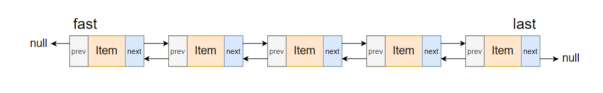
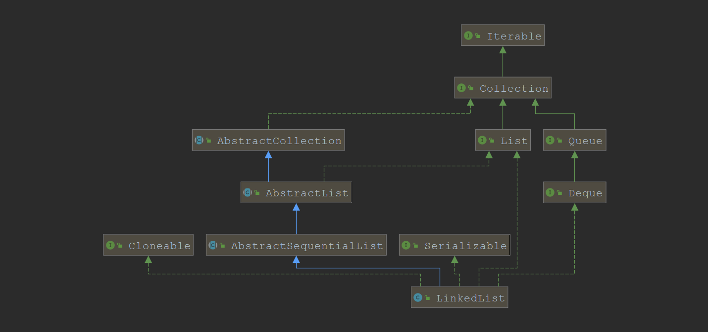
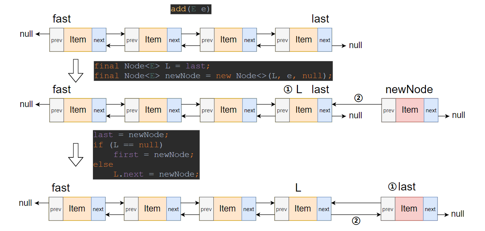
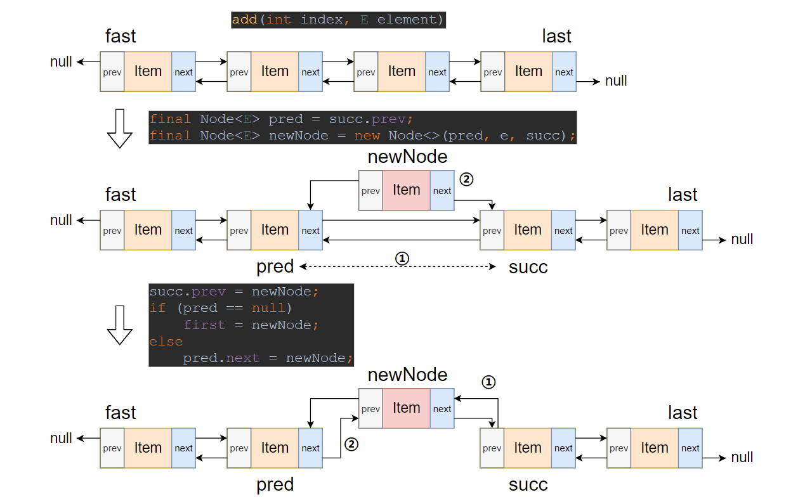
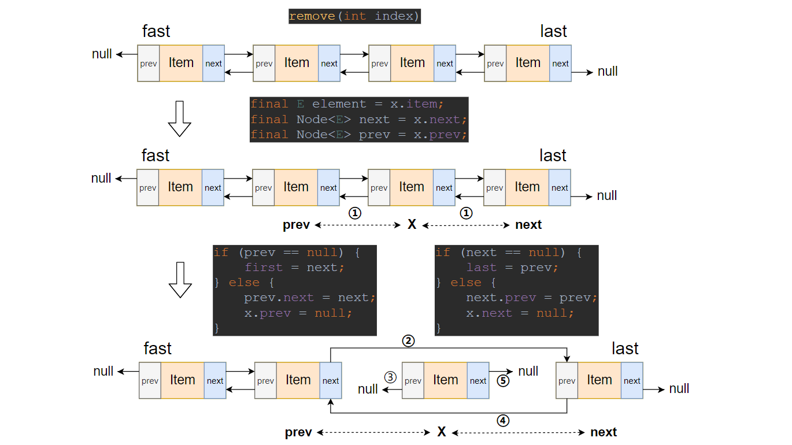
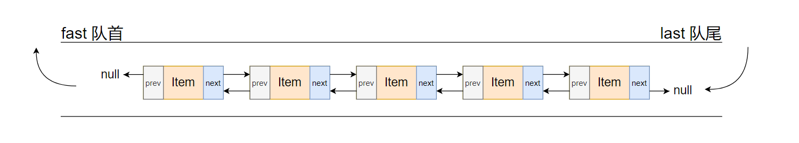

> 微信关注【面试情报局】我们一起干翻面试官。

# 1.前言

今天我们要研究的集合是`LinkedList`，在我们学习`LinkedList`之前，我们先看看LinkedList的相关面试题。

>1.`LinkedList`的结构。
>
>2.`LinkedList`插入元素的详细过程。
>
>3.`LinkedList`和`ArrayList`的区别。
>
>4 …….

这些面试题其实都是考察我们对链表这种结构是否有了解，是否有看过相关源码实现；只要看过源码，这些问题回答起来很是轻松；废话不多说，让我们一起来看看`LinkedList`的源码实现。


# 2.概述

`LinkedList`底层实现是一个双向链表，这种结构非常适合队列(先入先出)和栈(先入后出)的操作，并且他实现了`List`和`Deque`接口，所以它不仅有列表的操作还有队列相关的操作；其实现的队列和栈的出队入度，出栈入栈操作时间复杂度均为`O(1)`， 如下是其结构示意图：



# 3.类图



- `AbstractSequentialList` 抽象类，提供了List接口的相关实现和迭代逻辑的实现，不过对`LinkedList`意义不大，因为`LinkedList`大量重写了其中的实现
- `List` 接口，定义了数组的增删改查迭代遍历等相关操作。
- `Cloneable` 接口，支持`ArrayList`克隆
- `Serializabel` 接口，支持`ArrayList`序列化与反序列化
- `Deque`接口，定义了队列两端插入和删除元素的相关操作。

# 4.属性

首先让我们看看源码中的定义：

```java
public class LinkedList<E> extends AbstractSequentialList<E>
    implements List<E>, Deque<E>, Cloneable, java.io.Serializable
{
    // 链表大小(储存元素的个数)
    transient int size = 0;

    // 头结点
    transient Node<E> first;

    // 尾结点
    transient Node<E> last;
    
    // 储存元素的类(节点)
    private static class Node<E> {
        // 实际储存的元素
        E item;
        // next节点
        Node<E> next;
        // prev节点
        Node<E> prev;

        Node(Node<E> prev, E element, Node<E> next) {
            this.item = element;
            this.next = next;
            this.prev = prev;
        }
    }
    // 该属性是通过继承 AbstractList 得来,列表修改的次数(版本号)
    protected transient int modCount = 0;
}    
```

- `Node` 是链表中储存数据的节点，他有三个属性`item`（存储元素），`next`（指向下一个节点），`prev`（指向上一个节点）。
- `size` 双向链表的节点个数。
- `first` 双向链表头，头节点的`prev`指向`null`。
- `last` 双向链表尾，尾节点的`next`指向`null`。
- `modCount` 版本号，记录修改次数。

# 5.常用方法

## 5-1.新增

`LinkedList`的新增分三类：首节点新增，指定索引节点新增，尾节点新增。首先，看看对`List`接口实现的新增：

```java
// 将指定的元素追加到此列表的末尾。 此方法等效于addLast（E）。
public boolean add(E e) {
    linkLast(e);
    return true;
}
// 将元素添加到列表尾
void linkLast(E e) {
    // 预存尾结点
    final Node<E> l = last; 
    final Node<E> newNode = new Node<>(l, e, null);
    last = newNode;
    // 判断是否为第一个插入的节点
    if (l == null) 
        first = newNode;
    else
        l.next = newNode;
    size++;
    modCount++;
}
```



如图我们可以知道，在向末尾添加元素时先预存了`last`节点，然后构造新节点`newNode`并连接到当前尾节点，然后在更新`newNode`节点为`last`节点，最后在将节点连接完成。

指定索引节点新增：

```java
// 将指定的元素插入此列表中的指定位置。将当前在该位置的元素（如果有）和任何后续元素右移（将其索引加一）。
public void add(int index, E element) {
    checkPositionIndex(index);
    // 小优化
    if (index == size)
        linkLast(element);
    else
        linkBefore(element, node(index));
}
// 返回指定元素索引处的（非空）节点。
Node<E> node(int index) {
    // assert isElementIndex(index);
    // 小优化，一次二分查找
    if (index < (size >> 1)) {
        Node<E> x = first;
        for (int i = 0; i < index; i++)
            x = x.next;
        return x;
    } else {
        Node<E> x = last;
        for (int i = size - 1; i > index; i--)
            x = x.prev;
        return x;
    }
}
// 在非null节点succ之前插入元素e
void linkBefore(E e, Node<E> succ) {
    // assert succ != null;
    // 预存上一位节点
    final Node<E> pred = succ.prev; 
    final Node<E> newNode = new Node<>(pred, e, succ);
    // 链接新节点
    succ.prev = newNode; 
    // 判断succ是否为头节点
    if (pred == null) 
        first = newNode;
    else
        pred.next = newNode;
    size++;
    modCount++;
}
```



如图我们可以知道，在指定索引位置添加元素时有5步：

- 通过`node(int index)`方法找到指定索引节点`succ`
- 先预存指定索引节点`succ`的`prev`节点为`pred`
- 构建新节点`newNode`并连接指定索引节点`succ`的`prev`节点和指定索引节点`succ`
- 将指定索引节点`succ`的`prev`指向`newNode`节点
- 将预存的`prev`节点`pred`的`next`节点指向`newNode`节点

通过源码我们还可以知道，`node(int index)`(指定索引查找节点)方法有个小优化

```java
// 返回指定元素索引处的（非空）节点。
Node<E> node(int index) {
    // assert isElementIndex(index);
    // 小优化，一次二分查找
    if (index < (size >> 1)) {
        Node<E> x = first;
        for (int i = 0; i < index; i++)
            x = x.next;
        return x;
    } else {
        Node<E> x = last;
        for (int i = size - 1; i > index; i--)
            x = x.prev;
        return x;
    }
}
```

它通过一次二分的方式，定位了索引在前半段还是后半段，减少了一半的查询时间，提高了查询效率。


下面是添加集合到链表的方法，插入方式和上面基本相似。

```java
// 将指定集合中的所有元素追加到此列表的末尾，按照指定集合的迭代器返回它们的顺序。
public boolean addAll(Collection<? extends E> c) {
    return addAll(size, c);
}

// 从指定位置开始，将指定集合中的所有元素插入此列表。
// 将当前在该位置的元素（如果有）和任何后续元素右移（增加其索引）
// 新元素将按照指定集合的迭代器返回的顺序显示在列表中。
public boolean addAll(int index, Collection<? extends E> c) {
    checkPositionIndex(index); // 检查插入位置是否合法

    Object[] a = c.toArray();
    int numNew = a.length;
    if (numNew == 0)
        return false;
    // 储存上一位元素和当前index位置的元素
    Node<E> pred, succ;
    if (index == size) {
        succ = null;
        pred = last;
    } else {
        succ = node(index);
        pred = succ.prev;
    }

    for (Object o : a) {
        // 构造元素
        @SuppressWarnings("unchecked") E e = (E) o;
        Node<E> newNode = new Node<>(pred, e, null);
        // 链接到链表
        if (pred == null)
            first = newNode;
        else
            pred.next = newNode;
        pred = newNode;
    }

    if (succ == null) {
        last = pred;
    } else {
        pred.next = succ;
        succ.prev = pred;
    }

    size += numNew;
    modCount++;
    return true;
}
```

`LinkedList`不仅实现了`List`接口，还实现了`Deque`接口，下面看看`Deque`接口的实现：

```java
// 将指定的元素插入此列表的开头。
public void addFirst(E e) {
    linkFirst(e);
}
// 将元素添加到列表头
private void linkFirst(E e) {
    // 预存头结点
    final Node<E> f = first; 
    // 构造新节点
    final Node<E> newNode = new Node<>(null, e, f); 
    // 新节点升级为头节点
    first = newNode;
    // 将新节点和链表链接
    // 判断是否为第一个插入的节点
    if (f == null) 
        last = newNode;
    else
        f.prev = newNode;
    size++; // 链表大小加一
    modCount++; // 版本号加一
}

// 将指定的元素追加到此列表的末尾。 此方法等效于add（E）。
public void addLast(E e) {
    linkLast(e);
}
// 将元素添加到列表尾
void linkLast(E e) {
    // 预存尾结点
    final Node<E> l = last; 
    final Node<E> newNode = new Node<>(l, e, null);
    last = newNode;
    // 判断是否为第一个插入的节点
    if (l == null) 
        first = newNode;
    else
        l.next = newNode;
    size++;
    modCount++;
}

// 将指定的元素添加为此列表的尾部（最后一个元素）。
public boolean offer(E e) {
    return add(e); // add(E e)->linkLast(E e)
}

// 将指定的元素插入此列表的前面。
public boolean offerFirst(E e) {
    addFirst(e); // addFirst(E e)->linkFirst(E e)
    return true;
}

// 将指定的元素插入此列表的末尾。
public boolean offerLast(E e) {
    addLast(e); // addLast(E e)->linkLast(E e)
    return true;
}

// 将元素压入此列表表示的堆栈。换句话说，将元素插入此列表的前面。 此方法等效于addFirst（E）。
public void push(E e) {
    addFirst(e); // addFirst(E e)->linkFirst(E e)
}
```

通过源码我们发现`LinkedList`实现`Deque`接口的插入最终都是调用`linkFirst(E e)`和`linkLast(E e)`，其插入过程在源码中以详细注释。

## 5-2.删除

首先我们看看`LinkedList`对`List`接口的实现：对指定元素对象删除和对指定节点删除

```java
// 如果存在指定元素，则从该列表中删除该元素的第一次出现。
// 如果此列表不包含该元素，则它保持不变。
// 如果此列表包含指定的元素，则返回true。
public boolean remove(Object o) {
    if (o == null) { // null值特殊处理
        for (Node<E> x = first; x != null; x = x.next) {
            if (x.item == null) {
                unlink(x);
                return true;
            }
        }
    } else {
        for (Node<E> x = first; x != null; x = x.next) {
            if (o.equals(x.item)) { // 自定义元素对象，注意重写equals
                unlink(x);
                return true;
            }
        }
    }
    return false;
}

// 取消链接x节点
E unlink(Node<E> x) {
    // assert x != null;
    // 预存x节点Item
    final E element = x.item; 
    // 预存x节点下一位节点
    final Node<E> next = x.next; 
    // 预存x节点上一位节点
    final Node<E> prev = x.prev; 

    // x的上一位节点链接x的下一位节点
    if (prev == null) {
        first = next;
    } else {
        prev.next = next;
        x.prev = null;
    }
    // x的下一位节点链接x的上一位节点
    if (next == null) {
        last = prev;
    } else {
        next.prev = prev;
        x.next = null;
    }

    x.item = null;
    size--;
    modCount++;
    return element;
}

// 删除此列表中指定位置的元素。将所有后续元素向左移动（从其索引中减去一个）。返回从列表中删除的元素。
public E remove(int index) {
    checkElementIndex(index);
    return unlink(node(index));
}
```

通过源码发现，最终删除都是通过`unlink(Node<E> x)`来完成，过程如下图：



我们再来看看`LinkedList`对`Deque`接口的实现:

```java
// 检索并删除此列表的头（第一个元素）。
public E remove() {
    return removeFirst(); // -> unlinkFirst(f)
}

// 从此列表中删除并返回第一个元素。
public E removeFirst() {
    final Node<E> f = first;
    if (f == null)
        throw new NoSuchElementException();
    return unlinkFirst(f);
}

// 取消链接非空的第一个节点f
private E unlinkFirst(Node<E> f) {
    // assert f == first && f != null;
    // 预存first节点的Item
    final E element = f.item; 
    // 预存第二个节点
    final Node<E> next = f.next; 
    f.item = null;
    f.next = null; // help GC
    // 移除第一个节点
    first = next; 
    // 连接节点
    if (next == null)
        last = null;
    else
        next.prev = null;
    size--;
    modCount++;
    return element;
}

// 从此列表中删除并返回最后一个元素。
public E removeLast() {
    final Node<E> l = last;
    if (l == null)
        throw new NoSuchElementException();
    return unlinkLast(l);
}
// 取消链接非空的最后一个节点l
private E unlinkLast(Node<E> l) {
    // assert l == last && l != null;
    // 预存last节点Item
    final E element = l.item; 
    // 预存倒数第二个节点
    final Node<E> prev = l.prev; 
    l.item = null;
    l.prev = null; // help GC
    // 移除最后一个节点
    last = prev;
    // 连接
    if (prev == null)
        first = null;
    else
        prev.next = null;
    size--;
    modCount++;
    return element;
}

// 检索并删除此列表的第一个元素，如果此列表为空，则返回null。
public E pollFirst() {
    final Node<E> f = first;
    return (f == null) ? null : unlinkFirst(f);
}

// 检索并删除此列表的最后一个元素，如果此列表为空，则返回null。
public E pollLast() {
    final Node<E> l = last;
    return (l == null) ? null : unlinkLast(l);
}

// 检索并删除此列表的头（第一个元素）。
public E poll() {
    final Node<E> f = first;
    return (f == null) ? null : unlinkFirst(f);
}
```

从源码中我们可以知道`LinkedList`对`Deque`的删除实现，最终都都是调用的`unlinkFirst(Node<E> f)`和`unlinkLast(Node<E> l)`，其移除过程在源码中有详细注释。



## 5-3.修改

老规矩，还是先看看源码实现：

```java
// 用指定的元素替换此列表中指定位置的元素。
public E set(int index, E element) {
    checkElementIndex(index);
    // 返回指定元素索引处的（非空）节点。
    Node<E> x = node(index);
    E oldVal = x.item;
    x.item = element;
    return oldVal;
}
```

`LinkedList`实现的修改过程十分简单：

- 首先检查索引是否合法`>=0&&<size`。
- 其次通过`node(int index)`找到要修改的节点。
- 最后修改`item`，返回旧值。

## 5-4.查询

`LinkedList`对`List`接口的查询实现包括：通过索引查询和通过元素查询(从前往后和从后往前)

```java
// 返回此列表中指定位置的元素。
public E get(int index) {
    checkElementIndex(index);
    return node(index).item;
}

// 如果此列表包含指定的元素，则返回true。
// 更正式地说，当且仅当此列表包含至少一个元素（e == null？e == null：o.equals（e））时，返回true。
public boolean contains(Object o) {
    return indexOf(o) != -1;
}

// 返回指定元素在此列表中首次出现的索引；如果此列表不包含该元素，则返回-1。
// 更正式地，返回最低索引i，使其（o == null？get（i）== null：o.equals（get（i）））;
// 如果没有这样的索引，则返回-1。
public int indexOf(Object o) {
    int index = 0;
    if (o == null) {
        for (Node<E> x = first; x != null; x = x.next) {
            if (x.item == null)
                return index;
            index++;
        }
    } else {
        for (Node<E> x = first; x != null; x = x.next) {
            if (o.equals(x.item))
                return index;
            index++;
        }
    }
    return -1;
}

// 返回指定元素在此列表中最后一次出现的索引；如果此列表不包含该元素，则返回-1。
public int lastIndexOf(Object o) {
    int index = size;
    if (o == null) {
        for (Node<E> x = last; x != null; x = x.prev) {
            index--;
            if (x.item == null)
                return index;
        }
    } else {
        for (Node<E> x = last; x != null; x = x.prev) {
            index--;
            if (o.equals(x.item))
                return index;
        }
    }
    return -1;
}
```

`LinkedList`对`Deque`接口的查询实现：

```java
// 检索但不删除此列表的头（第一个元素）
public E peek() {
    final Node<E> f = first;
    return (f == null) ? null : f.item;
}

// 检索但不删除此列表的第一个元素，如果此列表为空，则返回null。
public E peekFirst() {
    final Node<E> f = first;
    return (f == null) ? null : f.item;
}

// 检索但不删除此列表的最后一个元素，如果此列表为空，则返回null。
public E peekLast() {
    final Node<E> l = last;
    return (l == null) ? null : l.item;
}
```

# 6.总结

从源码中我们可以看出链表实现队列和栈非常有优势，只需要对表头和表尾进行操作既可。而且`LinkedList`的属性刚好保存了头和尾的引用，所以整个操作都是`O(1)`的时间复杂度。

现在我们在来看看最开始的面试题:

> 1.`LinkedList`的结构。
>
> 2.`LinkedList`插入元素的详细过程。
>
> 3.`LinkedList`和`ArrayList`的区别。

通过源码的学习1,2两个题目可以很轻松的回答，我们重点研究第3个问题：`LinkedList`和`ArrayList`的区别。

通过上一篇[《我们一起学集合》-ArrayList]()文章的学习，我们可以知道`ArrayList`底层是基于数组实现的支持动态扩容的一种数据结构

，他随机访问快，随机插入和删除慢(因为会移动元素)和`LinkedList`的区别有：

- 结构不同：`ArrayList`是基于数组`LinkedList`是基于节点`Node`
- 效率不同：`ArrayList`随机访问比`LinkedList`效率高，因为`LinkedList`必须每次从头遍历查找
- 储存不同：`ArrayList`需要大量的连续储存空间，并且在连续扩容后会产生较多存碎片，而`LinkedList`不需要连续的储存空间，这意味着它可以使用更多内存，但它储存每个元素消耗的内存也更多，因为他必须保持每个节点的`prev`和`next`引用。

从理论上讲`ArrayList`删除一个元素的效率是比`LinkedList`低，应为`ArrayList`删除一个不是末尾的元素会产生元素拷贝，而`LinkedList`删除一个元素只是修改前后节点的引用。


从理论上讲是这样，但在实际中，由于现代计算机体系结构的缘故(cpu缓存)，在几乎所有可能的用例中，`ArrayList`的效率都将大大提高。主要是`LinkedList`的节点随机分布在整个内存中。 `RAM`（“随机访问内存”）并不是真正随机的，需要获取内存块以进行缓存。此操作需要时间，并且当此类获取频繁发生时缓存中的内存页面需要一直替换->缓存未命中->缓存效率不高。 `ArrayList`元素存储在连续内存中，这更利于缓存。这也正是现代`CPU`体系结构正在优化的内容。


个人认为`ArrayList`和`LinkedList`的选用是值得深思的问题，需要根据不同的场景和考虑后才能决定。个人倾向在一般情况下优先使用`ArrayList`。

参考文章：

https://stackoverflow.com/questions/322715/when-to-use-linkedlist-over-arraylist-in-java/24607151#24607151

https://stackoverflow.com/questions/11667955/difference-between-arraylist-and-linkedlist

> 微信关注【面试情报局】我们一起干翻面试官。

# 7.附录

```java
/**
 * Doubly-linked list implementation of the {@code List} and {@code Deque}
 * interfaces.  Implements all optional list operations, and permits all
 * elements (including {@code null}).
 * 双链表实现了list和Deque接口。实现所有可选的列表操作，并允许所有元素(包括null)。
 * <p>All of the operations perform as could be expected for a doubly-linked
 * list.  Operations that index into the list will traverse the list from
 * the beginning or the end, whichever is closer to the specified index.
 * 所有的操作都可以像预期的那样执行一个双链表。
 * 索引到列表中的操作将从开始或结束遍历列表，以最接近指定索引的那一个为准。
 * <p><strong>Note that this implementation is not synchronized.</strong>
 * If multiple threads access a linked list concurrently, and at least
 * one of the threads modifies the list structurally, it <i>must</i> be
 * synchronized externally.  (A structural modification is any operation
 * that adds or deletes one or more elements; merely setting the value of
 * an element is not a structural modification.)  This is typically
 * accomplished by synchronizing on some object that naturally
 * encapsulates the list.
 * 请注意，此实现未同步。如果多个线程同时访问链表，并且至少一个线程在结构上修改了链表，则必须在外部进行同步。
 * 结构修改是添加或删除一个或多个元素的任何操作。仅设置元素的值不是结构上的修改。
 * 通常，通过对自然封装列表的某个对象进行同步来完成此操作。
 *
 * If no such object exists, the list should be "wrapped" using the
 * {@link Collections#synchronizedList Collections.synchronizedList}
 * method.  This is best done at creation time, to prevent accidental
 * unsynchronized access to the list:<pre>
 *   List list = Collections.synchronizedList(new LinkedList(...));</pre>
 * 如果不存在这样的对象，则应使用Collections.synchronizedList方法“包装”列表。
 * 最好在创建时完成此操作，以防止意外的不同步访问列表
 *
 * <p>The iterators returned by this class's {@code iterator} and
 * {@code listIterator} methods are <i>fail-fast</i>: if the list is
 * structurally modified at any time after the iterator is created, in
 * any way except through the Iterator's own {@code remove} or
 * {@code add} methods, the iterator will throw a {@link
 * ConcurrentModificationException}.  Thus, in the face of concurrent
 * modification, the iterator fails quickly and cleanly, rather than
 * risking arbitrary, non-deterministic behavior at an undetermined
 * time in the future.
 * 此类的迭代器和listIterator方法返回的迭代器是快速失败的：
 * 如果在创建迭代器之后的任何时间对列表进行结构修改。除了通过迭代器自己的remove或add方法之外，
 * 迭代器将抛出ConcurrentModificationException。因此，面对并发修改，迭代器会快速干净地失败，
 * 而不会在未来的不确定时间冒着任意，不确定的行为的风险。
 * 
 * <p>Note that the fail-fast behavior of an iterator cannot be guaranteed
 * as it is, generally speaking, impossible to make any hard guarantees in the
 * presence of unsynchronized concurrent modification.  Fail-fast iterators
 * throw {@code ConcurrentModificationException} on a best-effort basis.
 * Therefore, it would be wrong to write a program that depended on this
 * exception for its correctness:   <i>the fail-fast behavior of iterators
 * should be used only to detect bugs.</i>
 * 请注意，一般而言，不能保证迭代器的快速失败行为，一般来说，在存在不同步的并发修改的情况下，
 * 不可能做出任何严格的保证。快速失败的迭代器会尽最大努力抛出。
 * 因此，编写依赖于此异常的程序的正确性是错误的：迭代器的快速失败行为应仅用于检测错误
 * <p>This class is a member of the
 * <a href="{@docRoot}/../technotes/guides/collections/index.html">
 * Java Collections Framework</a>.
 *
 * @author  Josh Bloch
 * @see     List
 * @see     ArrayList
 * @since 1.2
 * @param <E> the type of elements held in this collection
 */

public class LinkedList<E> extends AbstractSequentialList<E>
    implements List<E>, Deque<E>, Cloneable, java.io.Serializable
{
    transient int size = 0;

    /**
     * Pointer to first node.
     * Invariant: (first == null && last == null) ||
     *            (first.prev == null && first.item != null)
     * 头结点
     */
    transient Node<E> first;

    /**
     * Pointer to last node.
     * Invariant: (first == null && last == null) ||
     *            (last.next == null && last.item != null)
     * 尾结点
     */
    transient Node<E> last;

    /**
     * Constructs an empty list.
     */
    public LinkedList() {
    }

    /**
     * Constructs a list containing the elements of the specified
     * collection, in the order they are returned by the collection's
     * iterator.
     * 构造一个列表，该列表包含指定集合的元素，其顺序由集合的迭代器返回。
     * @param  c the collection whose elements are to be placed into this list
     * @throws NullPointerException if the specified collection is null
     */
    public LinkedList(Collection<? extends E> c) {
        this();
        addAll(c);
    }

    /**
     * Links e as first element.
     * 将元素添加到列表头
     */
    private void linkFirst(E e) {
        // 预存头结点
        final Node<E> f = first; 
        // 构造新节点
        final Node<E> newNode = new Node<>(null, e, f); 
        // 新节点升级为头节点
        first = newNode;
        // 将新节点和链表链接
        // 判断是否为第一个插入的节点
        if (f == null) 
            last = newNode;
        else
            f.prev = newNode;
        size++; // 链表大小加一
        modCount++; // 版本号加一
    }

    /**
     * Links e as last element.
     * 将元素添加到列表头
     */
    void linkLast(E e) {
        // 预存尾结点
        final Node<E> l = last; 
        final Node<E> newNode = new Node<>(l, e, null);
        last = newNode;
        // 判断是否为第一个插入的节点
        if (l == null) 
            first = newNode;
        else
            l.next = newNode;
        size++;
        modCount++;
    }

    /**
     * Inserts element e before non-null Node succ.
     * 在非null节点succ之前插入元素e
     */
    void linkBefore(E e, Node<E> succ) {
        // assert succ != null;
        // 预存上一位节点
        final Node<E> pred = succ.prev; 
        final Node<E> newNode = new Node<>(pred, e, succ);
        // 链接新节点
        succ.prev = newNode; 
        // 判断succ是否为头节点
        if (pred == null) 
            first = newNode;
        else
            pred.next = newNode;
        size++;
        modCount++;
    }

    /**
     * Unlinks non-null first node f.
     * 取消链接非空的第一个节点f
     */
    private E unlinkFirst(Node<E> f) {
        // assert f == first && f != null;
        // 预存first节点的Item
        final E element = f.item; 
        // 预存第二个节点
        final Node<E> next = f.next; 
        f.item = null;
        f.next = null; // help GC
        // 移除第一个节点
        first = next; 
        if (next == null)
            last = null;
        else
            next.prev = null;
        size--;
        modCount++;
        return element;
    }

    /**
     * Unlinks non-null last node l.
     * 取消链接非空的最后一个节点l
     */
    private E unlinkLast(Node<E> l) {
        // assert l == last && l != null;
        // 预存last节点Item
        final E element = l.item; 
        // 预存倒数第二个节点
        final Node<E> prev = l.prev; 
        l.item = null;
        l.prev = null; // help GC
        // 移除最后一个节点
        last = prev; 
        if (prev == null)
            first = null;
        else
            prev.next = null;
        size--;
        modCount++;
        return element;
    }

    /**
     * Unlinks non-null node x.
     * 取消链接x节点
     */
    E unlink(Node<E> x) {
        // assert x != null;
        // 预存x节点Item
        final E element = x.item; 
        // 预存x节点下一位节点
        final Node<E> next = x.next; 
        // 预存x节点上一位节点
        final Node<E> prev = x.prev; 
		
        // 链接前节点
        if (prev == null) {
            first = next;
        } else {
            prev.next = next;
            x.prev = null;
        }
		// 链接后节点
        if (next == null) {
            last = prev;
        } else {
            next.prev = prev;
            x.next = null;
        }

        x.item = null;
        size--;
        modCount++;
        return element;
    }

    /**
     * Returns the first element in this list.
     * 返回此列表中的第一个元素。
     * @return the first element in this list
     * @throws NoSuchElementException if this list is empty
     */
    public E getFirst() {
        final Node<E> f = first;
        if (f == null)
            throw new NoSuchElementException();
        return f.item;
    }

    /**
     * Returns the last element in this list.
     * 返回此列表中的最后一个元素。
     * @return the last element in this list
     * @throws NoSuchElementException if this list is empty
     */
    public E getLast() {
        final Node<E> l = last;
        if (l == null)
            throw new NoSuchElementException();
        return l.item;
    }

    /**
     * Removes and returns the first element from this list.
     * 从此列表中删除并返回第一个元素。
     * @return the first element from this list
     * @throws NoSuchElementException if this list is empty
     */
    public E removeFirst() {
        final Node<E> f = first;
        if (f == null)
            throw new NoSuchElementException();
        return unlinkFirst(f);
    }

    /**
     * Removes and returns the last element from this list.
     * 从此列表中删除并返回最后一个元素。
     * @return the last element from this list
     * @throws NoSuchElementException if this list is empty
     */
    public E removeLast() {
        final Node<E> l = last;
        if (l == null)
            throw new NoSuchElementException();
        return unlinkLast(l);
    }

    /**
     * Inserts the specified element at the beginning of this list.
     * 将指定的元素插入此列表的开头。
     * @param e the element to add
     */
    public void addFirst(E e) {
        linkFirst(e);
    }

    /**
     * Appends the specified element to the end of this list.
     * <p>This method is equivalent to {@link #add}.
     * 将指定的元素追加到此列表的末尾。 此方法等效于add（E）。
     * @param e the element to add
     */
    public void addLast(E e) {
        linkLast(e);
    }

    /**
     * Returns {@code true} if this list contains the specified element.
     * More formally, returns {@code true} if and only if this list contains
     * at least one element {@code e} such that
     * <tt>(o==null&nbsp;?&nbsp;e==null&nbsp;:&nbsp;o.equals(e))</tt>.
     * 如果此列表包含指定的元素，则返回true。
     * 更正式地说，当且仅当此列表包含至少一个元素（e == null？e == null：o.equals（e））时，返回true。
     * @param o element whose presence in this list is to be tested
     * @return {@code true} if this list contains the specified element
     */
    public boolean contains(Object o) {
        return indexOf(o) != -1;
    }

    /**
     * Returns the number of elements in this list.
     * 返回此列表中的元素数。
     * @return the number of elements in this list
     */
    public int size() {
        return size;
    }

    /**
     * Appends the specified element to the end of this list.
     * <p>This method is equivalent to {@link #addLast}.
     * 将指定的元素追加到此列表的末尾。 此方法等效于addLast（E）。
     * @param e element to be appended to this list
     * @return {@code true} (as specified by {@link Collection#add})
     */
    public boolean add(E e) {
        linkLast(e);
        return true;
    }

    /**
     * Removes the first occurrence of the specified element from this list,
     * if it is present.  If this list does not contain the element, it is
     * unchanged.  More formally, removes the element with the lowest index
     * {@code i} such that
     * <tt>(o==null&nbsp;?&nbsp;get(i)==null&nbsp;:&nbsp;o.equals(get(i)))</tt>
     * (if such an element exists).  Returns {@code true} if this list
     * contained the specified element (or equivalently, if this list
     * changed as a result of the call).
     * 如果存在指定元素，则从该列表中删除该元素的第一次出现。
     * 如果此列表不包含该元素，则它保持不变。
     * 更正式地说，删除索引i最低的元素，使（o == null？get（i）== null：o.equals（get（i）））
     * 如果此列表包含指定的元素，则返回true。
     * @param o element to be removed from this list, if present
     * @return {@code true} if this list contained the specified element
     */
    public boolean remove(Object o) {
        if (o == null) { // null值特殊处理
            for (Node<E> x = first; x != null; x = x.next) {
                if (x.item == null) {
                    unlink(x);
                    return true;
                }
            }
        } else {
            for (Node<E> x = first; x != null; x = x.next) {
                if (o.equals(x.item)) { // 自定义元素对象，注意重写equals
                    unlink(x);
                    return true;
                }
            }
        }
        return false;
    }

    /**
     * Appends all of the elements in the specified collection to the end of
     * this list, in the order that they are returned by the specified
     * collection's iterator.  The behavior of this operation is undefined if
     * the specified collection is modified while the operation is in
     * progress.  (Note that this will occur if the specified collection is
     * this list, and it's nonempty.)
     * 将指定集合中的所有元素追加到此列表的末尾，按照指定集合的迭代器返回它们的顺序。
     * 如果在操作进行过程中修改了指定的集合，则此操作的行为是不确定的。
     * 请注意，如果指定的集合是此列表，并且是非空的，则会发生这种情况。
     * @param c collection containing elements to be added to this list
     * @return {@code true} if this list changed as a result of the call
     * @throws NullPointerException if the specified collection is null
     */
    public boolean addAll(Collection<? extends E> c) {
        return addAll(size, c);
    }

    /**
     * Inserts all of the elements in the specified collection into this
     * list, starting at the specified position.  Shifts the element
     * currently at that position (if any) and any subsequent elements to
     * the right (increases their indices).  The new elements will appear
     * in the list in the order that they are returned by the
     * specified collection's iterator.
     * 从指定位置开始，将指定集合中的所有元素插入此列表。
     * 将当前在该位置的元素（如果有）和任何后续元素右移（增加其索引）
     * 新元素将按照指定集合的迭代器返回的顺序显示在列表中。
     * @param index index at which to insert the first element
     *              from the specified collection
     * @param c collection containing elements to be added to this list
     * @return {@code true} if this list changed as a result of the call
     * @throws IndexOutOfBoundsException {@inheritDoc}
     * @throws NullPointerException if the specified collection is null
     */
    public boolean addAll(int index, Collection<? extends E> c) {
        checkPositionIndex(index); // 检查插入位置是否合法

        Object[] a = c.toArray();
        int numNew = a.length;
        if (numNew == 0)
            return false;
		// 储存上一位元素和当前index位置的元素
        Node<E> pred, succ;
        if (index == size) {
            succ = null;
            pred = last;
        } else {
            succ = node(index);
            pred = succ.prev;
        }

        for (Object o : a) {
            // 构造元素
            @SuppressWarnings("unchecked") E e = (E) o;
            Node<E> newNode = new Node<>(pred, e, null);
            // 链接到链表
            if (pred == null)
                first = newNode;
            else
                pred.next = newNode;
            pred = newNode;
        }

        if (succ == null) {
            last = pred;
        } else {
            pred.next = succ;
            succ.prev = pred;
        }

        size += numNew;
        modCount++;
        return true;
    }

    /**
     * Removes all of the elements from this list.
     * The list will be empty after this call returns.
     * 从此列表中删除所有元素。该调用返回后，该列表将为空。
     */
    public void clear() {
        // Clearing all of the links between nodes is "unnecessary", but:
        // - helps a generational GC if the discarded nodes inhabit
        //   more than one generation
        // - is sure to free memory even if there is a reachable Iterator
        for (Node<E> x = first; x != null; ) {
            Node<E> next = x.next;
            x.item = null;
            x.next = null;
            x.prev = null;
            x = next; // 滚动删除
        }
        first = last = null;
        size = 0;
        modCount++;
    }


    // Positional Access Operations

    /**
     * Returns the element at the specified position in this list.
     * 返回此列表中指定位置的元素。
     * @param index index of the element to return
     * @return the element at the specified position in this list
     * @throws IndexOutOfBoundsException {@inheritDoc}
     */
    public E get(int index) {
        checkElementIndex(index);
        return node(index).item;
    }

    /**
     * Replaces the element at the specified position in this list with the
     * specified element.
     * 用指定的元素替换此列表中指定位置的元素。
     * @param index index of the element to replace
     * @param element element to be stored at the specified position
     * @return the element previously at the specified position
     * @throws IndexOutOfBoundsException {@inheritDoc}
     */
    public E set(int index, E element) {
        checkElementIndex(index);
        Node<E> x = node(index);
        E oldVal = x.item;
        x.item = element;
        return oldVal;
    }

    /**
     * Inserts the specified element at the specified position in this list.
     * Shifts the element currently at that position (if any) and any
     * subsequent elements to the right (adds one to their indices).
     * 将指定的元素插入此列表中的指定位置。将当前在该位置的元素（如果有）和任何后续元素右移（将其索引加一）。
     * @param index index at which the specified element is to be inserted
     * @param element element to be inserted
     * @throws IndexOutOfBoundsException {@inheritDoc}
     */
    public void add(int index, E element) {
        checkPositionIndex(index);
		// 小优化
        if (index == size)
            linkLast(element);
        else
            linkBefore(element, node(index));
    }

    /**
     * Removes the element at the specified position in this list.  Shifts any
     * subsequent elements to the left (subtracts one from their indices).
     * Returns the element that was removed from the list.
     * 删除此列表中指定位置的元素。将所有后续元素向左移动（从其索引中减去一个）。返回从列表中删除的元素。
     * @param index the index of the element to be removed
     * @return the element previously at the specified position
     * @throws IndexOutOfBoundsException {@inheritDoc}
     */
    public E remove(int index) {
        checkElementIndex(index);
        return unlink(node(index));
    }

    /**
     * Tells if the argument is the index of an existing element.
     * 判断参数是否为现有元素的索引
     */
    private boolean isElementIndex(int index) {
        return index >= 0 && index < size;
    }

    /**
     * Tells if the argument is the index of a valid position for an
     * iterator or an add operation.
     */
    private boolean isPositionIndex(int index) {
        return index >= 0 && index <= size;
    }

    /**
     * Constructs an IndexOutOfBoundsException detail message.
     * Of the many possible refactorings of the error handling code,
     * this "outlining" performs best with both server and client VMs.
     */
    private String outOfBoundsMsg(int index) {
        return "Index: "+index+", Size: "+size;
    }

    private void checkElementIndex(int index) {
        if (!isElementIndex(index))
            throw new IndexOutOfBoundsException(outOfBoundsMsg(index));
    }

    private void checkPositionIndex(int index) {
        if (!isPositionIndex(index))
            throw new IndexOutOfBoundsException(outOfBoundsMsg(index));
    }

    /**
     * Returns the (non-null) Node at the specified element index.
     */
    Node<E> node(int index) {
        // assert isElementIndex(index);
		// 小优化，一次二分查找
        if (index < (size >> 1)) {
            Node<E> x = first;
            for (int i = 0; i < index; i++)
                x = x.next;
            return x;
        } else {
            Node<E> x = last;
            for (int i = size - 1; i > index; i--)
                x = x.prev;
            return x;
        }
    }

    // Search Operations

    /**
     * Returns the index of the first occurrence of the specified element
     * in this list, or -1 if this list does not contain the element.
     * More formally, returns the lowest index {@code i} such that
     * <tt>(o==null&nbsp;?&nbsp;get(i)==null&nbsp;:&nbsp;o.equals(get(i)))</tt>,
     * or -1 if there is no such index.
     * 返回指定元素在此列表中首次出现的索引；如果此列表不包含该元素，则返回-1。
     * 更正式地，返回最低索引i，使其（o == null？get（i）== null：o.equals（get（i）））;
     * 如果没有这样的索引，则返回-1。
     * @param o element to search for
     * @return the index of the first occurrence of the specified element in
     *         this list, or -1 if this list does not contain the element
     */
    public int indexOf(Object o) {
        int index = 0;
        if (o == null) {
            for (Node<E> x = first; x != null; x = x.next) {
                if (x.item == null)
                    return index;
                index++;
            }
        } else {
            for (Node<E> x = first; x != null; x = x.next) {
                if (o.equals(x.item))
                    return index;
                index++;
            }
        }
        return -1;
    }

    /**
     * Returns the index of the last occurrence of the specified element
     * in this list, or -1 if this list does not contain the element.
     * More formally, returns the highest index {@code i} such that
     * <tt>(o==null&nbsp;?&nbsp;get(i)==null&nbsp;:&nbsp;o.equals(get(i)))</tt>,
     * or -1 if there is no such index.
     * 返回指定元素在此列表中最后一次出现的索引；如果此列表不包含该元素，则返回-1。
     * @param o element to search for
     * @return the index of the last occurrence of the specified element in
     *         this list, or -1 if this list does not contain the element
     */
    public int lastIndexOf(Object o) {
        int index = size;
        if (o == null) {
            for (Node<E> x = last; x != null; x = x.prev) {
                index--;
                if (x.item == null)
                    return index;
            }
        } else {
            for (Node<E> x = last; x != null; x = x.prev) {
                index--;
                if (o.equals(x.item))
                    return index;
            }
        }
        return -1;
    }

    // Queue operations.

    /**
     * Retrieves, but does not remove, the head (first element) of this list.
     * 检索但不删除此列表的头（第一个元素）
     * @return the head of this list, or {@code null} if this list is empty
     * @since 1.5
     */
    public E peek() {
        final Node<E> f = first;
        return (f == null) ? null : f.item;
    }

    /**
     * Retrieves, but does not remove, the head (first element) of this list.
     * 检索但不删除此列表的头（第一个元素）。
     * @return the head of this list
     * @throws NoSuchElementException if this list is empty
     * @since 1.5
     */
    public E element() {
        return getFirst();
    }

    /**
     * Retrieves and removes the head (first element) of this list.
     * 检索并删除此列表的头（第一个元素）。
     * @return the head of this list, or {@code null} if this list is empty
     * @since 1.5
     */
    public E poll() {
        final Node<E> f = first;
        return (f == null) ? null : unlinkFirst(f);
    }

    /**
     * Retrieves and removes the head (first element) of this list.
     * 检索并删除此列表的头（第一个元素）。
     * @return the head of this list
     * @throws NoSuchElementException if this list is empty
     * @since 1.5
     */
    public E remove() {
        return removeFirst();
    }

    /**
     * Adds the specified element as the tail (last element) of this list.
     * 将指定的元素添加为此列表的尾部（最后一个元素）。
     * @param e the element to add
     * @return {@code true} (as specified by {@link Queue#offer})
     * @since 1.5
     */
    public boolean offer(E e) {
        return add(e);
    }

    // Deque operations
    /**
     * Inserts the specified element at the front of this list.
     * 将指定的元素插入此列表的前面。
     * @param e the element to insert
     * @return {@code true} (as specified by {@link Deque#offerFirst})
     * @since 1.6
     */
    public boolean offerFirst(E e) {
        addFirst(e);
        return true;
    }

    /**
     * Inserts the specified element at the end of this list.
     * 将指定的元素插入此列表的末尾。
     * @param e the element to insert
     * @return {@code true} (as specified by {@link Deque#offerLast})
     * @since 1.6
     */
    public boolean offerLast(E e) {
        addLast(e);
        return true;
    }

    /**
     * Retrieves, but does not remove, the first element of this list,
     * or returns {@code null} if this list is empty.
     * 检索但不删除此列表的第一个元素，如果此列表为空，则返回null。
     * @return the first element of this list, or {@code null}
     *         if this list is empty
     * @since 1.6
     */
    public E peekFirst() {
        final Node<E> f = first;
        return (f == null) ? null : f.item;
     }

    /**
     * Retrieves, but does not remove, the last element of this list,
     * or returns {@code null} if this list is empty.
     * 检索但不删除此列表的最后一个元素，如果此列表为空，则返回null。
     * @return the last element of this list, or {@code null}
     *         if this list is empty
     * @since 1.6
     */
    public E peekLast() {
        final Node<E> l = last;
        return (l == null) ? null : l.item;
    }

    /**
     * Retrieves and removes the first element of this list,
     * or returns {@code null} if this list is empty.
     * 检索并删除此列表的第一个元素，如果此列表为空，则返回null。
     * @return the first element of this list, or {@code null} if
     *     this list is empty
     * @since 1.6
     */
    public E pollFirst() {
        final Node<E> f = first;
        return (f == null) ? null : unlinkFirst(f);
    }

    /**
     * Retrieves and removes the last element of this list,
     * or returns {@code null} if this list is empty.
     * 检索并删除此列表的最后一个元素，如果此列表为空，则返回null。
     * @return the last element of this list, or {@code null} if
     *     this list is empty
     * @since 1.6
     */
    public E pollLast() {
        final Node<E> l = last;
        return (l == null) ? null : unlinkLast(l);
    }

    /**
     * Pushes an element onto the stack represented by this list.  In other
     * words, inserts the element at the front of this list.
     * 将元素压入此列表表示的堆栈。换句话说，将元素插入此列表的前面。 此方法等效于addFirst（E）。
     * <p>This method is equivalent to {@link #addFirst}.
     *
     * @param e the element to push
     * @since 1.6
     */
    public void push(E e) {
        addFirst(e);
    }

    /**
     * Pops an element from the stack represented by this list.  In other
     * words, removes and returns the first element of this list.
     * <p>This method is equivalent to {@link #removeFirst()}.
     * 从此列表表示的堆栈中弹出一个元素。换句话说，删除并返回此列表的第一个元素。 此方法等效于removeFirst（）。
     * @return the element at the front of this list (which is the top
     *         of the stack represented by this list)
     * @throws NoSuchElementException if this list is empty
     * @since 1.6
     */
    public E pop() {
        return removeFirst();
    }

    /**
     * Removes the first occurrence of the specified element in this
     * list (when traversing the list from head to tail).  If the list
     * does not contain the element, it is unchanged.
     * 删除列表中第一次出现的指定元素（从头到尾遍历列表时）如果列表不包含该元素，则该元素不变。
     * @param o element to be removed from this list, if present
     * @return {@code true} if the list contained the specified element
     * @since 1.6
     */
    public boolean removeFirstOccurrence(Object o) {
        return remove(o);
    }

    /**
     * Removes the last occurrence of the specified element in this
     * list (when traversing the list from head to tail).  If the list
     * does not contain the element, it is unchanged.
     * 删除此列表中最后一次出现的指定元素（从头到尾遍历列表时）。如果列表不包含该元素，则该元素不变。
     * @param o element to be removed from this list, if present
     * @return {@code true} if the list contained the specified element
     * @since 1.6
     */
    public boolean removeLastOccurrence(Object o) {
        if (o == null) {
            for (Node<E> x = last; x != null; x = x.prev) {
                if (x.item == null) {
                    unlink(x);
                    return true;
                }
            }
        } else {
            for (Node<E> x = last; x != null; x = x.prev) {
                if (o.equals(x.item)) {
                    unlink(x);
                    return true;
                }
            }
        }
        return false;
    }

    /**
     * Returns a list-iterator of the elements in this list (in proper
     * sequence), starting at the specified position in the list.
     * Obeys the general contract of {@code List.listIterator(int)}.<p>
     * 从列表中的指定位置开始（按适当顺序）返回此列表中元素的列表迭代器。遵守List.listIterator（int）的常规协定。
     * The list-iterator is <i>fail-fast</i>: if the list is structurally
     * modified at any time after the Iterator is created, in any way except
     * through the list-iterator's own {@code remove} or {@code add}
     * methods, the list-iterator will throw a
     * {@code ConcurrentModificationException}.  Thus, in the face of
     * concurrent modification, the iterator fails quickly and cleanly, rather
     * than risking arbitrary, non-deterministic behavior at an undetermined
     * time in the future.
     *
     * @param index index of the first element to be returned from the
     *              list-iterator (by a call to {@code next})
     * @return a ListIterator of the elements in this list (in proper
     *         sequence), starting at the specified position in the list
     * @throws IndexOutOfBoundsException {@inheritDoc}
     * @see List#listIterator(int)
     */
    public ListIterator<E> listIterator(int index) {
        checkPositionIndex(index);
        return new ListItr(index);
    }

    private class ListItr implements ListIterator<E> {
        private Node<E> lastReturned;
        private Node<E> next;
        private int nextIndex;
        private int expectedModCount = modCount;

        ListItr(int index) {
            // assert isPositionIndex(index);
            next = (index == size) ? null : node(index);
            nextIndex = index;
        }

        public boolean hasNext() {
            return nextIndex < size;
        }

        public E next() {
            checkForComodification();
            if (!hasNext())
                throw new NoSuchElementException();

            lastReturned = next;
            next = next.next;
            nextIndex++;
            return lastReturned.item;
        }

        public boolean hasPrevious() {
            return nextIndex > 0;
        }

        public E previous() {
            checkForComodification();
            if (!hasPrevious())
                throw new NoSuchElementException();

            lastReturned = next = (next == null) ? last : next.prev;
            nextIndex--;
            return lastReturned.item;
        }

        public int nextIndex() {
            return nextIndex;
        }

        public int previousIndex() {
            return nextIndex - 1;
        }

        public void remove() {
            checkForComodification();
            if (lastReturned == null)
                throw new IllegalStateException();

            Node<E> lastNext = lastReturned.next;
            unlink(lastReturned);
            if (next == lastReturned)
                next = lastNext;
            else
                nextIndex--;
            lastReturned = null;
            expectedModCount++;
        }

        public void set(E e) {
            if (lastReturned == null)
                throw new IllegalStateException();
            checkForComodification();
            lastReturned.item = e;
        }

        public void add(E e) {
            checkForComodification();
            lastReturned = null;
            if (next == null)
                linkLast(e);
            else
                linkBefore(e, next);
            nextIndex++;
            expectedModCount++;
        }

        public void forEachRemaining(Consumer<? super E> action) {
            Objects.requireNonNull(action);
            while (modCount == expectedModCount && nextIndex < size) {
                action.accept(next.item);
                lastReturned = next;
                next = next.next;
                nextIndex++;
            }
            checkForComodification();
        }

        final void checkForComodification() {
            if (modCount != expectedModCount)
                throw new ConcurrentModificationException();
        }
    }

    private static class Node<E> {
        E item;
        Node<E> next;
        Node<E> prev;

        Node(Node<E> prev, E element, Node<E> next) {
            this.item = element;
            this.next = next;
            this.prev = prev;
        }
    }

    /**
     * @since 1.6
     */
    public Iterator<E> descendingIterator() {
        return new DescendingIterator();
    }

    /**
     * Adapter to provide descending iterators via ListItr.previous
     */
    private class DescendingIterator implements Iterator<E> {
        private final ListItr itr = new ListItr(size());
        public boolean hasNext() {
            return itr.hasPrevious();
        }
        public E next() {
            return itr.previous();
        }
        public void remove() {
            itr.remove();
        }
    }

    @SuppressWarnings("unchecked")
    private LinkedList<E> superClone() {
        try {
            return (LinkedList<E>) super.clone();
        } catch (CloneNotSupportedException e) {
            throw new InternalError(e);
        }
    }

    /**
     * Returns a shallow copy of this {@code LinkedList}. (The elements
     * themselves are not cloned.)
     * 返回此LinkedList的浅表副本。 （元素本身不会被克隆。）
     * @return a shallow copy of this {@code LinkedList} instance
     */
    public Object clone() {
        LinkedList<E> clone = superClone();

        // Put clone into "virgin" state
        clone.first = clone.last = null;
        clone.size = 0;
        clone.modCount = 0;

        // Initialize clone with our elements
        for (Node<E> x = first; x != null; x = x.next)
            clone.add(x.item);

        return clone;
    }

    /**
     * Returns an array containing all of the elements in this list
     * in proper sequence (from first to last element).
     * 以正确的顺序（从第一个元素到最后一个元素）返回包含此列表中所有元素的数组。
     * <p>The returned array will be "safe" in that no references to it are
     * maintained by this list.  (In other words, this method must allocate
     * a new array).  The caller is thus free to modify the returned array.
     * 返回的数组将是“安全的”，因为此列表不保留对其的引用。 
     *（换句话说，此方法必须分配一个新数组）。因此，调用者可以自由修改返回的数组。
     * <p>This method acts as bridge between array-based and collection-based
     * APIs.
     * 此方法充当基于数组的API和基于集合的API之间的桥梁。
     * @return an array containing all of the elements in this list
     *         in proper sequence
     */
    public Object[] toArray() {
        Object[] result = new Object[size];
        int i = 0;
        for (Node<E> x = first; x != null; x = x.next)
            result[i++] = x.item;
        return result;
    }

    /**
     * Returns an array containing all of the elements in this list in
     * proper sequence (from first to last element); the runtime type of
     * the returned array is that of the specified array.  If the list fits
     * in the specified array, it is returned therein.  Otherwise, a new
     * array is allocated with the runtime type of the specified array and
     * the size of this list.
     * 返回一个数组，该数组按正确的顺序包含此列表中的所有元素（从第一个元素到最后一个元素）
     * 返回数组的运行时类型是指定数组的运行时类型。如果列表适合指定的数组，则将其返回。
     * 否则，将使用指定数组的运行时类型和此列表的大小分配一个新数组。
     * <p>If the list fits in the specified array with room to spare (i.e.,
     * the array has more elements than the list), the element in the array
     * immediately following the end of the list is set to {@code null}.
     * (This is useful in determining the length of the list <i>only</i> if
     * the caller knows that the list does not contain any null elements.)
     * 如果列表适合指定的数组并有剩余空间（即，数组中的元素多于列表），则紧接列表结尾的数组中的元素将设置为null。
     * 仅当调用者知道列表不包含任何null元素时，这才对确定列表的长度很有用。）
     * <p>Like the {@link #toArray()} method, this method acts as bridge between
     * array-based and collection-based APIs.  Further, this method allows
     * precise control over the runtime type of the output array, and may,
     * under certain circumstances, be used to save allocation costs.
     * 与toArray（）方法一样，此方法充当基于数组的API和基于集合的API之间的桥梁。
     * 此外，此方法允许对输出数组的运行时类型进行精确控制，并且在某些情况下可以用于节省分配成本。
     * <p>Suppose {@code x} is a list known to contain only strings.
     * The following code can be used to dump the list into a newly
     * allocated array of {@code String}:
     *
     * <pre>
     *     String[] y = x.toArray(new String[0]);</pre>
     *
     * Note that {@code toArray(new Object[0])} is identical in function to
     * {@code toArray()}.
     *
     * @param a the array into which the elements of the list are to
     *          be stored, if it is big enough; otherwise, a new array of the
     *          same runtime type is allocated for this purpose.
     * @return an array containing the elements of the list
     * @throws ArrayStoreException if the runtime type of the specified array
     *         is not a supertype of the runtime type of every element in
     *         this list
     * @throws NullPointerException if the specified array is null
     */
    @SuppressWarnings("unchecked")
    public <T> T[] toArray(T[] a) {
        if (a.length < size) // a不够容量就新分配一个
            a = (T[])java.lang.reflect.Array.newInstance( a.getClass().getComponentType(), size);
        int i = 0;
        Object[] result = a;
        for (Node<E> x = first; x != null; x = x.next)
            result[i++] = x.item;

        if (a.length > size)
            a[size] = null;

        return a;
    }

    private static final long serialVersionUID = 876323262645176354L;

    /**
     * Saves the state of this {@code LinkedList} instance to a stream
     * (that is, serializes it).
     *
     * @serialData The size of the list (the number of elements it
     *             contains) is emitted (int), followed by all of its
     *             elements (each an Object) in the proper order.
     */
    private void writeObject(java.io.ObjectOutputStream s)
        throws java.io.IOException {
        // Write out any hidden serialization magic
        s.defaultWriteObject();

        // Write out size
        s.writeInt(size);

        // Write out all elements in the proper order.
        for (Node<E> x = first; x != null; x = x.next)
            s.writeObject(x.item);
    }

    /**
     * Reconstitutes this {@code LinkedList} instance from a stream
     * (that is, deserializes it).
     */
    @SuppressWarnings("unchecked")
    private void readObject(java.io.ObjectInputStream s)
        throws java.io.IOException, ClassNotFoundException {
        // Read in any hidden serialization magic
        s.defaultReadObject();

        // Read in size
        int size = s.readInt();

        // Read in all elements in the proper order.
        for (int i = 0; i < size; i++)
            linkLast((E)s.readObject());
    }

    /**
     * Creates a <em><a href="Spliterator.html#binding">late-binding</a></em>
     * and <em>fail-fast</em> {@link Spliterator} over the elements in this
     * list.
     *
     * <p>The {@code Spliterator} reports {@link Spliterator#SIZED} and
     * {@link Spliterator#ORDERED}.  Overriding implementations should document
     * the reporting of additional characteristic values.
     *
     * @implNote
     * The {@code Spliterator} additionally reports {@link Spliterator#SUBSIZED}
     * and implements {@code trySplit} to permit limited parallelism..
     *
     * @return a {@code Spliterator} over the elements in this list
     * @since 1.8
     */
    @Override
    public Spliterator<E> spliterator() {
        return new LLSpliterator<E>(this, -1, 0);
    }

    /** A customized variant of Spliterators.IteratorSpliterator */
    static final class LLSpliterator<E> implements Spliterator<E> {
        static final int BATCH_UNIT = 1 << 10;  // batch array size increment
        static final int MAX_BATCH = 1 << 25;  // max batch array size;
        final LinkedList<E> list; // null OK unless traversed
        Node<E> current;      // current node; null until initialized
        int est;              // size estimate; -1 until first needed
        int expectedModCount; // initialized when est set
        int batch;            // batch size for splits

        LLSpliterator(LinkedList<E> list, int est, int expectedModCount) {
            this.list = list;
            this.est = est;
            this.expectedModCount = expectedModCount;
        }

        final int getEst() {
            int s; // force initialization
            final LinkedList<E> lst;
            if ((s = est) < 0) {
                if ((lst = list) == null)
                    s = est = 0;
                else {
                    expectedModCount = lst.modCount;
                    current = lst.first;
                    s = est = lst.size;
                }
            }
            return s;
        }

        public long estimateSize() { return (long) getEst(); }

        public Spliterator<E> trySplit() {
            Node<E> p;
            int s = getEst();
            if (s > 1 && (p = current) != null) {
                int n = batch + BATCH_UNIT;
                if (n > s)
                    n = s;
                if (n > MAX_BATCH)
                    n = MAX_BATCH;
                Object[] a = new Object[n];
                int j = 0;
                do { a[j++] = p.item; } while ((p = p.next) != null && j < n);
                current = p;
                batch = j;
                est = s - j;
                return Spliterators.spliterator(a, 0, j, Spliterator.ORDERED);
            }
            return null;
        }

        public void forEachRemaining(Consumer<? super E> action) {
            Node<E> p; int n;
            if (action == null) throw new NullPointerException();
            if ((n = getEst()) > 0 && (p = current) != null) {
                current = null;
                est = 0;
                do {
                    E e = p.item;
                    p = p.next;
                    action.accept(e);
                } while (p != null && --n > 0);
            }
            if (list.modCount != expectedModCount)
                throw new ConcurrentModificationException();
        }

        public boolean tryAdvance(Consumer<? super E> action) {
            Node<E> p;
            if (action == null) throw new NullPointerException();
            if (getEst() > 0 && (p = current) != null) {
                --est;
                E e = p.item;
                current = p.next;
                action.accept(e);
                if (list.modCount != expectedModCount)
                    throw new ConcurrentModificationException();
                return true;
            }
            return false;
        }

        public int characteristics() {
            return Spliterator.ORDERED | Spliterator.SIZED | Spliterator.SUBSIZED;
        }
    }

}
```

