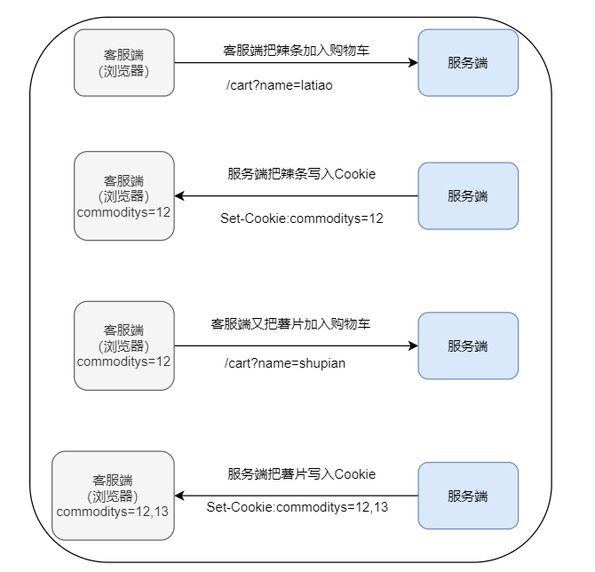
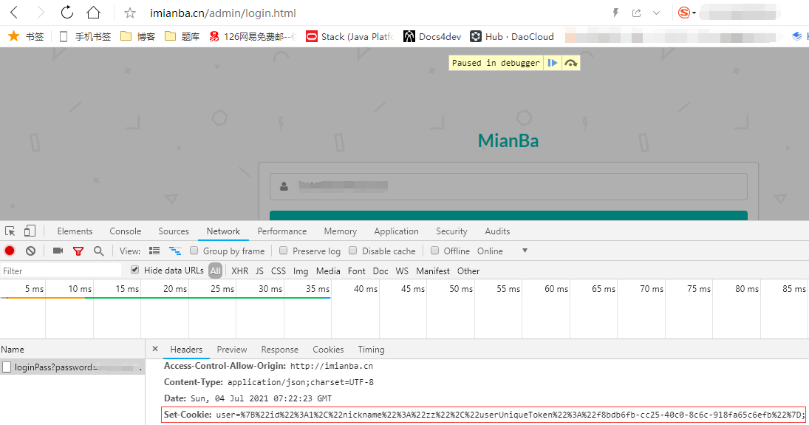
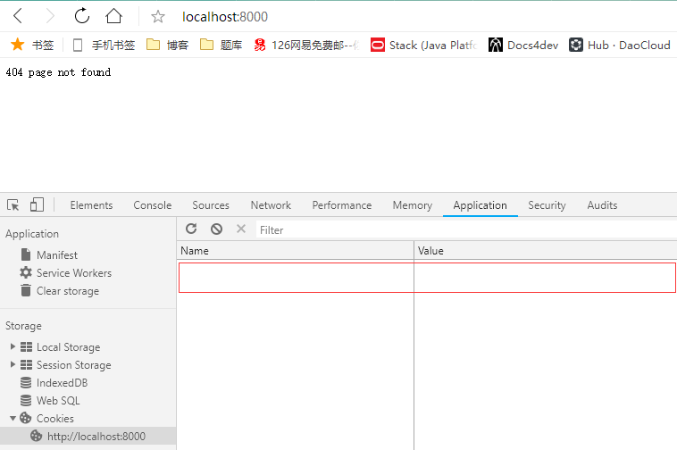
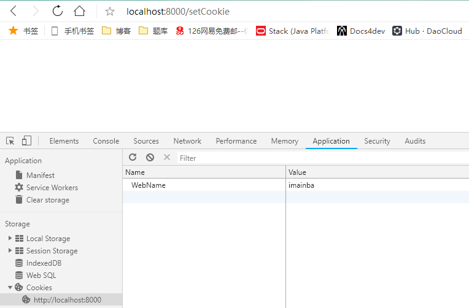
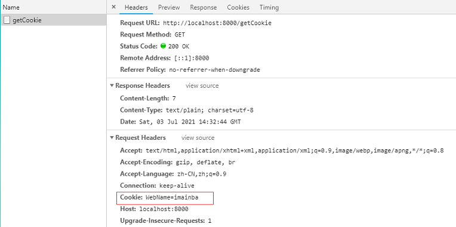
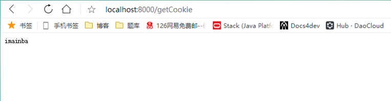
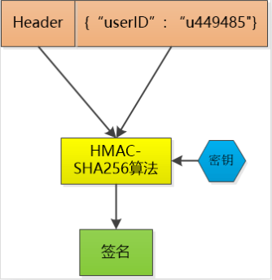
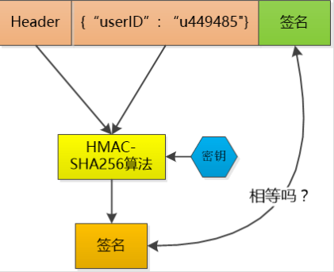
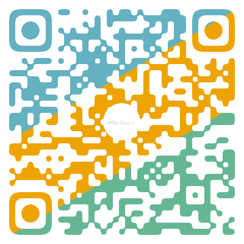

首先我来看几个面试题

>cookie和session的关系,区别?
>
>禁用cookie还可以使用session吗？如何使用?
>
>session的机制?
>
>cookie，session，token又有什么关系和区别。

在我开始前，我们要记住一点：

**http是无状态协议！！！**

**http是无状态协议！！！**

**http是无状态协议！！！**

# Cookie

## 1.是什么

首先我们先介绍Cookie是什么，Cookie是客户端(浏览器)保存用户信息的一种机制，用来记录用户的一些信息，是实现Session的一种方式。

> 还有什么机制来保持信息？

- sessionStorage
- localStorage

> 区别？

- sessionStorage：在当前浏览器窗口关闭或刷新前有效，不能持久保存数据。
- localStorage：持久保存数据，窗口或浏览器关闭也一直保存。
- Cookie：可持久并且在同源的 HTTP 请求中始终会被携带（即使不需要），Cookie可以在浏览器和服务器间来回传递。

## 2.为什么

上面我们知道了Cookies到底是个什么东西。接下来我们看一一看为什么需要Cookies。

因为 **HTTP 协议是无状态的**，即服务器不知道用户上一次做了什么，这导致用户和web服务器交互的时候，他不知道我们是谁。web服务器就像一个傻瓜，即使我们上一次请求告诉了web服务器我们是谁，下次访问时他还是不知道我们是谁

> 那为什么 HTTP 协议是无状态？

个人认为有以下几个原因：

- 出于性能考虑最大限度地减少需要传输的数据量，让请求和响应的数据结构简单。
- 历史原因，当时HTTP 协议被提出，是为了提供一个通用标准来将文件从一台计算机（服务器）传输到另一台计算机（客户端）。从当时来看这种需求并不需要状态。
- HTTP 是一个可扩展协议，如果需要可以自行扩展，这就有了后来的Cookie。

所以，Cookie 就是用来解决 HTTP 的无状态性的“额外手段”之一。用户每次请求时浏览器都会帮我携带上Cookie信息，然后服务器可以设置或读取 Cookies 中包含的信息，借此维护用户跟服务器会话中的状态。

> 哪还有那些手段维持状态性？

- 隐藏表单域，当提交表单时，指定的名称和值会自动包含在 GET 或 POST 数据中。每次 Web 浏览器发请求时，服务端可以使用 session_id 值来跟踪不同的浏览器或用户。

```html
<input type = "hidden" name = "sessionid" value = "12345">
```

- URL重写，可以在每个 URL 的末尾附加一些额外的数据。该数据标识会话；服务器可以将该会话标识符与其存储的关于该会话的数据相关联。

```html
http://imianba.com/index.html;sessionid=12345
```

## 3.怎么用

我们知道了因为HTTP 协议是无状态的，所以需要引入Cookie，来维持状态。那有那些典型应用场景喃？

> 会话状态管理（如用户登录状态、购物车、游戏分数或其它需要记录的信息）

在购物场景中，当用户选购了第一项商品后，服务器在响应用户的同时，还会发送一段 Cookie，该Cookie记录着那项商品的信息。当用户访问另一个页面，浏览器会把 Cookie 发送给服务器，于是服务器知道他之前选购了什么。用户继续选购其他商品，服务器就在原来那段 Cookie 里追加新的商品信息。结帐时，服务器读取发送来的 Cookie 即可。



当登录一个网站时，网站往往会请求用户输入用户名和密码，并且用户可以勾选“下次自动登录”。如果勾选了，那么下次访问同一网站时，用户会发现没输入用户名和密码就已经登录了。这正是因为前一次登录时，服务器发送了包含登录凭据（用户名加密码的某种自动登录加密形式,一般称为Token）的 Cookie 到用户的硬盘上。第二次登录时，如果该 Cookie 尚未到期，浏览器会发送该 Cookie，服务器验证凭据，于是不必输入用户名和密码就让用户登录了。



> 浏览器行为跟踪（如跟踪分析用户行为,Cookie信息精准广告定向技术-广告联盟）

当使用搜索引擎的时候，有点搜索引擎会把你的此次搜索保存到cookie中，并且分配这个浏览器唯一可标识的ID号，当你打开xx影视，xx软件的时候，该页的广告模块就向第三方也就是广告服务商的服务器去请求搜索引擎保存在浏览器的cookie，然后就可以知道你最近浏览或者搜索过哪些商品，然后就返回给你相关的广告。

> 个性化设置（如用户自定义设置、主题等）

> 代码实操

为了方便演示，我们用golang来编写获取追踪cookie操作的代码。

```go
package main

import (
	"log"
	"net/http"
)

func doSetCookie(w http.ResponseWriter, r *http.Request) {
	c := http.Cookie{
		Name: "WebName",
		Value: "imainba",
	}
	http.SetCookie(w, &c)
}

func doGetCookie(w http.ResponseWriter, r *http.Request) {
	if cookie, err := r.Cookie("WebName"); err == nil {
		w.Write([]byte(cookie.Value))
	}
}

func main() {
	http.HandleFunc("/setCookie", doSetCookie)      //   设置访问路由
	http.HandleFunc("/getCookie", doGetCookie)      //   设置访问路由
	err := http.ListenAndServe(":8000", nil) //设置监听的端口
	if err != nil {
		log.Fatal("ListenAndServe: ", err)
	}
}
```

启动服务，然后通过浏览器访问8000端口,打开控制台查看cookie信息，第一次访问我们并没有设置任何cookie信息。



然后，我们访问设置cookie信息的接口setCookie,当响应成功后可以看到浏览器已经为我们保存了服务端设置的cookie信息。



最后，我们访问getCookie接口，可以看到当我们请求getCookie时，浏览器会自动带上我们设置的Cookie信息，然后我们获取设置的cookie信息并返回到界面。





## 4.不足

从历史来看，解决一个问题必定会带来其他问题，在引入Cookie解决状态问题后，会带来什么其他问题？

- Cookie 会被附加在每个 HTTP 请求中，无形中增加了流量。
- HTTP 请求中的 Cookie 是明文传递的，所以安全性成问题，除非使用超文本传输安全协议
- Cookie 的大小限制在 4 KB 左右，对于复杂的存储需求来说是不够用的。
- 隐私，安全问题
  - 电子商务网站广告投递
  - 跨站点脚本攻击，盗取cookies

# Session

上面详细介绍了Cookie，下面我们再介绍一下Session。

在我的理解中，Session不是一个具体的东西，它是一种抽象定义；是一种持久网络协议，它在用户（或用户代理）端和服务器端之间创建关联，从而起到交换数据包的作用机制，他可以有很多种实现，比如：

- 客服端利用Cookie方式存储SessionId的实现
- 服务端利用数据库，内存缓存，redis等存储SessionId的实现
- 软件利用进程和线程的实现，每加入一个会话时即创建一个新的进程或线程。

使用这些方式，其最终目的是让服务端记住访问用户或保存一些状态信息，解决HTTP的无状态性。所以Cookie只是Session在客服端的一种配合实现方式，它只是存储SessionId的一种方式。也可以有其他的配合实现（比如：隐藏表单域，URL重写），但用Cookie实现是最契合的。

---

客服端的Cookie实现我们已经讨论过了，那看看服务端的实现有哪些问题？

> 缓存存储会话数据消耗较多内存空间

服务端使用缓存存储会话数据。这种方式适合于处理少量数据的客户端操作。这种方式会消耗较多内存空间。

> 分布式 Session 

现今的互联网公司为了可以支撑更大的流量，后端往往都是多台服务器共同处理前端用户请求，那如果用户第一次请求在 A 服务器登录了，第二次请求跑到 B 服务上时，这时如果B服务器拿不到用户的登录凭证或者说SessionId就会出现登录失效问题。

这种问题就是分布式 Session 问题，一般会有以下几种解决方案：

- Nginx ip_hash 策略，服务端使用 Nginx 代理，每个请求按访问 IP 的 hash 分配，这样来自同一 IP 固定访问一个后台服务器，避免了在服务器 A 创建 Session，第二次分发到 B 服务器的现象。
- Session 复制，任何一个服务器上的 Session 发生改变（增删改），该节点会把这个 Session 的所有内容序列化，然后广播给所有其它节点。
- 共享 Session，服务端无状态话，将用户的 Session 等信息使用缓存中间件来统一管理(如：redis)，当用户登录后就将信息写到缓存中间件。用户第二次来访问时，不管访问的是那台服务器，这台服务器上的应用都会到缓存中间件去取对应SessionId的信息，然后进行验证。

---

# Token

上面我们讨论了，cookies和SessionId可以扩展http的无状态性，但他们都有一个问题：双方都要把SessionId存起来。

当我的服务只有少量人访问的时候还好，如果有成千上万的人都来访问我们的服务时，我们服务可能就承受不了。因为双方(客服端和服务端)都要保存这个sessionId，客服端存储的sessionId被分摊到每个用户上存储，没什么存储压力，但我们的服务端只有几台甚至一台服务器时我们要保存如此多的sessionId就会占用大量的存储(而且是要能高速访问的存储(一般就是内存)，然而内存这东西贵啊)。

所以，我们就想，能不能只让客服端存储SessionId，我们服务端只生成和做验证。可是如果不保存这些 SessionId, 怎么验证客户端发给我的 SessionId 的确是我生成的呢？如果有人伪造 了SessionId , 那不是就可以为所欲为了。

所以重点就只能放在如何让任何人都伪造不了SessionId 。我们可以怎么做？

这就涉及到了加密算法的使用了，我们可以对SessionId做一个签名。什么是签名，我们可以简单理解为：我们通过某个函数或某个算法或某种方式（当然这个函数或算法或这种方式只能我们自己知道，其他任何人都不能知道），将我们要发送的sessionId做一系列的处理后生成一串长度为16或者32的字符串。

然后把sessionId+我们生成的这串字符串（也叫签名）做一下base64编码，然后一起发送给客服端（通常我们称这段base64编码的数据为token）。当我们客服端第二次请求带上这些信息来访问时，我们通过同样的方式（通过上面的某个函数或某个算法或某种方式）对数据中的sessionId进行处理，得到一串字符串(签名)，然后对比token中的签名，如果一样，证明已经授权过了；如果不相同， sessionId部分肯定被人篡改过，我们就告诉客服端：对不起，没有授权。当然我这里被处理的sessionId可以是其他数据（比如：用户脱敏信息）

通常我们这样实现上面的过程，我用 HMAC-SHA256 算法，加上一个只有我才知道的密钥， 对数据做一个签名， 把这个签名和数据一起作为 token， 由于密钥别人不知道， 就无法伪造 token 了。



当然， 如果一个人的 `token` 被别人偷走了， 那我们也没办法， 我们也会认为小偷就是合法用户， 这其实和一个人的 `session id` 被别人偷走是一样的。

# 总结

- cookie+session的引入都是为了解决http协议的无状态性
- cookie一般保存在客服端，每次http请求都会携带，并且cookie保存在客服端不安全，容易被盗取
- session一般都保存在服务端，比较安全；但是会带来存储压力，而且在负载均衡场景会出问题。（虽然我觉得session是一个抽象概念，就算sessionId也只是session的一种实现而已，cookie也只是客服端的一种辅助session实现而已，但是大家都这样叫，我也就这样叫了）
- Token是一种令牌，为了解决session在服务端存储问题，为了确保不被伪造我们不得不引入加密，签名这些东西。token也是一种时间换空间的做法，通过算力来解决存储。



# 参考

https://stackoverflow.com/questions/13200152/why-is-it-said-that-http-is-a-stateless-protocol

https://www.tutorialspoint.com/as-http-is-a-stateless-then-how-to-maintain-the-session-between-web-browser-and-web-server

https://www.quora.com/Why-is-HTTP-stateless

https://zh.wikipedia.org/wiki/Cookie

https://blog.csdn.net/weixin_30596023/article/details/95141645

https://sherryhsu.medium.com/session-vs-token-based-authentication-11a6c5ac45e4

https://www.cnblogs.com/ityouknow/p/10856177.html

https://zh.wikipedia.org/wiki/%E4%BC%9A%E8%AF%9D_(%E8%AE%A1%E7%AE%97%E6%9C%BA%E7%A7%91%E5%AD%A6)

https://stackoverflow.com/questions/3804209/what-are-sessions-how-do-they-work

https://zhuanlan.zhihu.com/p/56654133

https://dev.to/dev_emmy/what-is-really-the-difference-between-cookie-session-and-tokens-when-it-comes-to-authentication-4164

https://www.programmersought.com/article/47524220074/

https://learnku.com/articles/30051

# 视频

https://www.bilibili.com/video/BV1s4411z7zq

https://www.bilibili.com/video/BV1Uv411H7Jq

https://www.bilibili.com/video/BV1kE411J7TR

https://www.youtube.com/watch?v=uXDnS5PcjCA